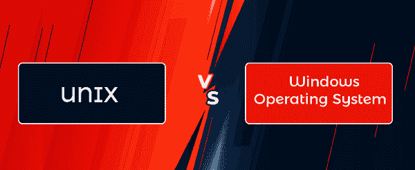

# UNIX 和 Windows 操作系统的区别

> 原文：<https://www.javatpoint.com/unix-vs-windows-operating-system>

在本文中，您将了解到 **UNIX** 和 **Windows 操作系统**之间的区别。但是在讨论差异之前，您必须了解 UNIX 和 Windows 操作系统及其优缺点。

## 什么是 UNIX 操作系统？

UNIX 操作系统是连接计算机和用户的一组程序。UNIX 操作系统创建于**60 年代**，此后不断更新。这是一款强大的多用户、多任务操作系统，由 **AT & T 贝尔实验室**打造。由于其最有价值的特性，如灵活性、可移植性、网络能力等，它在科学家、工程师和学者中非常受欢迎。这是一个稳定的多用户多任务系统，适用于服务器、电脑和笔记本电脑。它是用 **C** 语言编写的，使得 UNIX 操作系统可以在各种平台上运行。

UNIX 操作系统自带**命令行界面**。图形软件未涵盖的操作或没有可用的窗口界面时，例如在 telnet 会话期间，需要 UNIX 知识。

### UNIX 操作系统的优缺点

UNIX 操作系统有各种各样的优点和缺点。UNIX 操作系统的一些优点和缺点如下:

**优势**

1.  许多大型网上商店在 UNIX 或 Linux 服务器上运行他们的网站。它也被用来控制手机和其他电子设备。
2.  运行复杂程序时，它消耗的内存更少。它可以非常有效地处理虚拟内存。虚拟内存随着许多程序进入主内存而增长。在 UNIX 中，大多数作业都是用较少的资源完成的。
3.  UNIX 操作系统既免费又安全，因此通常被网络托管提供商使用。**域名服务器(DNS)、动态主机配置协议(DHCP)** 、网络服务器都是很多网络托管服务器使用的工具。
4.  它允许您打开许多程序，并且所有程序都使用多处理器技术并行执行。
5.  它为众多用户提供了一个安全可靠的环境，让他们无需担心安全问题就能与服务器进行在线交互。与 UNIX 服务器的通信快速且无错误。
6.  多个网络服务器和电子设备不需要用户参与。对于需要很少或不需要用户交互的机器和系统来说，这是一个很好的选择。它可以非常有效地处理系统的自动工作。

**缺点**

1.  对于 UNIX，没有合适的文档可用。如果用户有问题，他必须寻求专家的建议，因为从文档中获得在线帮助相当困难。
2.  UNIX 命令远比 Windows、MS-DOS 和 macOS 难学。
3.  新用户很难使用。因为大多数 UNIX 工作都是通过命令行界面中的命令来完成的，所以初学者必须学习各种命令。它是专门为程序员设计的，不是为新用户设计的。一些经验丰富的用户很难使用这些命令，因为有些命令的名称非常不同。
4.  大多数 UNIX 命令都使用隐晦的单词。非技术用户很难理解命令是如何工作的。有些命令使用不寻常的字符，新程序员可能很难掌握它们。
5.  UNIX 操作系统的用户界面没有吸引力。
6.  UNIX 的某些变体最需要内存。

## 什么是视窗操作系统？

Windows 是由微软合作公司设计开发的操作系统。它是世界上最著名的操作系统之一。Windows 使用**图形用户界面**。它允许用户存储文件、观看视频、运行软件、玩游戏和访问互联网。微软视窗的第一个版本是 1983 年 11 月 10 日在**发布的**1.0 版**。微软视窗有各种版本，包括**视窗 XP、Vista、视窗 95、视窗 7、8、10 和 11** 。**

第一个面向业务的 Windows 版本，被称为 **Windows NT 3.1** ，于 **1993** 推出。接下来的版本， **Windows 3.5，4/0** ，以及 **Windows 2000，**发布。微软在 **2001** 发布时，为家庭和商业环境打造了各种版本的 **Windows XP** 。它使用常见的 x86 硬件构建，如 **AMD** 和**英特尔处理器**。因此，它可能运行在不同的硬件上，包括惠普、戴尔、索尼系统和定制电脑。

Windows 操作系统附带了非常有用的功能。用户可以轻松地创建文件夹并排列他们的文件。启动按钮可用于定位系统上安装的软件。用户也可以使用开始按钮来访问控制面板并获得系统帮助和支持。不同的主题也可以用来定制桌面。它还附带了各种有用的软件，包括微软 Excel、PowerPoint 和 Word。

### 视窗操作系统的优缺点

视窗操作系统有各种各样的优点和缺点。Windows 操作系统的一些优点和缺点如下:

**优势**

1.  Windows 平台适合游戏和软件开发人员。因为 Windows 拥有庞大的用户群，所以设计人员希望为操作系统创建实用程序、游戏和编程。
2.  Windows 10 旨在用于触摸屏设备和桌面系统。Windows 10 的用户界面旨在通过一个 Windows 小工具更好地运行。
3.  由于 **95%** 的用户使用的是 Windows 操作系统，所以大部分设备商都会为 Windows 创建驱动。
4.  大多数装备可以通过附件和玩法自然区分，包括。您不需要物理安装设备，但它在链接时使用，如控制台、鼠标、网络摄像头、手机等。
5.  微软视窗的所有版本都有一些共同点，允许用户轻松地从一个版本切换到另一个版本。Windows 7 的用户切换到 Windows 10 不会有任何困难，因为 Windows 10 的大部分功能都与 Windows 7 相同。Windows 的用户界面也比 UNIX 和 MAC 更容易使用。

**缺点**

1.  Windows 的大部分产品都是付费的，比如设计编程、游戏、下载首席，还有另一种流行的编程。用户必须购买这些产品或按月付费才能使用。
2.  Linux 操作系统是开源的，任何人都可以免费使用，但是 Windows 需要购买许可证，不能免费使用。Windows 操作系统也很贵。您还需要购买其他微软软件，如微软办公软件，以便在系统上进行常规办公。
3.  Windows 有大量的黑客攻击。黑客很容易破解 Windows 安全。因此，Windows 用户依赖反病毒软件，必须每月向公司支付费用来保护他们的数据。此外，Windows 用户必须保持他们的操作系统是最新的，以便获得安全修复。
4.  Windows 操作系统支持对大多数用户来说并不理想。只有少数重要企业可能会依赖 Windows 团队的帮助。普通用户必须寻找论坛来解决他们的问题。
5.  如果你安装了视窗系统，你的电脑将会有大量的内存，大量的硬盘空间和一个好的显卡。这是由于 Windows 中使用的功能。如果您希望安装图形应用程序，如 Photoshop，您应该至少有 **16 GB** 的内存。

## UNIX 和 Windows 操作系统之间的主要区别

**UNIX** 和 **Windows 操作系统**有各种主要区别。UNIX 和 Windows 操作系统之间的一些主要区别如下:

1.  UNIX 操作系统带有命令行界面。相比之下，视窗操作系统带有图形用户界面。
2.  在 UNIX 操作系统中，多处理是可能的。相比之下，多处理在 Windows 操作系统中是不可能的。
3.  UNIX 是一个免费的开源操作系统。相比之下，Windows 是许可操作系统。
4.  UNIX 是一个基于命令的操作系统。相比之下，Windows 是基于菜单的操作系统。
5.  Unix 完全区分大小写，文件可以被认为是独立的文件。相比之下，Windows 有区分大小写的选项。
6.  众所周知，Unix 操作系统执行起来非常稳定。尽管近年来，Windows 的稳定性有了很大的提高，但在这种情况下，大多数 Unix 系统仍然远胜一筹。
7.  UNIX 系统的硬件支持有限。某些硬件无法提供驱动程序。相比之下，Windows 操作系统几乎包含了所有可用硬件的所有驱动程序。
8.  Unix 是一种灵活的操作系统，可以安装在各种系统上，包括大型机、超级计算机和微型计算机。Unix 还推广新的软件设计思想，例如通过连接更简单的工具来解决问题，而不是开发大规模的、单一的应用程序。相比之下，Windows 操作系统不如 Unix 强大，但就功能而言，操作起来相对简单。
9.  UNIX 操作系统使用 **ERR** 和 **STD。IO** 文件系统和 **UFS (Unix 文件系统)**将所有物理驱动器视为一个逻辑驱动器。它有一个稳定有效的文件系统。具有单个根的分层树代表文件系统。另一方面，Windows 使用**新技术文件系统(NTFS)** 和**文件分配表(FAT32)** 系统来处理文件，并要求可执行文件的所有者才能执行它们。文件存储在几个硬盘上的文件夹中，如 C、D 和 e
10.  用户可以在 UNIX 操作系统中保存两个同名文件。相比之下，用户可能不会在 Windows 操作系统中保存两个同名文件。

## UNIX 操作系统和 Windows 操作系统之间的直接比较

在 UNIX 和 Windows 操作系统之间有各种面对面的比较。UNIX 和 Windows 操作系统之间的一些主要对比如下:

| 特征 | UNIX 操作系统 | windows 操作系统 |
| **用户界面** | 它带有命令行界面。 | 它带有图形用户界面。 |
| **许可** | 这是一个免费的开源操作系统。 | 这是一个许可的操作系统。 |
| **安全** | 它更安全，因为所有系统更新都需要明确的用户权限。 | 它不如 UNIX 操作系统安全。 |
| **加工** | 它支持多处理。 | 它不支持多重处理。 |
| **区分大小写** | 它完全区分大小写，文件可以被认为是独立的文件。 | 它有区分大小写的选项。 |
| **基础** | 这是一个基于命令的操作系统。 | 这是一个基于菜单的操作系统。 |
| **硬件** | 在 UNIX 系统中，硬件支持是有限的。某些硬件不能内置驱动程序。 | 几乎所有硬件都有可用的驱动程序。 |
| **文件系统** | 它使用包含标准的 Unix 文件系统(UFS)。ERR 和 STD。输入输出文件系统。 | 它利用了新技术文件系统(NTFS)和文件分配系统(FAT32)。 |
| **可靠性** | Unix 及其发行版以其高度的稳定性而闻名。 | 尽管近年来 Windows 变得更加稳定，但它仍然达不到 Unix 系统提供的可靠性。 |
| **数据备份和恢复** | 在 Unix 中创建备份和恢复系统很耗时，但是随着新的 UNIX 发行版的发布，这变得更加容易。 | 它包含一个内置的备份和恢复系统，使其更加用户友好。 |

* * *