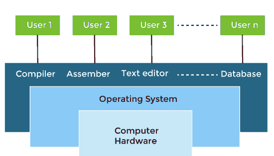
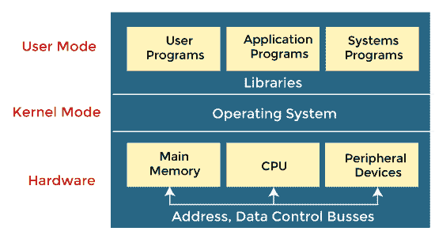

# 操作系统中的用户视图与硬件视图以及系统视图

> 原文：<https://www.javatpoint.com/user-view-vs-hardware-view-vs-system-view-in-operating-system>

操作系统是一种允许用户应用程序与系统硬件交互的结构。操作系统不提供任何功能，但它提供了一种氛围，不同的应用程序和程序可以在其中做有用的工作。

可以从用户或系统的角度观察操作系统。这分别称为用户视图和系统视图。

在本文中，您将了解**用户视图、硬件视图**和**系统视图**之间的差异，但是在讨论差异之前，您必须简要了解用户视图、硬件视图和系统视图。

### 什么是操作系统中的用户视图？

用户视图取决于用户使用的系统界面。用户视图是关于用户如何在各种应用程序的帮助下与操作系统交互。从系统的角度来看，我们将看到硬件如何与操作系统交互来完成各种任务。

有些系统是为单个用户独占资源以最大化用户的任务而设计的。在这些情况下，操作系统主要是为了易于使用而设计的，很少强调质量，也不强调资源利用率。不同类型的用户视图体验可以解释如下:

**1。单用户视图:**大多数计算机用户使用显示器、键盘、鼠标、打印机和其他附件来操作他们的计算机系统。这些系统更多地是为单个用户体验而设计的，并且满足单个用户的需求，在这种情况下，性能并不像多用户系统那样受到重视。在某些情况下，系统被设计为最大化单个用户的输出。因此，更多的注意力放在可访问性上，资源分配就不那么重要了。

例如，如果用户使用个人计算机，操作系统在很大程度上被设计成使交互变得容易。也关注系统的性能，但操作系统不需要担心资源利用率。这是因为个人电脑使用了所有可用的资源，没有共享。

**2。多用户视图:**如果用户正在使用连接到大型机或小型机的系统，并且他们计算机上的许多用户试图通过大型机与他们的内核进行交互。操作系统很大程度上与资源利用率有关。这是因为可能有多个终端连接到主机。操作系统确保所有的资源，如中央处理器、内存、输入输出设备等。，在它们之间被均匀地划分。

在这种情况下，必须有效地完成中央处理器的内存分配，以提供良好的用户体验。客户机-服务器体系结构是另一个很好的例子，其中许多客户机可以通过远程服务器进行交互，并且可能会出现有效使用服务器资源的相同限制。

**3。已处理用户视图:**如果用户使用手机等手持电脑，则操作系统会处理设备的可用性，包括一些远程操作。还会考虑设备的电池电量。智能手机通过无线设备进行交互以执行大量操作，但它们不如计算机界面高效，限制了它们的实用性。然而，他们的操作系统是一个很好的例子，创造了一个专注于用户观点的设备。

**4。嵌入式系统用户视角:**有些系统，像嵌入式系统一样，缺乏用户视角。用于打开**或关闭**电视的遥控器都是嵌入式系统的一部分，在该系统中，电子设备与用户视点受限的另一个程序进行通信，并允许用户参与应用程序。****

 ****有些设备包含很少或没有用户视图，因为没有与用户的交互，如嵌入式系统。您用来打开或关闭电视的遥控器是嵌入式系统的一部分，电子设备在其中与其他应用程序交互。用户观点不多，但它允许用户与应用程序交互。

### 什么是操作系统中的硬件视图？

操作系统主要用于控制硬件，并协调不同用户的各种应用程序之间的使用。**计算机硬件**包含中央处理器(CPU)、内存和输入/输出(I/O)设备，它为系统提供基本的计算资源。操作系统有效地管理资源，为用户程序提供服务。它充当资源管理器，并执行以下任务，例如:

*   资源分配。
*   控制程序的执行。
*   控制输入/输出设备的操作。
*   资源保护。
*   监控数据。

### 什么是操作系统中的系统视图？

根据计算机系统，操作系统是应用程序和硬件之间的桥梁。它与硬件关系最密切，用于根据需要控制硬件。操作系统可以被视为资源分配器和控制程序。计算机系统由各种资源组成，如硬件和软件，这些资源必须得到有效管理。操作系统管理资源，决定竞争需求，控制程序执行，等等。根据这个观点，操作系统的目的是最大化性能。操作系统负责管理硬件资源，并将其分配给程序和用户，以确保最高性能。

从用户的角度来看，我们已经讨论了许多需要不同程度用户参与的应用程序。然而，从系统的角度来看，我们更关心的是硬件如何与操作系统交互，而不是用户。操作系统的不同类型的系统视图可以解释如下:

**1。资源分配:**硬件包含寄存器、缓存、CPU 时间、内存空间、文件存储空间、RAM、ROM、CPU、I/O 交互等多种资源。这些都是应用程序需要时操作系统需要的资源。操作系统必须明智地将这些资源分配给进程，以便计算机系统能够尽可能平稳地运行。

只有操作系统可以分配资源，它使用了几种策略和策略来最大化其处理和内存空间。操作系统使用各种策略来充分利用硬件资源，包括分页、虚拟内存、缓存等。这些在各种用户视点的情况下非常重要，因为低效的资源分配可能会影响用户视点，导致用户系统滞后或挂起，降低用户体验。

**2。控制程序:**操作系统也可以作为控制程序工作。它管理所有进程和输入/输出设备，以顺利工作，没有错误。用户可以请求只能用输入/输出设备完成的操作；在这种情况下，操作系统还必须具有适当的通信、控制、检测和处理这些设备。它确保输入/输出设备正常工作，不会产生问题。

3.操作系统也可以被视为使使用硬件变得更容易。

4.要求计算机能轻松解决用户问题。然而，直接使用计算机硬件并不容易。因此，开发操作系统是为了方便与硬件通信。

5.操作系统也可以被认为是在计算机系统(称为内核)的后台一直运行并处理所有应用程序的程序。这是通常遵循的操作系统的定义。

### 用户视图、硬件视图和系统视图之间的区别

以下是操作系统中用户视图、硬件视图和系统视图之间的区别。

| 用户视图 | 系统视图 | 硬件视图 |
| 用户对计算机系统的看法因所使用的界面而异。 | 从系统的角度来看，操作系统是一个与硬件相关的程序。 | 操作系统主要用于控制硬件，并协调不同用户的各种应用程序之间的使用。 |
| 大多数系统设计为由单一用户操作。然而，在某些系统中，多个用户可以共享资源、内存。在这些情况下，操作系统被设计成在多个用户和中央处理器之间有效地处理可用资源。 | 操作系统是一个分配器，它在各种进程之间分配内存和资源。它控制程序间的资源共享。 | 硬件包括输入设备、处理设备、输出设备、存储设备等。 |
| 操作系统的设计必须考虑可用性和有效的资源利用。 | 它防止不当使用、错误和处理死锁情况。 | 它包括有形的、物理的组件、内存、存储容量、电源等。 |
| 在嵌入式系统(自动化系统)中，用户视图不存在。 | 它是一个一直以 ***【内核】*** 的形式在系统中运行的程序。 | 它是系统运行所需的物理组件，没有它，计算机将无法启动。 |
| 操作系统给用户的感觉好像处理器只处理当前任务，但在后台，处理器处理几个进程。 | 它控制不属于内核的应用程序。 | 硬件包括提高员工生产率、实施正确的业务技术、存储信息、开发有效的沟通等。 |
| 用户共享资源，可以交换信息。一些用户坐在连接到大型或小型计算机的终端上。为资源利用而设计。 | 操作系统之所以存在，是因为它们是解决创建可用计算机系统问题的合理方法。pc 的目标是执行用户程序和更容易地解决问题。 | 它的主要目的是使任何电子或计算机设备工作并执行任务。 |

* * *****