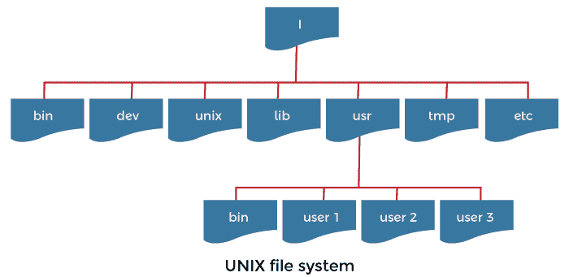
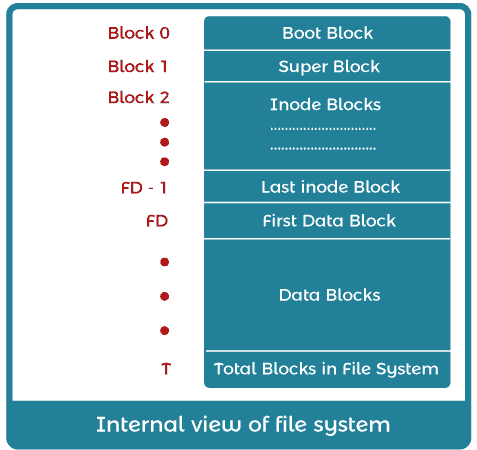
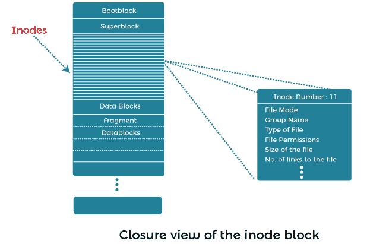
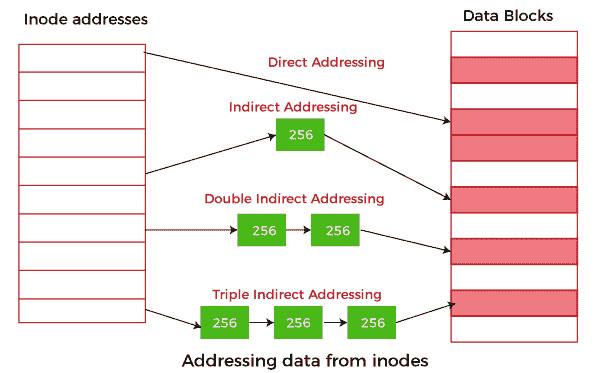

# UNIX 文件系统的内部结构

> 原文：<https://www.javatpoint.com/internal-structure-of-unix-file-system>

在本文中，我们将详细了解 UNIX 文件系统及其内部结构。

### 你说的 UNIX 操作系统是什么意思？

所有实用程序和应用程序都存储为文件。这是一种组织和存储大量信息的逻辑方法。

在 UNIX 中，文件系统是文件和目录的分层结构，用户可以在其中使用文件存储和检索信息。

### UNIX 文件系统的结构

UNIX 系统中的所有文件都是相互关联的。

### UNIX 文件系统的目录结构如下所示:

**Root(/:**目录结构的顶部称为 Root。它也称为父目录，因为它包含 UNIX 文件系统的所有子目录。在 UNIX 系统中用斜杠符号表示。

**/lib:** 该目录包含系统库函数的所有信息和一些关键文件，如内核模块或设备驱动程序。它还包含编译器可以包含在程序中的系统调用。

**/bin:** 该目录包含系统的二进制文件和某些基本实用程序。它是管理级命令(如 ls 或 cp)的目录。路径(var)总是在列表中显示这个目录。

**以下是/bin 目录的子目录:**

*   **/sbin:** 如果有一个命令你不能执行，系统管理员可以执行这个命令，这样它就可以在这个目录中。只有系统和管理员路径显示此目录。

**/dev:** 代表“设备”，包含 UNIX 系统中使用的设备文件的所有信息。这些文件不占用磁盘上的任何空间。它含有铝；关于硬盘的信息、外围设备的文件表示、软盘、设备信息和伪设备。

**以下是/dev 目录的子目录:**

*   **/dev /HD1:** 此设备文件包含第一个硬盘驱动器信息。
*   **/dev /HD2:** 此设备文件包含第二个硬盘驱动器信息。
*   **/dev /FD0:** 此设备文件包含第一个软盘驱动器信息。
*   **/dev /FD1:** 此设备文件包含第二张软盘驱动器信息。

**/etc :** 该目录及其子目录包含了很多 UNIX 配置文件和系统数据库。这些文件有许多文本文件，可以根据系统的功能进行更改。它还包含您的登录名和密码信息。

**以下是/etc 目录的子目录:**

*   **/etc/passwd:** 此目录包含您的系统密码信息。
*   **。/etc/shadow:** 此目录包含原始密码的信息。

**/home:** 该目录包含用户主目录的所有信息。每当用户登录系统时，UNIX 系统会自动将您放在主目录中。

**例如:**

如果您使用登录名 demo 登录 UNIX 系统，您将位于一个可能具有路径名 **/home/demo** 的目录中

该目录由系统在您开户时创建。您可以随时使用 cd 命令更改您的主目录。要查看当前工作的主目录，可以使用 **pwd** 命令。

**/tmp:** 该目录包含了 UNIX 或用户在 UNIX 系统中创建的所有临时文件的信息。

**/var:**UNIX 文件系统的可变目录包含打印作业以及传出和传入电子邮件的所有信息。文件系统的可变部分可以作为数据库存储放在文件中。

**以下是/var 目录的子目录:**

*   **/var/log:** 该目录包含系统日志文件的信息。
*   **/var/mail:** 该目录包含存储所有传入电子邮件的信息。
*   **/var/spool:** 这个目录也叫 spool 目录。它包含有关打印作业、邮件线轴和其他排队任务的信息。
*   **/var/tmp:** 该目录包含临时文件的信息。

**/usr:** 该目录包含 UNIX 系统中与用户相关的所有信息。这意味着它包含所有用户帐户，如 user1、user2 等。

**以下是/usr 目录的子目录:**

*   **/usr/bin:** 该目录存储了 UNIX 系统中使用的所有用户二进制文件的信息。
*   **/usr/include:** 该目录存储系统中使用的所有开发头的信息。#主要使用头文件，包括 C/C++编程语言中的指令。

### UNIX 文件系统的内部结构是什么意思？

文件系统是一组文件，包含有关文件和信息节点如何存储在磁盘上的信息。

### 下图显示了 UNIX 文件系统的内部视图:

**在上图中定义了几个参数，如:**

*   **引导块:**它是 UNIX 文件系统的第一个块，包含一个小的引导程序，即所谓的引导程序。它被加载到主内存中，并在启动时执行。这个引导程序是从一个称为根文件系统的文件系统的引导块中获取的。
*   **超级块:**它包含文件系统的静态参数，如总大小、数据块总数和文件系统状态、信息节点数、可用和已用信息节点以及文件系统的块大小。超级块保存在内存中，由内核维护。
    文件系统组织将磁盘分区划分为一个或多个称为柱面组的区域。该组由磁盘上的一个或多个连续圆柱体组成。每个柱面由超级块的复制副本、用于索引节点的空间以及一条描述柱面组内数据块使用情况的摘要信息组成。
*   **Inodes:** 代表索引节点。创建文件时，还会创建一个信息节点来保存有关特定文件所有属性的信息。索引节点的数量代表了 UNIX 系统中文件的最大数量。
    文件的索引节点负责存储整个文件的相关数据，但其名称除外，该名称作为条目存储在其父目录中。
    文件打开时，内核将其对应的 inode 从磁盘复制到主存。索引节点包括文件的类型、文件的访问信息，即文件的读、写或执行几个链接、文件的字节长度以及拥有文件的用户和组的表示。
    
    在上图中，仔细观察索引节点结构会发现寻址并不总是简单明了的。在这里，有一个间接、双重甚至三重间接磁盘块地址的概念，如下图所示:
    
    在 UNIX 中，当创建一个文件时，会为它分配一个唯一的编号，称为 inode 编号。这样，UNIX 中的每个文件都有一个索引节点号。UNIX 将所有目录视为文件，因此它们也有一个索引节点号。
    可以使用“ls- i”命令访问分配给文件的索引节点号，而“ls- l”命令将检索索引节点信息。
*   **数据块:**数据块从索引节点列表的末尾开始，包含文件数据。在 UNIX 系统中，分配的数据块只能属于一个文件。磁盘磁头试图访问数据块，我们从同一个柱面组分配数据块。如果单个文件不能占用一个柱面组中的所有块，并且一个文件超过了某个大小，则进一步的块分配将重定向到另一个柱面组。

* * *