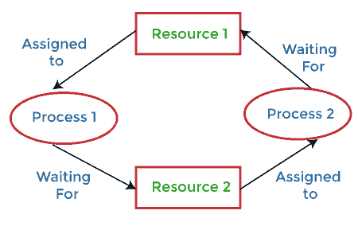
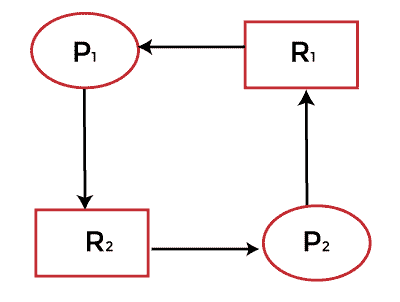
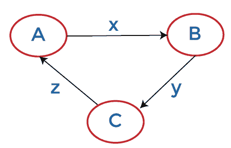

# 分布式系统中资源死锁和通信死锁的区别

> 原文：<https://www.javatpoint.com/resource-deadlocks-vs-communication-deadlocks-in-distributed-systems>

死锁是这样一种情况，其中一个进程不能继续，因为它需要获得另一个进程持有的资源，而它本身持有另一个进程需要的资源。发生死锁必须满足四个要求:

1.  **互斥:**系统中至少有一个资源一次只能被一个进程使用。
2.  **保持&等待:**必须有一个进程在等待另一个进程获取另一个资源的同时保留一个资源。
3.  **无抢占:**表示资源不能强行从一个进程拿走，交给另一个进程。
4.  **循环等待:**所有进程必须以循环方式等待资源，最后一个进程等待第一个进程的资源。

### 什么是分布式系统死锁？

分布式系统中的死锁类似于单处理器系统中的死锁。它们不容易避免、预防、检测，并且当被追踪时更难治愈，因为所有相关信息分散在许多机器上。有些系统，如分布式数据库系统，可能会非常严重，因此了解它们与普通死锁的区别非常重要。

分布式死锁有两种，通信死锁和资源死锁。当进程 A 试图向进程 B 发送一条消息，进程 B 试图向进程 C 发送一条消息，进程 C 试图向进程 A *发送一条消息时，就会出现 ***通信死锁*** 。*这种情况会导致死锁的各种情况，例如没有可用的缓冲区。当进程争夺对输入/输出设备、文件、锁或其他资源的独占访问时，就会出现 ***资源死锁*** 。

各种策略被用来处理死锁。可以通过以下方式处理死锁，例如:

*   **忽略问题:**我们可以选择忽略问题。最受欢迎的选择之一就是这个。
*   **检测:**允许死锁发生，然后检测系统存在死锁，最后处理死锁。死锁检测需要检查进程-资源交互的状态，看是否存在循环等待。分布式系统中的死锁检测似乎是处理分布式系统中死锁的最佳方法。
*   **预防:**我们可以施加资源分配限制，防止死锁。死锁预防通常是通过让进程在开始执行之前同时获取所有需要的资源来实现的，或者通过抢占拥有所需资源的进程来实现的。
*   **避免:**在分布式系统的死锁避免方法中，如果产生的全局系统状态是安全的，则资源被授予进程。然而，由于一些问题，避免死锁在分布式系统中是不切实际的。

分布式系统中不使用死锁避免。避免死锁的困难在于，算法需要提前知道资源使用需求，才能正确调度它们。

这四种方法都有可能适用于分布式系统。在分布式系统中，死锁处理变得非常复杂，因为没有一个站点准确地知道系统的当前状态，并且因为每个站点间的通信都涉及有限且不可预测的延迟。

### 什么是资源死锁？

在资源死锁中，进程可以同时等待几个资源，并且在获得所有这些资源之前无法继续。如果一组进程中的每个进程都请求该组中另一个进程所拥有的资源，则该组进程是资源死锁的，并且它必须接收所有请求的资源，然后才能解除阻塞。这被称为资源死锁。

**例如**假设一个系统运行 2 个进程，P1T8【P】T4 2，他们想要资源 R1T9】R2。资源分配图如下所示:

但是在这里，进程 P 1 持有资源 R 1 &等待获取 R2 资源，而进程 P 2 持有资源 R2T19】等待获取 R 1 资源。这样，P 1 等待 P 2 完成& P 2 等待 P 1 完成&从而出现死锁。

### 什么是沟通僵局？

这个死锁中的进程等待与一组进程中的其他进程通信。等待进程可以在接收到来自这些进程中任何一个的通信时解除阻止。如果集合中的每个进程都在等待与集合中的另一个进程通信，并且集合中的任何进程在接收到它正在等待的通信之前都不会开始任何额外的通信，则集合是通信死锁的。

**例如:**假设，进程 A 等待从进程 B 获取消息，进程 B 等待从进程 C 获取消息，进程 C 等待从进程 A 获取消息，因此出现死锁。TFW 图如下所示:

分布式系统(DDBS)中的用户通过执行事务来访问数据库的数据对象。事务可以被认为是对数据对象执行的一系列读写操作。数据库的数据对象可以被视为由事务获取(通过锁定)和释放(通过解锁)的资源。在 DDBS，等待图被称为事务等待图(TWF 图)

### 资源死锁和通信死锁的区别

在 ***资源死锁*** 中，进程访问资源，例如数据库系统中的数据对象和存储转发通信网络中的缓冲区。进程在访问资源之前获取它，在使用它之后释放它。一个需要资源来执行的过程在获得所有这些资源之前是无法进行的。如果一组进程中的每个进程都请求该组中另一个进程持有的资源，则该组进程处于资源死锁状态。

在 ***通信死锁*** 中，消息是进程等待的资源。消息的接收使进程脱离等待并解除阻塞。如果一组进程中的每个进程都在等待来自该组中另一个进程的消息，并且该组中没有任何进程发送过消息，那么该组进程就是通信死锁的。下面是资源死锁和通信死锁的更多区别。

| 资源死锁 | 通信死锁 |
| 不直接知道哪个事务依赖于哪个其他事务。 | 在通信模型中，在进程可以继续之前，它可能知道进程的标识，它必须从这些进程接收消息才能进行通信。 |
| 在资源分配模型中，一个进程在收到它正在等待的所有资源之前不能继续执行。 | 在通信模型中，进程不能继续执行，直到它可以与它正在等待的进程之一进行通信。 |
| 等待(通过进程)是为了资源。 | 等待(由进程)完成消息。 |
| 如果集合中的每个进程都在寻找集合中另一个进程所拥有的资源，并且必须获得所有请求的资源才能解除阻塞，那么该进程集合就是资源死锁。 | 如果集合中的每个进程都在等待与集合中的另一个进程通信，并且集合中的任何进程在收到它正在等待的通信之前都不会开始任何额外的通信，则集合是通信死锁的。 |
| 安全状态可以防止资源死锁。 | 安全状态无法防止通信死锁。 |

* * *