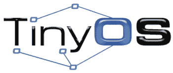
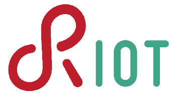
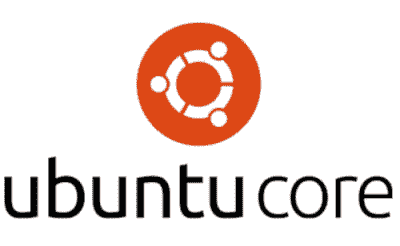
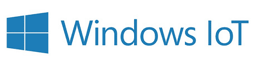
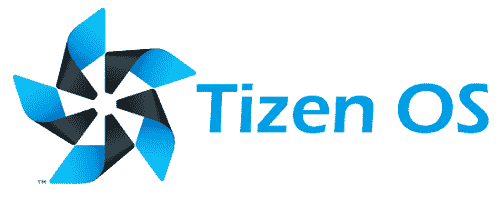
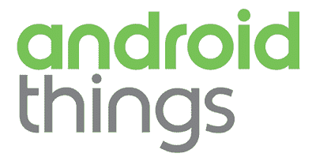

# 物联网操作系统

> 原文：<https://www.javatpoint.com/iot-operating-systems>

操作系统是任何计算机的大脑和神经系统，如笔记本电脑、智能手机和服务器。操作系统负责通过分配所有资源(如处理、内存和存储)来控制应用程序的软件和硬件。操作系统既有开源版本，也有商业版本。

物联网操作系统的创建是为了在小型物联网设备的限制范围内表现良好。如果没有操作系统，每个应用程序都必须有自己的用户界面和代码库来处理底层计算机的细节。在本文中，您将学习最好的物联网操作系统。但是在讨论最好的物联网操作系统之前，你必须了解物联网操作系统。

## 什么是物联网操作系统？

物联网操作系统使用户能够在连接互联网的设备上执行基本的计算机活动。物联网操作系统运行在物联网设备上，并连接到更大的设备网络。这些操作系统通过提供内存和数据存储处理能力来提供类似计算机的功能。这些系统可以运行和处理安装在设备上的任何程序。物联网设备的操作系统与物联网设备管理软件进行通信。

现在有各种最好的物联网操作系统。一些最好的物联网操作系统如下:

1.  **TinyOS**
2.  **康提卡**
3.  **RIOT**
4.  **Ubuntu 核心**
5.  **府西亚 OS**
6.  **Windows 10 IoT**
7.  **输入**
8.  **安卓事物**
9.  **打开 Wrt**
10.  **嵌入式操作系统**

## TinyOS

**TinyOS** 是一个基于组件的开源 OS。TinyOS 的基础语言是 nesC，它是 C 编程语言的一个版本。它是为无线传感器网络设计的。TinyOS 在开发人员中非常受欢迎，因为它具有内存优化功能。TinyOS 包括一个组件，它中和了一些物联网系统抽象，如感知、数据包传输、路由等。TinyOS 联盟是这款物联网操作系统的开发团队。

它最初是一个谷歌代码项目，一小群人只能编写核心开发者的代码。然而，从 2013 年**开始，它已经转移到了 GitHub，在那里它对开源社区更加开放，每年至少有 **35，000 次**下载。**

 **### TinyOS 的优缺点

TinyOS 有各种各样的优缺点。TinyOS 的一些优点和缺点如下:

**优势**

1.  TinyOS 是一个事件驱动的操作系统，这意味着它依赖于它从周围环境接收的事件。
2.  TinyOS 是一个运行在所有设备上的嵌入式操作系统。TinyOS 需要更少的内存来执行。如果你想运行这个操作系统，你不需要购买更多的内存设备。
3.  TinyOS 的源代码相对较少。代码可以优化，以帮助运行任何特定的系统。由于代码减少，设备运行得更快，操作系统不会使设备过载。
4.  TinyOS 是一个便携式操作系统，可以在多种设备上使用。如果设备性质相同，编码就不需要改变。
5.  TinyOS 由各种模块组成。这些模块具有各种功能，包括任务、微控制器、命令、硬件、事件和软件。每个模块都执行自己的功能。

**缺点**

1.  需要进行一些修改，以允许硬件和软件之间的通信。这是由于低电压的限制。
2.  由于内存限制、异步行为和低电压等限制，TinyOS 编程非常困难。这种操作系统的主要缺点是 NesC 编程语言。
3.  因为网络传感器设备必须每秒从其周围环境中刷新数据，所以程序员必须记住这一点，以确保代码在所有情况下都能工作。

## 康提基

**Contiki** 是一个免费的开源操作系统，用于将低功耗、低成本的微控制器连接到互联网，也是创建复杂无线系统的工具箱。

Contiki 旨在坚持最高的互联网标准，如全面支持 **IPv4** 和 **IPv6** 。它是用 C 语言编写的，在一次下载中提供了一个快速的编程环境，它还包括一个活跃的社区，让任何用户都感到轻松。

### 康蒂基的优缺点

孔蒂基有各种各样的优缺点。康蒂基的一些优点和缺点如下:

**优势**

1.  它提供强大的低功耗互联网通信。
2.  它支持完全标准的 IPv6 和 IPv4。
3.  它可以与各种低功耗无线设备一起使用，其中一些设备在网上很容易获得。
4.  它是免费的开源软件，可以在商业和非商业系统中使用，并提供源代码。

**缺点**

1.  Contiki 是一个事件驱动的操作系统；因此，不使用高级调度算法。
2.  随着事件的发生，它们被分派到目标应用程序。
3.  Contiki 不便于实时应用的部署，所以这个操作系统中不包含实时进程调度算法。

## 暴乱

这是一个由支持性开发社区支持的免费开源物联网操作系统。它旨在提供物联网服务，并根据不可复制的 GNU 小型通用公共许可证发布。该社区通常被称为物联网世界的 Linux，由学者、程序员和爱好者组成。RIOT 是一个基于微内核架构以及 C 和 C++编程语言的低功耗操作系统。

它支持完整的多线程和 SSL/TLS 库，包括 wolfSSL，并在 8 位、16 位和 32 位处理器上运行。RIOT 配备了一个端口，使其能够作为 Linux 或 macOS 进程执行，并支持单板计算机和 IOT 设备。其他特性包括部分 POSIX 合规性、TCP、以内容为中心的网络、UDP 和 CoAp 网络协议。它为物联网设备和微控制器设计提供了安全性、连接性、隐私性和耐用性。

RIOT 可能是唯一一个拥有强大社区的操作系统，该社区遍布 Twitter、Mastodon、Hackster.io、discussion、YouTube 和 GitHub 等众多平台。

### RIOT 的特点

RIOT 有各种各样的特性。RIOT 操作系统的一些特性如下:

1.  它支持 8、16、32 位微控制器平台。
2.  它保持能源效率。
3.  没有任何新的编程环境。C 或 C++编程语言可以直接与现有工具一起使用，如 gdb、gcc 等。
4.  依赖硬件的代码较少。
5.  它允许多线程。
6.  它支持物联网的完整网络栈。
7.  因为如果硬件不可访问，所有输出都可以在终端中看到，所以提供了一个名为 RIOT-TV 的可视化工具。

## Ubuntu 内核

这是 Ubuntu 和 Linux 最流行发行版的健壮版本，专门为大型容器部署和物联网设备而设计。它是由 Canonical 开发的，使用与 Ubuntu 相似的内核、系统软件和库，但规模较小。它用于数字标牌、动力机器人、网关和其他设备。它可以用来为物联网设备创建一个安全的嵌入式 Linux。

它的所有组件都经过验证，以创建不可变的包和持久的数字签名。这是一个简单的企业级设计。

### Ubuntu 内核的特性

Ubuntu Core 有各种各样的特性。ubuntu Core 的一些特性如下:

1.  它是全磁盘加密。
2.  它具有安全功能，例如全磁盘加密、加密验证的引导过程以及手动和远程恢复模式。
3.  安全引导确保并确认每次引导时设备上加载的软件的真实性。

## 府西亚 OS

是**谷歌**为物联网设备开发的实时开源操作系统。紫红色基于锆石内核。它是一个基于微内核的操作系统，结合了有效的网络解决方案，可以在低功耗设备上运行。在操作系统上使用 Node.js 可以确保应用程序在平板电脑、手机和物联网设备上运行。它采用基于卡的设计，用于多应用程序管理的用户界面，以及用于用户界面和应用程序的 Flutter 软件开发工具包。

### 紫红色操作系统的特点

Fuchsia OS 有各种各样的特性。紫红色操作系统的一些特性如下:

1.  谷歌 Fuchsia 旨在满足跨平台设备的需求。Fuchsia 专注于在所有设备上提供相同的用户体验，包括智能手机、可穿戴设备、计算机和平板电脑。Fuchsia 开发人员可以使用单个代码库为各种平台创建应用程序。
2.  根据谷歌的说法，Fuchsia 操作系统有很大的潜力。它将使用摄像头、应用抽屉和屏幕上的应用编程接口认证，使其更加用户友好。
3.  Fuchsia 将帮助开发者设计视觉上吸引人的用户界面。它将确保您的用户界面组件，如通知、按钮、背景、箭头等，都是好的。此外，您可以使用拖放工具自定义您的屏幕。你会立即考虑在谷歌操作系统上切换到材料设计。

## Windows 10 IoT

它是 Windows 10 家族的一员，为物联网带来了企业级的功能、安全性和可管理性。它利用 Windows 的嵌入式体验、生态系统和云连接，帮助组织利用安全设备建立物联网，这些设备可以快速部署、管理并链接到更广泛的云战略中。它不适用于视窗 10 中包含的 Cortana 或 FileOpenPicker。

Windows 10 物联网操作系统分为两部分:

1.  第一个是 **Windows 10 IoT Core，**是为了支持小型嵌入式设备而开发的。
2.  第二款是 **Windows 10 IoT 企业版**，设计支持重型工业应用，兼顾高等级可靠性。

### Windows 10 物联网的功能

Windows 10 物联网有多种功能。Windows 10 物联网的一些功能如下:

1.  它为视窗专业人员提供多语言用户界面。
2.  它的支持时间至少为 10 年，并且还将再提供 5 年，这对长期应用非常重要。
3.  Windows 10 物联网企业版有 30 多个语言包。

## 蒂森

这是一个开放灵活的操作系统，旨在满足互联设备生态系统的需求。它创建于 2011 年，适用于移动和小型嵌入式系统。与机器人操作系统相比，它的内核类型是单片的和轻量级的。

蒂森是一个基于 Linux 的免费移动和连接设备操作系统，有平板电脑、汽车、智能手机、电视和可穿戴设备的变体。操作系统提供了一个快速和安全的用户界面，使开发人员能够创建直接在硬件上运行的应用程序，而不需要任何定制的光盘或修改。

Tizen 还提供了一个平台，允许应用程序开发人员快速创建应用程序。蒂森支持 **Exynos 5410** 或 **5420** 处理器架构和**马里 G52** 或 **Cuda M1** 图形处理器。它还支持非易失性存储和存储在非易失性存储设备上的应用程序的读/写功能。蒂森社区总是由在操作系统上合作的人组成。

### 蒂森的特点

蒂森有各种各样的特点。蒂森操作系统的一些特性如下:

1.  这是一个开源且灵活的操作系统。
2.  与其他平台相比，它提供了令人难以置信的操作速度。
3.  它在中央处理器、内存和电池上更轻。
4.  三星一直将蒂森操作系统视为“通用操作系统”。
5.  三星与英特尔结盟，持续升级蒂森操作系统平台。

## 安卓的东西

**安卓事物**是谷歌为物联网和嵌入式设备开发的操作系统。此前，它被命名为布里洛。它建立在基于 Linux 内核的安卓之上。它还支持多任务处理和虚拟内存。它可能只需要很少的电力就能运行，并且还具有无线网络和蓝牙功能。它的设计适合内存占用小的设备，尽管它至少需要 512 兆内存。因此，安卓物联网针对的是与基于微控制器的物联网设备不同的物联网市场。

安卓事物将使安卓开发者更容易创建物联网应用。他们可能会用到安卓 Studio、安卓 SDK、谷歌 Play Services、Firebase、谷歌云，这些都是大家熟悉的工具和界面。Kotlin 和 RxJava 是两个可以用来构建应用程序的安卓库。谷歌还认证了兼容的模块系统，并提供了主板支持包。安卓事物控制台将允许对物联网设备进行托管固件和应用程序更新。

### 安卓事物的特点

安卓东西有各种各样的功能。安卓系统的一些特点如下:

1.  它有潜力成为一个新的数据收集渠道。它或许能让谷歌更好地理解用户行为。因此，谷歌将能够为其庞大的用户群提供更具针对性和情境驱动的广告。
2.  谷歌负责为安卓设备提供定期的安全更新，而不是目前结构中的开发者。
3.  安卓事物有潜力降低开发物联网应用的整体成本。这将降低间接成本，提高生产率。这是因为安卓事物框架可以用作运行在任何硬件上的应用程序，企业可能只是在此基础上开发新的应用程序。

## OpenWrt(打开 Wrt)

**OpenWrt OS** 基于 Linux 内核，主要用于嵌入式设备上路由网络流量。这是针对支持 802.11n 标准的设备的完整无线网络解决方案。

它是由一个总部设在德国的跨国社区设计和开发的。它是许多物联网应用开发者的最佳选择，因为它为构建最先进的嵌入式系统提供了一个稳定且值得信赖的框架。

命令行或网络界面用于配置 OpenWrt (LuCI)。opkg 软件包管理系统大约有 3500 个可选软件包可供安装。它可能运行在几种类型的设备上，如住宅网关、掌上电脑、智能手机和 CPE 路由器。它也可以安装在个人电脑和笔记本电脑上。

与其他平台相比，该操作系统的主要优势是支持传统硬件。它提供了对强大的跨平台应用程序堆栈和用户友好界面的访问。它的路由器是开放和灵活的，允许开发者添加额外的无线和有线网络硬件组件。与专有操作系统不同，它不需要用户在扩展网络后将其计算机重置为出厂设置。

### OpenWrt 的特点

OpenWrt 操作系统有各种各样的特性。OpenWrt 操作系统的一些特性如下:

1.  允许用户创建、删除和更改任何文件的可写根文件系统。
2.  它具有所有硬件驱动程序的可扩展设置，例如内置网络交换机及其 VLAN 功能、可用硬件按钮、DSL 调制解调器、FX、WNICs 等。
3.  UCI(统一配置界面)是一系列脚本，旨在统一和简化整个系统的设置。
4.  有许多配置网络相关功能的选项。

## Mbed 操作系统

**Mbed OS** 是一款免费的开源操作系统，以使用 ARM CPU 和广泛的连接选项而闻名，包括 WiFi 和蓝牙。Mbed OS 的分层安全协议使得它对想要开始从事物联网应用的开发人员非常有吸引力。

有了 Mbed 操作系统，你可以用免费的在线 IDE 用 C++编写物联网软件，用 Arm C/C++编译器编译，在各种硬件平台上运行。对于开发人员来说，Mbed OS 的一个优势是它保持了他们的代码干净和可移植性，允许他们使用基于 ARM cortex M 的设备创建原型物联网应用程序。

### 嵌入式操作系统的特点

Mbed 操作系统有多种功能。Mbed 操作系统的一些功能如下:

1.  Mbed 操作系统社区使 ARM、50 多个合作伙伴和全球数以千计的个人开发者能够贡献和协作。
2.  它包括对各种标准微控制器外设的驱动程序支持。它包括数字和模拟输入输出、I2C、端口、总线输入输出、脉宽调制、中断、串行接口和串行。
3.  您可以放心地在商业和个人项目中使用 Mbed 操作系统，因为它是根据 Apache 2.0 许可证发布的。
4.  在各种基于 ARM Cortex-M 的设备上，借助 Mbed OS 兼容性的支持，开发人员可以在低成本的开发板上快速制作物联网应用的原型。
5.  Mbed 操作系统支持确定性的多线程实时软件执行，使用基于广泛使用的开源 CMIS-RTOS·RTX 的 RTOS 内核。因为 RTOS 原语始终可用，所以驱动程序和应用程序可以依赖于一些特性，包括信号量、线程和互斥体。

* * ***