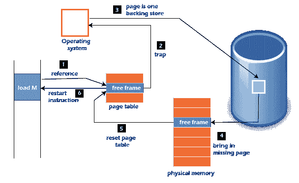

# 操作系统中的页面错误处理

> 原文：<https://www.javatpoint.com/page-fault-handling-in-operating-system>

在本文中，您将了解操作系统中的页面错误处理及其步骤。

## 什么是操作系统中的页面错误？

页面错误更像是一个错误。如果程序试图访问物理内存(主内存)中不存在的一块内存，就会发生页面错误。故障指定操作系统将所有数据跟踪到虚拟内存管理中，然后将其从辅助内存重新定位到主内存，如硬盘。

如果请求的页面没有加载到内存中，就会出现页面错误陷阱。页面故障主要导致异常，用于通知操作系统从虚拟内存中检索**“页面”**继续操作。一旦所有数据都放入物理内存，程序就恢复正常运行。页面错误过程发生在后台，因此用户并不知道。

1.  计算机对内核和程序计数器的硬件跟踪通常保存在堆栈上。中央处理器寄存器保存指令当前状态的信息。
2.  启动一个汇编程序，保存通用寄存器和其他易失性数据，以防止操作系统破坏它。

## 页面错误处理

当您访问标记为无效的页面时，会出现页面错误。分页硬件会注意到，在跨页表转换地址时设置了无效位，这将导致操作系统陷阱。该陷阱主要是由操作系统无法将所需页面加载到内存中造成的。

现在，让我们了解操作系统中页面错误处理的过程:

1.  首先，为这个过程创建一个内部表，以评估引用是有效的还是无效的内存访问。
2.  如果引用无效，系统进程将被终止。否则，页面将被调入。
3.  之后，自由帧列表在系统中找到自由帧。
4.  现在，磁盘操作将被安排从磁盘获取所需的页面。
5.  当输入/输出操作完成时，进程的页表将被更新为新的帧号，无效位将被更改。现在，它是一个有效的页面引用。
6.  如果发现任何页面错误，请重新开始这些步骤。

## 页面错误术语

操作系统中有各种页面错误术语。页面错误的一些术语如下:

**1。页面点击**

当中央处理器试图从主存获取所需页面，并且该页面存在于**主存(RAM)** 中时，称为**“页面命中”**。

**2。页面错过**

如果所需页面在**主存(RAM)** 中不存在，则称为**“页面缺失”**。

**3。页面故障时间**

加载所需页面后，从辅助内存获取页面并从主内存恢复页面所需的时间称为**“页面故障时间”**。

**4。页面故障延迟**

线程在内存中定位页面错误的速率称为**“页面错误速率”**。页面错误率是每秒钟测量的。

**5。硬页故障**

如果硬盘的页面文件中存在所需的页面，则称之为**“硬页面故障”**。

**6。软页故障**

如果所需页面不在硬盘上，但在内存中的其他地方找到，则称为**“软页面故障”**。

**7。次要页面错误**

如果一个进程需要数据，而该数据存在于内存中，但同时被分配给另一个进程，这被称为**“次要页面错误”**。

* * *