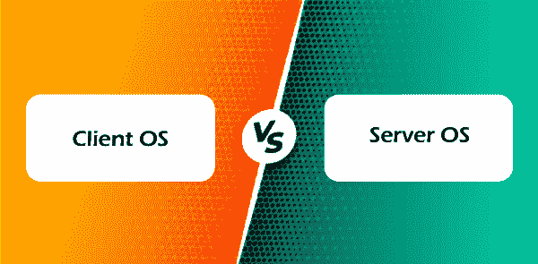

# 客户端操作系统和服务器操作系统的区别

> 原文：<https://www.javatpoint.com/client-operating-system-vs-server-operating-system>

操作系统充当用户和硬件之间的桥梁。操作系统执行各种重要任务，如内存管理、进程处理、文件、控制硬件设备等。它还确保了系统资源和数据的安全。操作系统有几种类型。客户端操作系统和服务器操作系统就是其中的两种。

在本文中，您将了解客户机和服务器操作系统之间的区别。但是在讨论区别之前，您应该了解客户端和服务器操作系统。

## 什么是客户端操作系统？

客户端操作系统是运行在台式计算机和其他便携式设备(如笔记本电脑和智能手机)上的计算机操作系统。它可以处理连接到它的不同硬件组件，如打印机、监视器和照相机。

这些操作系统一次支持一个用户。客户端操作系统可以使用服务器操作系统来获取服务。此外，与服务器操作系统相比，客户端操作系统以较低的成本提供多处理能力。客户端操作系统包括 Windows、Mac、安卓等。

### 客户端操作系统的特性

客户端操作系统的各种功能如下:

1.  它一次只支持一个用户。
2.  它运行在桌面系统和便携式设备上。
3.  部分客户端操作系统是 Windows、安卓、Mac 等。

## 什么是服务器操作系统？

服务器操作系统是运行在服务器上的操作系统。它是操作系统的更高级版本，具有更高效的特性和功能，可为连接到它的其他设备或客户端机器提供多种服务。

有针对软件、高级硬件和网络配置的服务。这些操作系统帮助安装和使用商业和在线网络应用程序。他们还可以管理和监控连接到他们的客户端设备。操作系统命令启动服务器操作系统中的大多数进程。此外，服务器操作系统执行其他管理过程。

有各种操作系统服务器系统。网络服务器操作系统根据客户的要求提供网页等网络资源。同样，服务器操作系统向客户端计算机提供服务。数据库服务器操作系统管理数据库，而文件服务器操作系统向连接的设备提供文件。

### 服务器操作系统的特性

服务器操作系统的各种功能如下:

1.  它可以通过图形用户界面和命令行界面访问服务器。
2.  它控制和监控客户端计算机和操作系统。
3.  它安装和使用网络应用程序和商业应用程序。
4.  它有助于执行操作系统命令中的大多数进程。
5.  它为管理用户、实现安全性和执行其他管理任务提供了一个中央界面。

## 客户端和服务器操作系统的主要区别

在这里，您将了解客户机和服务器操作系统之间的主要区别。客户端和服务器操作系统之间的各种差异如下:

1.  客户端操作系统是运行在台式计算机和其他便携式设备上的操作系统。相比之下，服务器操作系统是为在服务器上安装和使用而开发的操作系统。
2.  客户端操作系统可以从服务器获得服务。相比之下，服务器操作系统可以向许多客户端或最终用户设备提供服务。
3.  一个用户一次只能使用一个客户端操作系统。相比之下，服务器操作系统可以同时为几个客户端设备服务。
4.  客户端操作系统可以在客户端设备上运行，包括平板电脑、台式机、移动电话和笔记本电脑。相反，服务器操作系统可以在服务器上运行。
5.  服务器操作系统比客户端操作系统更高级，功能也更多。
6.  客户端操作系统不如服务器操作系统安全。相比之下，服务器操作系统比客户端操作系统更安全。
7.  客户端操作系统的一些例子有视窗、安卓、苹果等。相比之下，服务器操作系统的一些例子有苹果 OS X、视窗服务器、红帽企业 Linux 等。

## 客户机和服务器操作系统之间的面对面比较

在这里，您将学习客户机和服务器操作系统之间的面对面比较。客户端和服务器操作系统的一些面对面比较如下:

| 操作系统客户端 | 操作系统服务器 |
| 它是一个运行在台式电脑和其他便携式设备上的操作系统。 | 这是一个被开发为安装和使用在服务器上的操作系统。 |
| 这是一个简单易行的操作系统。 | 这是一个复杂的操作系统。 |
| 它提供的安全性不如服务器操作系统。 | 它比客户端操作系统提供了更多的安全性。 |
| 它可能运行在客户端设备上，包括移动电话、台式机、平板电脑和笔记本电脑。 | 它可能在服务器上运行。 |
| 它可能从服务器获得服务。 | 它可能向许多客户端或最终用户设备提供服务。 |
| 它不如服务器操作系统稳定。 | 它比客户端操作系统更稳定。 |
| 它的效率不如服务器操作系统。 | 它比客户端操作系统效率高。 |
| 客户端操作系统的一些例子有安卓、视窗、苹果等。 | 服务器操作系统的一些例子有苹果 OS X、视窗服务器、红帽企业 Linux 等。 |

## 结论

客户机和服务器操作系统是两种不同类型的操作系统。客户端操作系统运行在终端用户设备上，如个人电脑和其他便携式设备。相比之下，服务器操作系统运行在称为服务器的特定设备上。因此，客户端和服务器的操作系统都不同。

* * *