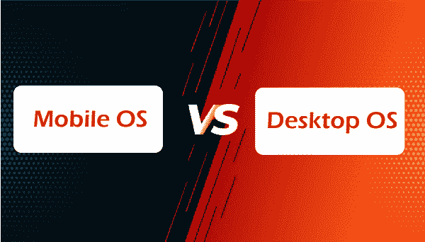

# 移动操作系统和桌面操作系统的区别

> 原文：<https://www.javatpoint.com/mobile-operating-system-vs-desktop-operating-system>

移动和桌面操作系统的开发方式不同，目的也不同。桌面操作系统较旧，在更广泛的人群中有很大的传播和渗透。微软 Windows 和 Mac OS 已经成为最受欢迎的两个操作系统，开源操作系统，包括 Linux、FreeBSD、OpenBSD 和 GNU，也获得了普及。桌面操作系统不是为通过无线网络操作移动设备而设计的。

在本文中，您将了解到**移动操作系统**和**桌面操作系统**的区别。但是在讨论差异之前，您必须了解移动操作系统和桌面操作系统。

## 什么是移动操作系统？

一个**移动操作系统**允许应用软件在移动设备上运行。它在某些方面类似于桌面操作系统，但相比之下更简单、更轻。智能手机操作系统包括 Windows Mobile、Palm webOS、Symbian OS、RIM 的黑莓、安卓、iPhone OS 和 Maemo。WebOS、Android 和 Maemo 都是 Linux 操作系统的变种。iPhone OS 基于 BSD 和 NeXTSTEP，这两个都是和 UNIX 相关的。

移动操作系统结合了计算机和手持设备的功能。他们经常为电话和互联网服务配备蜂窝调制解调器和 SIM 卡托盘。当您获得移动设备时，它会预装特定于设备的操作系统。

### 移动操作系统的特性

移动操作系统有多种功能。移动操作系统的一些功能如下:

1.  它非常容易理解和利用。移动操作系统的图形非常吸引人，其功能非常强大且易于使用。
2.  操作系统专注于控制数据和网络使用。它还将限制和要求保持在焦点上。
3.  它提供了更好的应用。这些应用程序应该简单而有吸引力。

## 什么是桌面操作系统？

桌面操作系统是用户管理个人计算机的环境。它有助于系统硬件和软件资源的管理。例如，Windows、Mac OS 和各种 Linux 发行版。它支持基本功能，包括任务调度、打印、输入/输出、外围控制和内存分配。

在桌面上，操作系统用户需要一个操作系统。操作系统充当程序和系统硬件之间的桥梁。一些操作系统需要安装，而其他操作系统可能会预装在新计算机上。微软视窗、苹果操作系统和 Linux 是最受欢迎的桌面操作系统。图形用户界面是现代操作系统的一个特征。

微软视窗操作系统是在 20 世纪 80 年代中期推出的。Windows 有各种版本，最近的有 **Windows 11 (2021)、Windows 10 (2015)、Windows 8 (2012)、Windows 7 (2009)、**和 **Windows Vista (2007)** 。Windows 预装在大多数新电脑上，使其成为世界上最常见的操作系统。苹果的 MacOS 是另一个众所周知的操作系统。它预装在所有麦金塔电脑上。**莫哈韦(2018 年)、高塞拉(2017 年)**、**塞拉(2016 年)**都是一些主要版本。

### 桌面操作系统的优缺点

桌面操作系统有各种各样的优缺点。桌面操作系统的一些优点和缺点如下:

**优势**

1.  操作系统充当用户和系统硬件之间的桥梁。它使用户能够输入数据、处理数据和查看结果。
2.  它使数据和相关信息能够通过播放器、打印机、调制解调器和传真机与其他用户共享。此外，单个用户可以通过电子邮件同时与几个人共享相同的数据。
3.  当其他程序的性能和软件得到升级以提高其功能时，操作系统必须增加并处理计算机操作的所有方面。它是需要定期更新以跟上许多功能的软件。它可以简单地更新，没有任何问题。
4.  它还有助于减少访问多个数据所需的工作量。
5.  它能够同时处理多个任务。它使用户能够同时完成几项任务。
6.  一个系统的故障不会影响其他系统，因为每个系统组件都是相互独立的。

**缺点**

1.  它是一个开源操作系统，所有其他平台都被认为是昂贵的。即使客户选择使用免费的操作系统，它也不总是最佳选择，因为它缺少一些功能。
2.  碎片化是将存储的内存分成碎片的过程。如果进程需要比分配给它的更多的空间来执行进程，这将导致存储空间不足。因此，该过程将占用更少的空间，导致内部碎片。内部碎片也是操作系统的一个风险。
3.  没有操作系统，计算机就无法工作。因此，操作系统中的任何故障都会对整个系统产生影响。
4.  病毒在操作系统中总是更危险。用户可能会不知不觉地下载危险程序、浏览恶意网站或打开感染病毒的电子邮件附件，所有这些都可能使计算机暴露于病毒之下。

## 移动和桌面操作系统的主要区别

在这里，您将了解移动和桌面操作系统之间的主要区别。移动操作系统和桌面操作系统之间的主要差异如下:

1.  移动操作系统是一种允许应用软件在移动设备上运行的操作系统。另一方面，桌面操作系统是用户处理个人计算机的环境。
2.  移动操作系统使用闪存驱动器来存储数据。另一方面，桌面操作系统使用硬盘和闪存驱动器来存储数据。
3.  移动操作系统需要最小的内存来优化。另一方面，桌面操作系统需要巨大的内存来操作。
4.  移动操作系统处理蜂窝和无线连接以及设备访问。另一方面，桌面操作系统处理系统的软硬件资源。
5.  移动操作系统运行在触摸屏或触摸板设备上。另一方面，桌面操作系统运行在许多输入设备上，包括鼠标、键盘等。
6.  移动操作系统启动时间更短。另一方面，桌面操作系统的启动速度要慢得多。
7.  移动操作系统经过优化，可以在更低的功耗下工作，并且具有避免能量损失的功能。另一方面，桌面操作系统不容易针对能耗进行优化。
8.  移动操作系统的例子有苹果操作系统、黑莓操作系统、iPhone、谷歌安卓、八达、塞班操作系统、掌上操作系统、视窗移动操作系统、鸿蒙系统、网络操作系统等。相比之下，桌面操作系统的一些例子是 Windows 10、MacOS、Windows Vista 等。

## 移动和桌面操作系统之间的面对面比较

在这里，您将学习移动和桌面操作系统之间的面对面比较。移动和桌面操作系统之间的一些比较如下:

| 特征 | 移动操作系统 | 桌面操作系统 |
| 定义 | 它是一种允许应用软件在移动设备上运行的操作系统。 | 它是用户操作个人计算机的环境。 |
| 内存需求 | 它需要最小的内存来优化。 | 它需要巨大的内存来操作。 |
| 仓库 | 它使用闪存驱动器来存储数据。 | 它使用硬盘和闪存驱动器来存储数据。 |
| 启动时间 | 启动时间更短。 | 启动需要很长时间。 |
| 目的 | 它处理蜂窝和无线连接以及设备访问。 | 它处理系统的软件和硬件资源。 |
| 力量 | 它经过优化，可在最低功耗下工作，并具有防止能量损失的功能。 | 它不容易针对能量损失进行优化。 |
| 连接 | 它运行在触摸屏或触摸板设备上。 | 它通过许多输入设备运行，包括鼠标、键盘等。 |
| 例子 | 移动操作系统的例子有苹果操作系统、谷歌安卓、八达、掌上操作系统、塞班操作系统、视窗移动操作系统、黑莓操作系统、苹果手机、鸿蒙系统、网络操作系统等。 | 桌面操作系统的一些例子有 Windows 10、MacOS、Windows Vista 等。 |

* * *