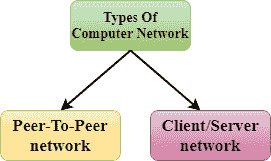
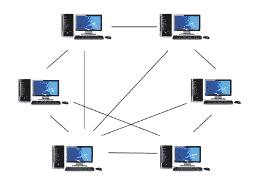
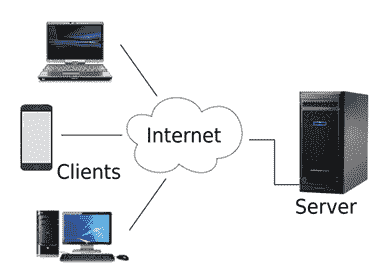

# 计算机网络体系结构

> 原文：<https://www.javatpoint.com/computer-network-architecture>

计算机网络体系结构被定义为数据传输的软件、硬件、协议和介质的物理和逻辑设计。简单地说，我们可以说计算机是如何组织的，任务是如何分配给计算机的。

**使用两种网络架构:**

*   对等网络
*   客户端/服务器网络

* * *

## 对等网络

*   对等网络是一种网络，在这种网络中，所有的计算机都以同等的权限和责任连接在一起处理数据。
*   点对点网络适用于小型环境，通常最多 10 台计算机。
*   点对点网络没有专用服务器。
*   为每台计算机分配了共享资源的特殊权限，但是如果拥有该资源的计算机出现故障，这可能会导致问题。

### 对等网络的优势:

*   它的成本较低，因为它不包含任何专用服务器。
*   如果一台计算机停止工作，但其他计算机不会停止工作。
*   由于每台计算机都自行管理，因此很容易设置和维护。

### 对等网络的缺点:

*   在对等网络的情况下，它不包含集中式系统。因此，它无法备份数据，因为不同位置的数据不同。
*   由于设备是自己管理的，因此存在安全问题。

* * *

## 客户端/服务器网络

*   客户机/服务器网络是为被称为客户机的终端用户设计的网络模型，以访问诸如歌曲、视频等资源。从称为服务器的中央计算机。
*   中央控制器被称为**服务器**，而网络中的所有其他计算机被称为**客户端**。
*   服务器执行所有主要操作，如安全和网络管理。
*   服务器负责管理所有资源，如文件、目录、打印机等。
*   所有客户端都通过服务器相互通信。例如，如果 client1 想向 client 2 发送一些数据，那么它首先向服务器发送权限请求。服务器向客户端 1 发送响应以启动其与客户端 2 的通信。

### 客户端/服务器网络的优势:

*   客户机/服务器网络包含集中式系统。因此，我们可以很容易地备份数据。
*   客户机/服务器网络有一个专用服务器，可以提高整个系统的整体性能。
*   客户机/服务器网络的安全性更好，因为单个服务器管理共享资源。
*   这也提高了资源共享的速度。

### 客户端/服务器网络的缺点:

*   客户机/服务器网络很昂贵，因为它要求服务器具有大内存。
*   服务器有一个网络操作系统(NOS)来为客户端提供资源，但是 NOS 的成本非常高。
*   它需要一个专门的网络管理员来管理所有资源。

* * *