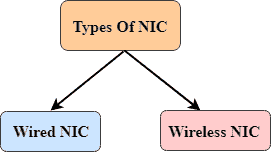

# 计算机网络组件

> 原文：<https://www.javatpoint.com/computer-network-components>

计算机网络组件是*安装软件*所需的*主要部件*。一些重要的网络组件有**网卡**、**交换机**、**电缆**、**集线器**、**路由器**、**调制解调器**。根据我们需要安装的网络类型，也可以删除一些网络组件。例如，无线网络不需要电缆。

以下是安装网络所需的主要组件:

## 国民保险分担

*   网卡代表网络接口卡。
*   网卡是一种硬件组件，用于将一台计算机与另一台计算机连接到网络上
*   它可以支持 10，100 到 1000 Mb/s 的传输速率。
*   媒体访问控制地址或物理地址编码在网卡芯片上，网卡芯片由 IEEE 分配，用于唯一识别网卡。媒体访问控制地址存储在可编程只读存储器中。

### 网卡有两种类型:

1.  有线网卡
2.  无线网卡

**有线网卡:**有线网卡位于主板内部。电缆和连接器与有线网卡一起使用来传输数据。

**无线网卡:**无线网卡包含通过无线网络获得连接的天线。例如，笔记本电脑包含无线网卡。

* * *

## 中心

集线器是一种硬件设备，它将网络连接划分给多个设备。当计算机从网络请求一些信息时，它首先通过电缆将请求发送到集线器。集线器将向整个网络广播此请求。所有设备将检查请求是否属于它们。如果没有，请求将被丢弃。

集线器使用的过程会消耗更多带宽，并限制通信量。如今，集线器的使用已经过时，取而代之的是更先进的计算机网络组件，如交换机、路由器。

* * *

## 转换

交换机是连接计算机网络上多个设备的硬件设备。交换机包含比集线器更多的高级功能。交换机包含决定数据传输或不传输的更新表。交换机根据传入消息中的物理地址将消息传递到正确的目的地。交换机不会像集线器一样将消息广播到整个网络。它确定消息要传输到的设备。因此，我们可以说交换机提供了源和目的地之间的直接连接。它提高了网络的速度。

* * *

## 路由器

*   路由器是一种硬件设备，用于连接局域网和互联网。它用于接收、分析传入的数据包并将其转发到另一个网络。
*   路由器在现场视察参考模型的第 3 层(网络层)工作。
*   路由器根据路由表中的信息转发数据包。
*   它从传输数据包的可用路径中确定最佳路径。

### 路由器的优势:

*   **安全性:**传输到网络的信息将穿过整个电缆，但只有被寻址的指定设备才能读取数据。
*   **可靠性:**如果服务器已经停止运行，网络将关闭，但路由器服务的其他网络不会受到影响。
*   **性能:**路由器增强了网络的整体性能。假设一个网络中有 24 个工作站产生相同数量的流量。这增加了网络上的流量负载。路由器将单个网络分成两个网络，每个网络有 12 个工作站，将流量负载减少一半。
*   **网络范围**

* * *

## 调制解调器

*   调制解调器是一种硬件设备，它允许计算机通过现有的电话线连接到互联网。
*   调制解调器没有与主板集成，而是安装在主板上的 PCI 插槽上。
*   它代表调制器/解调器。它通过电话线将数字数据转换成模拟信号。

根据速度和传输速率的不同，调制解调器可以分为以下几类:

*   标准电脑调制解调器或拨号调制解调器
*   蜂窝调制解调器
*   有线通

* * *

## 电缆和连接器

电缆是用于传输信号的传输介质。

传输中使用的电缆有三种:

*   双绞线电缆
*   同轴电缆
*   光纤电缆

* * *