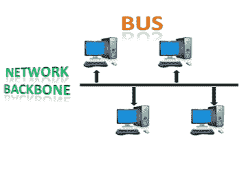
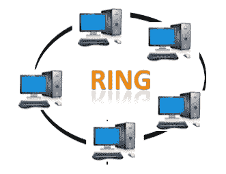
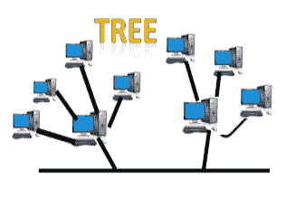
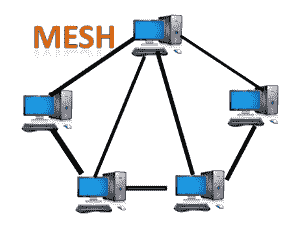
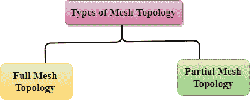
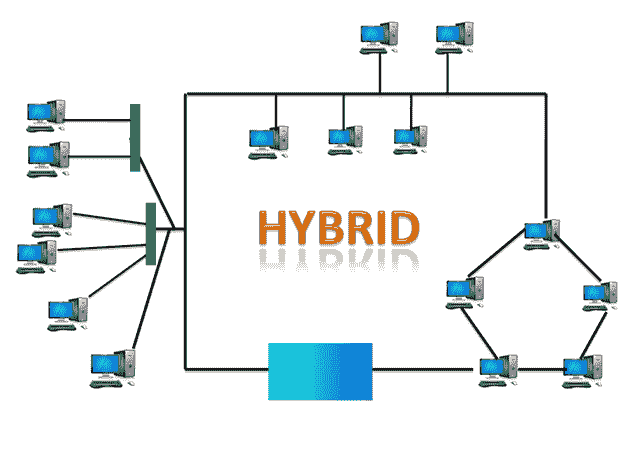

# 什么是拓扑？

> 原文：<https://www.javatpoint.com/computer-network-topologies>

拓扑定义了所有组件如何相互连接的网络结构。拓扑有两种类型:物理拓扑和逻辑拓扑。

物理拓扑是网络中所有节点的几何表示。

* * *

## 总线拓扑

*   总线拓扑的设计方式是，所有站点都通过一根称为主干电缆的电缆连接。
*   每个节点要么通过引入电缆连接到主干电缆，要么直接连接到主干电缆。
*   当节点想要通过网络发送消息时，它会通过网络发送消息。网络中所有可用的站都将接收到消息，不管它是否被寻址。
*   总线拓扑主要用于 802.3(以太网)和 802.4 标准网络。
*   与其他拓扑相比，总线拓扑的配置非常简单。
*   主干电缆被认为是一条**“单行道”**，通过它消息被广播到所有的站点。
*   总线拓扑中最常见的访问方法是 **CSMA** (载波侦听多路访问)。

**CSMA:** 它是一种媒体访问控制，用于控制数据流，以保持数据完整性，即数据包不会丢失。当两个节点同时发送消息时，有两种处理问题的替代方法。

*   **CSMA CD:** CSMA CD ( **碰撞检测**)是用于检测碰撞的访问方法。一旦检测到冲突，发送方将停止传输数据。因此，它在**碰撞后的恢复**上工作。
*   **CSMA CA:** **CSMA CA(防撞)**是一种通过检查传输介质是否繁忙来避免冲突的接入方式。如果忙，则发送方等待，直到介质空闲。这种技术有效地降低了碰撞的可能性。它对“碰撞后的恢复”不起作用。

### 总线拓扑的优势:

*   **低成本电缆:**在总线拓扑中，节点直接与电缆相连，不经过集线器。因此，安装的初始成本很低。
*   **中等数据速度:**同轴或双绞线电缆主要用于支持高达 10 Mbps 的基于总线的网络。
*   **熟悉的技术:**总线拓扑是一种熟悉的技术，因为安装和故障排除技术是众所周知的，并且硬件组件很容易获得。
*   **有限故障:**一个节点的故障不会对其他节点产生任何影响。

### 总线拓扑的缺点:

*   **大量布线:**总线拓扑相当简单，但仍然需要大量布线。
*   **疑难故障排除:**需要专门的测试设备来确定电缆故障。如果电缆出现任何故障，就会中断所有节点的通信。
*   **信号干扰:**如果两个节点同时发送消息，那么两个节点的信号就会发生冲突。
*   **重新配置困难:**向网络添加新设备会降低网络速度。
*   **衰减:**衰减是信号丢失导致的通信问题。中继器用于再生信号。

* * *

## 环形拓扑

*   环形拓扑类似于总线拓扑，但两端相连。
*   从上一台计算机接收消息的节点将重新传输到下一个节点。
*   数据单向流动。
*   数据在单个循环中连续流动，称为循环。
*   它没有终止端，即每个节点连接到另一个节点，并且没有终止点。
*   环形拓扑中的数据以顺时针方向流动。
*   环形拓扑最常见的访问方法是**令牌传递**。
    *   **令牌传递:**是一种将令牌从一个节点传递到另一个节点的网络接入方式。
    *   **令牌:**它是一个在网络中循环的框架。

### 令牌传递的工作原理

*   令牌在网络上移动，它在计算机之间传递，直到到达目的地。
*   发送方通过将地址和数据放在一起来修改令牌。
*   数据从一个设备传递到另一个设备，直到目的地址匹配。一旦令牌被目的设备接收到，它就向发送方发送确认。
*   在环形拓扑中，令牌用作载体。

### 环形拓扑的优势:

*   **网络管理:**故障设备可以从网络中移除，而不会导致网络瘫痪。
*   **产品可用性:**网络运行和监控的软硬件工具很多。
*   **成本:**双绞线布线价格低廉且容易获得。因此，安装成本非常低。
*   **可靠:**由于通信系统不依赖于单个主机，因此是一个更可靠的网络。

### 环形拓扑的缺点:

*   **疑难故障排除:**需要专门的测试设备来确定电缆故障。如果电缆出现任何故障，就会中断所有节点的通信。
*   **故障:**一站故障导致整体网络故障。
*   **重新配置困难:**向网络添加新设备会降低网络速度。
*   **延迟:**通信延迟与节点数成正比。添加新设备会增加通信延迟。

* * *

## 星形布局

*   星型拓扑是一种网络布局，其中每个节点都连接到中央集线器、交换机或中央计算机。
*   中央计算机被称为**服务器**，连接到服务器的外围设备被称为**客户端**。
*   同轴电缆或 RJ-45 电缆用于连接计算机。
*   集线器或交换机主要用作**物理星型拓扑**中的连接设备。
*   星型拓扑是网络实现中最流行的拓扑。

### 星型拓扑的优势

*   **高效故障排除:**与总线拓扑相比，星型拓扑中的故障排除效率相当高。在总线拓扑中，管理人员必须检查几公里长的电缆。在星型拓扑中，所有站点都连接到集中式网络。因此，网络管理员必须去单站解决问题。
*   **网络控制:**复杂的网络控制功能可以在星型拓扑中轻松实现。星型拓扑中所做的任何更改都会自动适应。
*   **有限故障:**由于每个站都用自己的电缆连接到中心集线器，因此一根电缆的故障不会影响整个网络。
*   **熟悉的技术:**星型拓扑是一种熟悉的技术，因为其工具具有成本效益。
*   **易于扩展:**它易于扩展，因为可以将新站点添加到集线器上的开放端口。
*   **性价比高:**星型拓扑网络使用廉价的同轴电缆，因此性价比高。
*   **高数据速度:**支持约 100Mbps 的带宽。以太网 100BaseT 是最流行的星型拓扑网络之一。

### 星型拓扑的缺点

*   **中央故障点:**如果中央集线器或交换机发生故障，则所有连接的节点将无法相互通信。
*   **电缆:**当需要大量布线时，有时电缆布线变得困难。

* * *

## 树形布局

*   树形拓扑结合了总线拓扑和星型拓扑的特点。
*   树形拓扑是一种所有计算机以分层方式相互连接的结构。
*   树拓扑中最顶端的节点称为根节点，所有其他节点都是根节点的后代。
*   两个节点之间只有一条数据传输路径。因此，它形成了父子层次结构。

### 树形拓扑的优点

*   **支持宽带传输:**树形拓扑主要用于提供宽带传输，即信号远距离发送而不衰减。
*   **易于扩展:**我们可以将新设备添加到现有网络中。因此，我们可以说树形拓扑很容易扩展。
*   **易于管理:**在树形拓扑中，整个网络被划分为称为星型网络的网段，这些网段易于管理和维护。
*   **错误检测:**在树形拓扑中，错误检测和错误纠正非常容易。
*   **有限故障:**一站故障不影响整个网络。
*   **点对点布线:**有单个段的点对点布线。

### 树形拓扑的缺点

*   **故障排除困难:**如果节点出现任何故障，那么故障排除就会变得困难。
*   **高成本:**宽带传输所需的设备非常昂贵。
*   **故障:**树形拓扑主要依靠主总线电缆，主总线电缆出现故障会破坏整体网络。
*   **重新配置困难:**如果增加了新设备，那么重新配置就变得困难。

* * *

## 网状拓扑

*   网状技术是一种网络安排，其中计算机通过各种冗余连接相互连接。
*   从一台计算机到另一台计算机有多条路径。
*   它不包含交换机、集线器或任何充当中央通信点的中央计算机。
*   互联网是网状拓扑的一个例子。
*   网状拓扑主要用于通信故障是一个关键问题的广域网实施。
*   网状拓扑主要用于无线网络。
*   网格拓扑可以用公式形成:
    **电缆数量=(n *(n-1))/2；**

其中 n 是代表网络的节点数。

**网状拓扑分为两类:**

*   全连接网状拓扑
*   部分连接网状拓扑

*   **全网状拓扑:**在全网状拓扑中，每台计算机都连接到网络中所有可用的计算机。
*   **部分网状拓扑:**在部分网状拓扑中，除了某些计算机之外，并非所有计算机都连接到它们经常与之通信的那些计算机。

### 网状拓扑的优势:

**可靠:**网状拓扑网络非常可靠，好像任何链路故障都不会影响连接的计算机之间的通信。

**快速通信:**节点之间的通信非常快。

**更容易重新配置:**添加新设备不会中断其他设备之间的通信。

### 网状拓扑的缺点

*   **成本:**网状拓扑比其他拓扑包含大量连接的设备，如路由器和更多的传输介质。
*   **管理:**网状拓扑网络非常大，非常难以维护和管理。如果网络没有被仔细监控，那么通信链路故障就不会被检测到。
*   **效率:**在这种拓扑中，冗余连接很高，会降低网络的效率。

* * *

## 混合拓扑

*   各种不同拓扑的组合被称为**混合拓扑**。
*   混合拓扑是不同链路和节点之间传输数据的连接。
*   当两个或多个不同的拓扑组合在一起时，称为混合拓扑，如果相似的拓扑相互连接，则不会产生混合拓扑。例如，如果 ICICI 组的一个分支中存在环形拓扑，而 ICICI 组的另一个分支中存在总线拓扑，则连接这两种拓扑将产生混合拓扑。

### 混合拓扑的优势

*   **可靠:**如果网络的任何部分发生故障，都不会影响网络其他部分的运行。
*   **可扩展:**在不影响现有网络功能的情况下，可以通过添加新设备轻松扩展网络规模。
*   **灵活:**这种拓扑非常灵活，因为可以根据组织的需求进行设计。
*   **有效:**混合拓扑非常有效，因为它可以设计为网络的强度最大化，网络的弱点最小化。

### 混合拓扑的缺点

*   **复杂设计:**混合拓扑的主要缺点是混合网络的设计。混合网络的架构设计非常困难。
*   **昂贵的集线器:**混合拓扑中使用的集线器非常昂贵，因为这些集线器不同于其他拓扑中使用的普通集线器。
*   **昂贵的基础设施:**基础设施成本非常高，因为混合网络需要大量布线、网络设备等。

* * *