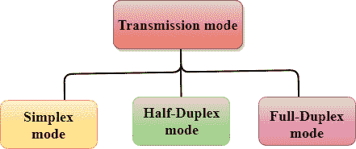
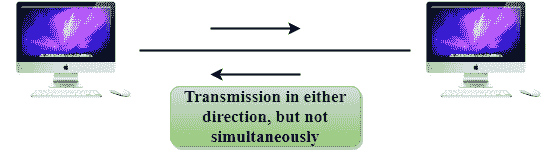

# 传输模式

> 原文：<https://www.javatpoint.com/computer-network-transmission-modes>

*   数据从一台设备传输到另一台设备的方式称为**传输模式**。
*   传输模式也称为通信模式。
*   每个通信信道都有一个相关的方向，传输介质提供方向。因此，传输模式也称为定向模式。
*   传输模式在物理层定义。

传输模式分为三类:

*   单工模式
*   半双工模式
*   全双工模式

* * *

## 单工模式

*   在单工模式下，通信是单向的，即数据流是单向的。
*   设备只能发送数据但不能接收数据，或者可以接收数据但不能发送数据。
*   这种传输模式不是很流行，因为通信主要需要双向数据交换。单工模式用于商业领域，如不需要任何相应回复的销售。
*   无线电台是单工频道，因为它向听众发送信号，但从不允许他们发回信号。
*   键盘和显示器是单工模式的例子，因为键盘只能接受来自用户的数据，而显示器只能用于在屏幕上显示数据。
*   单工模式的主要优点是在传输期间可以利用通信信道的全部容量。

### 单工模式的优势:

*   在单工模式下，基站可以利用通信信道的整个带宽，这样一次可以传输更多的数据。

### 单工模式的缺点:

*   通信是单向的，因此设备之间没有相互通信。

* * *

## 半双工模式

*   在半双工信道中，方向可以颠倒，即站也可以发送和接收数据。
*   消息双向流动，但不是同时流动。
*   通信信道的整个带宽一次在一个方向上使用。
*   在半双工模式下，可以执行错误检测，如果出现任何错误，接收方将请求发送方重新传输数据。
*   对讲机是半双工模式的一个例子。在对讲机中，一方说话，另一方听。暂停后，另一方发言，第一方聆听。同时说话会产生听不懂的失真声音。

### 半双工模式的优势:

*   在半双工模式下，两个设备都可以发送和接收数据，并且还可以在数据传输期间利用通信信道的整个带宽。

### 半双工模式的缺点:

*   在半双工模式下，当一台设备发送数据时，另一台设备必须等待，这将导致在正确的时间发送数据的延迟。

* * *

## 全双工模式

*   在全双工模式下，通信是双向的，即数据双向流动。
*   两个站可以同时发送和接收消息。
*   全双工模式有两个单工通道。一个通道有一个方向的流量，另一个通道有相反方向的流量。
*   全双工模式是设备间最快的通信模式。
*   全双工模式最常见的例子是电话网络。当两个人通过电话线相互交流时，两个人都可以同时说话和听。

### 全双工模式的优势:

*   两个站可以同时发送和接收数据。

### 全双工模式的缺点:

*   如果设备之间不存在专用路径，则通信信道的容量分为两部分。

* * *

## 单工、半双工和全双工模式的区别

| 比较的基础 | 单工模式 | 半双工模式 | 全双工模式 |
| 沟通方向 | 在单工模式下，通信是单向的。 | 在半双工模式下，通信是双向的，但一次一个。 | 在全双工模式下，通信是双向的。 |
| 发送/接收 | 设备只能发送数据但不能接收数据，或者只能接收数据但不能发送数据。 | 这两个设备都可以发送和接收数据，但一次只能发送一个。 | 这两个设备可以同时发送和接收数据。 |
| 表演 | 半双工模式的性能优于单工模式。 | 全双工模式的性能优于半双工模式。 | 全双工模式在单工和半双工模式中具有更好的性能，因为它使通信信道的容量利用率加倍。 |
| 例子 | 单工模式的例子有收音机、键盘和显示器。 | 半双工的例子是对讲机。 | 全双工模式的例子是电话网络。 |

* * *