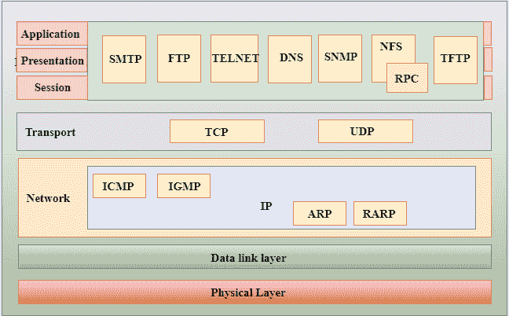
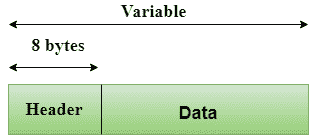
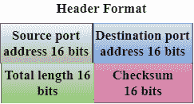

# TCP/IP 模型

> 原文：<https://www.javatpoint.com/computer-network-tcp-ip-model>

*   TCP/IP 模型是在现场视察模型之前开发的。
*   TCP/IP 模型与现场视察模型并不完全相似。
*   TCP/IP 模型由五层组成:应用层、传输层、网络层、数据链路层和物理层。
*   前四层提供与 OSI 模型前四层相对应的物理标准、网络接口、互联网络和传输功能，这四层在 TCP/IP 模型中由称为应用层的单层表示。
*   TCP/IP 是由交互模块组成的分层协议，每个模块都提供特定的功能。

这里，分层意味着每个上层协议都由两个或多个下层协议支持。

## TCP/IP 层的功能:

## 网络接入层

*   网络层是 TCP/IP 模型的最底层。
*   网络层是现场视察参考模型中定义的物理层和数据链路层的组合。
*   它定义了如何通过网络物理发送数据。
*   该层主要负责同一网络上两台设备之间的数据传输。
*   该层执行的功能是将 IP 数据报封装到网络传输的帧中，并将 IP 地址映射到物理地址。
*   该层使用的协议有以太网、令牌环、FDDI、X.25、帧中继。

## 互联网层

*   互联网层是 TCP/IP 模型的第二层。
*   互联网层也被称为网络层。
*   互联网层的主要职责是从任何网络发送数据包，无论数据包采用何种路由，它们都会到达目的地。

### 该层中使用的协议如下:

**IP 协议:**该层采用 IP 协议，是整个 TCP/IP 套件中最有意义的部分。

本协议的责任如下:

*   **IP 寻址:**该协议实现称为 IP 地址的逻辑主机地址。互联网和更高层使用 IP 地址来识别设备并提供互联网路由。
*   **主机到主机的通信:**它决定了数据传输的路径。
*   **数据封装和格式化:**一个 IP 协议接受来自传输层协议的数据。IP 协议确保数据被安全地发送和接收，它将数据封装成称为 IP 数据报的消息。
*   **分片和重组:**数据链路层协议对 IP 数据报大小的限制称为最大传输单位(MTU)。如果 IP 数据报的大小大于 MTU 单位，则 IP 协议会将数据报拆分成更小的单位，以便它们可以在本地网络上传输。分片可以由发送方或中间路由器完成。在接收端，所有的片段都被重组以形成原始消息。
*   **路由:**当 IP 数据报通过局域网、城域网、广域网等相同的本地网络发送时，称为直接传递。当源和目的地在远程网络上时，则间接发送 IP 数据报。这可以通过路由器等各种设备路由 IP 数据报来实现。

**ARP 协议**

*   ARP 代表**地址解析协议**。
*   ARP 是一种网络层协议，用于从 IP 地址中找到物理地址。
*   **这两个术语主要与 ARP 协议相关联:**
    *   **ARP 请求:**当发送方想知道设备的物理地址时，会向网络广播 ARP 请求。
    *   **ARP 回复:**连接到网络的每台设备都会接受 ARP 请求并处理该请求，但只有接收方识别出 IP 地址，并以 ARP 回复的形式发回其物理地址。接收者将物理地址添加到其高速缓冲存储器和数据报报头中

**ICMP 协议**

*   **ICMP** 代表互联网控制消息协议。
*   主机或路由器使用这种机制向发送方发回有关数据报问题的通知。
*   数据报在路由器之间传输，直到到达目的地。如果路由器因某些异常情况(如链路被禁用、设备着火或网络拥塞)而无法路由数据，则使用 ICMP 协议通知发送方数据报无法发送。
*   ICMP 协议主要使用两个术语:
    *   **ICMP 测试:** ICMP 测试用于测试目的地是否可达。
    *   **ICMP 回复:** ICMP 回复用于检查目的设备是否有响应。
*   ICMP 协议的核心职责是报告问题，而不是纠正问题。更正的责任在于发送者。
*   ICMP 只能将消息发送到源，而不能发送到中间路由器，因为 IP 数据报携带的是源和目的地的地址，而不是它要传递到的路由器的地址。

* * *

## 传输层

传输层负责通过网络发送的数据的可靠性、流量控制和纠正。

传输层使用的两个协议是**用户数据报协议和**传输控制协议。

*   **用户数据报协议**
    *   它提供无连接服务和端到端传输。
    *   这是一个不可靠的协议，因为它发现错误，但不指定错误。
    *   用户数据报协议发现错误，ICMP 协议向发送方报告用户数据报已损坏的错误。
    *   **UDP 由以下字段组成:**
        **源端口地址:**源端口地址是创建消息的应用程序的地址。
        **目的端口地址:**目的端口地址是接收报文的应用程序的地址。
        **总长度:**定义用户数据报的总字节数，单位为字节。
        **校验和:**校验和是用于错误检测的 16 位字段。
    *   UDP 不指定哪个数据包丢失。UDP 只包含校验和；它不包含任何数据段的标识。

*   **传输控制协议(TCP)**
    *   它为应用程序提供完整的传输层服务。
    *   它在发送方和接收方之间创建了一个虚拟电路，并且在传输期间处于活动状态。
    *   TCP 是一种可靠的协议，因为它可以检测到错误并重新传输损坏的帧。因此，它确保在传输被认为完成并丢弃虚电路之前，必须接收并确认所有数据段。
    *   在发送端，TCP 将整个消息分成更小的单元，称为段，每个段包含一个序列号，这是重新排序帧以形成原始消息所需的。
    *   在接收端，TCP 收集所有的数据段，并根据序列号对它们进行重新排序。

* * *

## 应用层

*   应用层是 TCP/IP 模型中的最顶层。
*   它负责处理高级协议和表示问题。
*   该层允许用户与应用程序交互。
*   当一个应用层协议想要与另一个应用层通信时，它会将其数据转发到传输层。
*   应用层出现了歧义。除了与通信系统交互的应用程序之外，不能将每个应用程序都放在应用层内。例如:网页浏览器使用 **HTTP** 协议与网络交互时，应用层不能考虑文本编辑器，其中 **HTTP** 协议是应用层协议。

### 下面是应用层使用的主要协议:

*   **http:** http stands for hypertext transfer protocol. This protocol allows us to access data through the World Wide Web. It transmits data in the form of plain text, audio and video. It is called Hypertext Transfer Protocol, because it is very efficient in hypertext environment, in which one document can jump quickly from another.
*   **SNMP:** SNMP stands for simple network management protocol. It is a framework for managing devices on the Internet by using TCP/IP protocol suite.
*   **SMTP:** SMTP stands for simple mail transfer protocol. The TCP/IP protocol that supports e-mail is called Simple Mail Transfer Protocol. This protocol is used to send data to another email address.
*   **DNS:** DNS stands for the domain name system. The IP address is used to uniquely identify the connection between the host and the Internet. However, people prefer names to addresses. Therefore, the system that maps names to addresses is called domain name system.
*   **Telnet:** is the abbreviation of terminal network. It establishes the connection between the local computer and the remote computer, so that the local terminal looks like the terminal on the remote system.
*   **FTP:** FTP stands for file transfer protocol. FTP is a standard Internet protocol for transferring files from one computer to another.