# 数字传输

> 原文：<https://www.javatpoint.com/computer-network-digital-transmission>

数据可以用模拟或数字形式表示。计算机使用数字形式存储信息。因此，数据需要转换成数字形式，以便计算机使用。

## 数字到数字转换

数字到数字编码是用数字信号表示数字信息。当计算机产生的二进制 1 和 0 被转换成可以通过导线传播的电压脉冲序列时，这个过程被称为数字到数字编码。

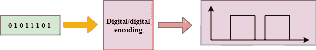

数字到数字编码分为三类:

*   单极编码
*   极坐标编码
*   双极编码

* * *

## 单极的

*   数字传输系统通过有线或电缆等介质链路发送电压脉冲。
*   在大多数类型的编码中，一个电压电平代表 0，另一个电压电平代表 1。
*   每个脉冲的极性决定了它是正的还是负的。
*   这种类型的编码被称为单极编码，因为它只使用一种极性。
*   在单极编码中，极性被分配给 1 二进制状态。
*   在这种情况下，1 表示为正值，0 表示为零值。
*   在单极编码中，“1”被认为是高电压，“0”被认为是零电压。
*   单极编码实现起来更简单，成本也更低。

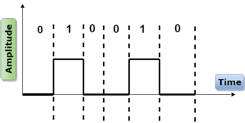

单极编码有两个问题，使得这种方案不太理想:

*   直流分量
*   同步

* * *

## 极地的

*   极性编码是一种使用两个电压电平的编码方案:一个是正的，另一个是负的。
*   通过使用两个电压电平，降低了平均电压电平，并且减轻了单极编码方案的 DC 分量问题。

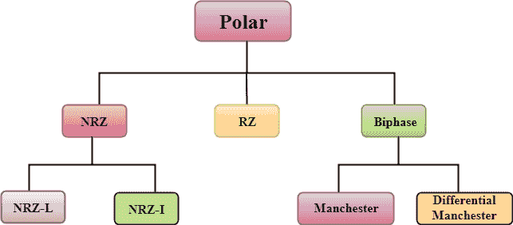

### 不归零制

*   NRZ 代表不归零。
*   在 NRZ 编码中，信号的电平可以表示为正或负。

**NRZ 最常用的两种方法是:**

**NRZ-L:** 在 NRZ-L 编码中，信号的电平取决于它所代表的位的类型。如果一个位是 0 或 1，那么它们的电压将分别为正和负。因此，我们可以说信号的电平取决于位的状态。

**NRZ-I:** NRZ-I 是表示 1 位的电压电平的反转。在 NRZ-I 编码方案中，在代表 1 位的正电压和负电压之间发生转换。在该方案中，0 位表示没有变化，1 位表示电压电平的变化。

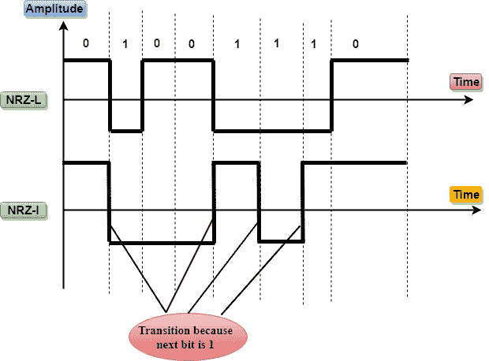

### 归零制

*   RZ 代表归零。
*   每个位必须有一个信号变化，以实现同步。然而，为了每一点都改变，我们需要有三个值:正、负和零。
*   RZ 是一种提供三个值的编码方案，正电压代表 1，负电压代表 0，零电压代表无。
*   在 RZ 方案中，在每个间隔的中途，信号返回到零。
*   在 RZ 方案中，1 位由正对零表示，0 位由负对零表示。

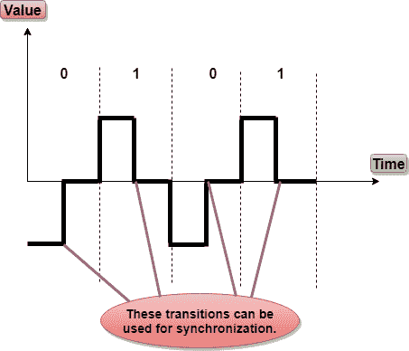

**RZ 劣势:**

它执行两次信号改变来编码一个获得更多带宽的位。

### 双相

*   双相是一种编码方案，其中信号在比特间隔的中间改变，但不归零。

双相编码以两种不同的方式实现:

**曼彻斯特**

*   它在比特间隔的中间改变信号，但是不返回到零以进行同步。
*   在曼彻斯特编码中，负向正转换表示二进制 1，正向负转换表示 0。
*   曼彻斯特具有与 RZ 方案相同的同步级别，只是它具有两个级别的幅度。

**微分曼彻斯特**

*   它在同步位间隔的中间改变信号，但是在间隔开始时是否有转换决定了位。转变意味着二进制 0，没有转变意味着二进制 1。
*   在曼彻斯特编码方案中，两个信号变化表示 0，一个信号变化表示 1。

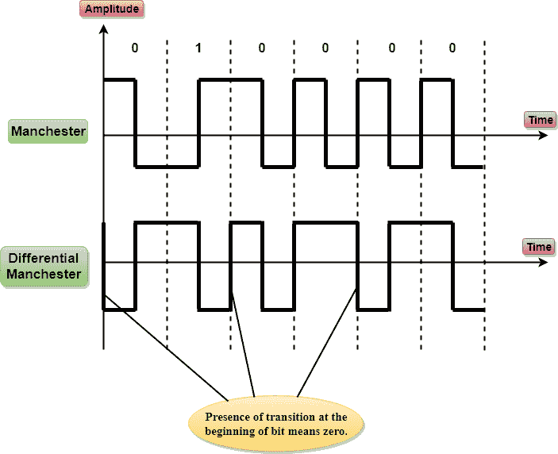

* * *

## 双极的

*   双极编码方案代表三个电压电平:正、负和零。
*   在双极编码方案中，零电平代表二进制 0，二进制 1 由正负电压交替表示。
*   如果第一个 1 位用正幅度表示，那么第二个 1 位用负电压表示，第三个 1 位用正幅度表示，以此类推。即使 1 位不连续，这种交替也可能发生。

**双极可分为:**

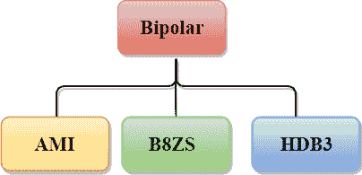

### 高级材料情报(Advanced Material Information)

*   AMI 代表 ***交替标记反转*** ，标记工作来自电报，意思是 1。所以，可以重新定义为**交替 1 反转**。
*   在双极 AMI 编码方案中，0 位由零电平表示，1 位由正负电压交替表示。

**优势:**

*   DC 分量为零。
*   1 位序列被同步。

**劣势:**

*   这种编码方案不能确保长串 0 位的同步。

### B8ZS

*   B8ZS 代表**双极 8-零替代**。
*   北美采用这种技术来提供长序列 0 位的同步。
*   在大多数情况下，B8ZS 的功能类似于双极性 AMI，但唯一的区别是，当出现长的 0 位序列时，它提供同步。
*   B8ZS 通过在 0 字符串模式内提供称为违例的强制人工信号更改来确保 0 长字符串的同步。
*   当出现八个 0 时，B8ZS 根据前一个 1 位的极性对 0 字符串模式进行一些更改。
*   如果前一个 1 位的极性为正，则八个 0 将被编码为零、零、零、正、负、零、负、正。

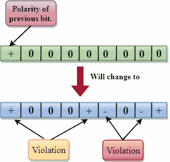

*   如果前 1 位的极性为负，则八个 0 将被编码为零、零、零、负、正、零、正、负。

### HDB3

*   HDB3 代表**高密度双极 3** 。
*   HDB3 技术最早在欧洲和日本采用。
*   HDB3 技术旨在提供长序列 0 位的同步。
*   在 HDB3 技术中，违规模式基于前一位的极性。
*   当出现四个 0 时，HDB3 查看自上次替换以来出现的 1 位数。
*   如果 1 的位数是奇数，则在 0 的第四个连续位发生违规。如果前一位的极性为正，则违规为正。如果前一位的极性为负，则违规为负。

**如果自最后一次替换以来的 1 位数是奇数。**

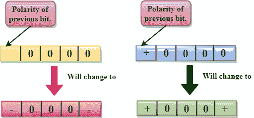

如果 1 的位数是偶数，则在第一个和第四个连续 0 的位置发生违规。如果前一位的极性为正，则违规为负，如果前一位的极性为负，则违规为正。

**如果自最后一次替换后的 1 位数为偶数。**

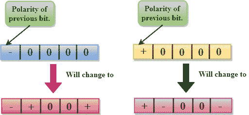

* * *

## 模数转换

*   当模拟信号被数字化时，这被称为模数转换。
*   假设人类以模拟信号的形式发送语音，我们需要将不易受噪声影响的模拟信号数字化。它需要减少模拟消息中的值的数量，以便它们可以在数字流中表示。
*   在模数转换中，包含在连续波形中的信息被转换成数字脉冲。

### 模数转换技术

### 脉冲幅度调制 （Pulse Amplitude Modulation 的缩写）

*   PAM 代表**脉冲调幅**。
*   PAM 是一种用于模数转换的技术。
*   PAM 技术获取模拟信号，对其进行采样，并根据采样结果生成一系列数字脉冲，其中采样意味着以相等的间隔测量信号的幅度。
*   PAM 技术在数据通信中没有用，因为它把原始波形转换成脉冲，但这些脉冲不是数字的。为了使它们数字化，PAM 技术被修改为 PCM 技术。

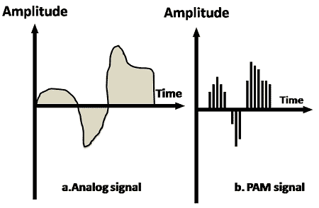
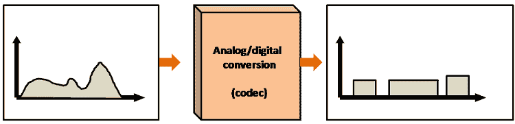

### 脉冲编码调制

*   PCM 代表**脉冲编码调制**。
*   脉码调制技术是用来修改脉冲产生的 PAM，以形成一个数字信号。为了实现这一点，PCM 量化 PAM 脉冲。量化是将特定范围内的整数值分配给采样实例的过程。
*   PCM 由四个独立的过程组成:PAM、量化、二进制编码和数字到数字编码。

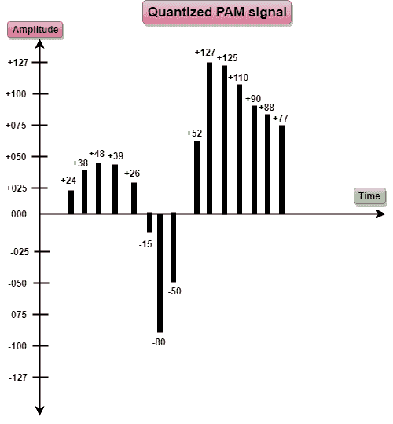

**动力系统控制模块**

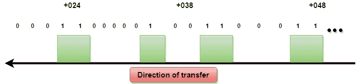