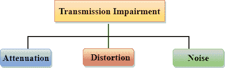

# 什么是传播媒介？

> 原文：<https://www.javatpoint.com/transmission-media>

*   传输媒体是将信息从发送者传送到接收者的通信渠道。数据通过电磁信号传输。
*   传输介质的主要功能是通过**局域网**(局域网)以比特的形式承载信息。
*   它是数据通信中发送器和接收器之间的物理路径。
*   在铜基网络中，电信号形式的比特。
*   在光纤网络中，光脉冲形式的比特。
*   在 **OSI** (开放系统互连)阶段，传输介质支持第 1 层。因此，它被视为第 1 层组件。
*   电信号可以通过铜线、光纤、大气、水和真空传输。
*   数据传输的特性和质量是由介质和信号的特性决定的。
*   传输媒体有两种类型:有线媒体和无线媒体。在有线介质中，介质特性更重要，而在无线介质中，信号特性更重要。
*   不同的传输介质具有不同的属性，例如带宽、延迟、成本以及安装和维护的便利性。
*   传输介质在 OSI 参考模型的最底层，即**物理层**中可用。

### 设计传输介质时需要考虑一些因素:

*   **带宽:**所有因素保持不变，介质的带宽越大，信号的数据传输速率越高。
*   **传输损伤:**由于传输损伤，接收信号与发射信号不同时。信号的质量会因为传输障碍而被破坏。
*   **干扰:**干扰的定义是，当信号在通信介质上传播时，加入一些不需要的信号，从而干扰信号的过程。

## 传输损伤的原因:

*   **衰减:**衰减是指能量的损失，即信号的强度随着距离的增加而降低，从而导致能量的损失。
*   **失真:**当信号的形状发生变化时，就会发生失真。从具有不同频率的不同信号中检查这种类型的失真。每个频率分量都有自己的传播速度，因此它们到达的时间不同，从而导致延迟失真。
*   **噪声:**当数据通过传输介质传输时，会有一些不需要的信号加入其中，从而产生噪声。

## 传输媒体的分类:

*   [引导传输媒体](guided-transmission-media)
*   [非导向传输介质](unguided-transmission-media)

* * *