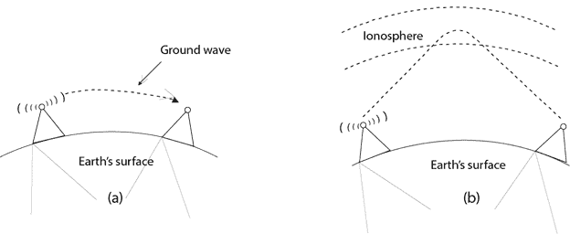
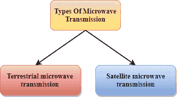

# 无制导传输

> 原文：<https://www.javatpoint.com/unguided-transmission-media>

*   无制导传输不使用任何物理介质传输电磁波。因此也被称为**无线传输**。
*   在非导向介质中，空气是电磁能容易流过的介质。

非导向传播大致分为三类:

## 无线电波

*   无线电波是在自由空间的所有方向上传输的电磁波。
*   无线电波是全向的，即信号向所有方向传播。
*   无线电波的频率范围从 3 千赫到 1 千赫。
*   在无线电波的情况下，发送和接收天线不对齐，即发送天线发送的波可以被任何接收天线接收。
*   无线电波的一个例子是**调频收音机**。

**无线电波的应用:**

*   当有一个发送者和许多接收者时，无线电波对于多播是有用的。
*   调频收音机、电视、无绳电话都是无线电波的例子。

**无线传输优势:**

*   无线电传输主要用于广域网和移动蜂窝电话。
*   无线电波覆盖了很大的面积，可以穿透墙壁。
*   无线电传输提供了更高的传输速率。

* * *

## 微波

微波炉有两种类型:

*   地面微波
*   卫星微波通信。

### 地面微波传输

*   地面微波传输是一种将无线电信号的聚焦波束从一个地面微波传输天线传输到另一个天线的技术。
*   微波是频率在 1 千兆赫至 1000 千兆赫范围内的电磁波。
*   微波是单向的，因为发送和接收天线是对准的，也就是说，由发送天线发送的波是窄聚焦的。
*   在这种情况下，天线安装在塔上，向千米外的另一个天线发送波束。
*   它对视线传输起作用，即安装在塔上的天线是彼此的直接视线。

**微波特性:**

*   **频率范围:**地面微波的频率范围为 4-6 GHz 至 21-23 GHz。
*   **带宽:**支持 1 到 10 Mbps 的带宽。
*   **短距离:**短距离便宜。
*   **长距离:**因为需要更高的塔才能走更远的距离，所以比较贵。
*   **衰减:**衰减表示信号丢失。它受环境条件和天线尺寸的影响。

**微波的优势:**

*   微波传输比使用电缆便宜。
*   由于不需要任何土地来安装电缆，因此无需征地。
*   微波传输为地形中的通信提供了便利，因为在地形中安装电缆是一项相当困难的任务。
*   海洋通信可以通过微波传输来实现。

**微波传输的缺点:**

*   **窃听:**窃听会造成不安全的通信。任何恶意用户都可以通过使用自己的天线在空中捕捉信号。
*   **异相信号:**利用微波传输可以使信号异相。
*   **易受天气条件影响:**微波传输易受天气条件影响。这意味着任何环境变化，如雨、风都会扭曲信号。
*   **带宽受限:**微波传输情况下带宽分配受限。

### 卫星微波通信

*   卫星是以已知高度围绕地球旋转的物理物体。
*   卫星通信现在更可靠，因为它比电缆和光纤系统更灵活。
*   我们可以通过卫星通信与地球上的任何一点进行通信。

**卫星是如何工作的？**

卫星接收地球站发送的信号，并放大信号。放大的信号被重新传输到另一个地球站。

**卫星微波通信优势:**

*   卫星微波的覆盖面积大于地面微波。
*   卫星的传输成本与距离覆盖区域中心的距离无关。
*   卫星通信用于移动和无线通信应用。
*   很容易安装。
*   它广泛应用于天气预报、无线电/电视信号广播、移动通信等。

**卫星微波通信的缺点:**

*   卫星的设计和开发需要更多的时间和更高的成本。
*   该卫星需要定期监测和控制，以便保持在轨道上。
*   卫星的寿命约为 12-15 年。由于这个原因，在卫星失去功能之前，必须计划再次发射卫星。

* * *

## 红外线的

*   红外传输是一种用于短距离通信的无线技术。
*   红外线的频率在 300 千兆赫到 400 太赫兹的范围内。
*   它用于短距离通信，例如两部手机之间的数据传输、电视远程操作、计算机和手机之间驻留在同一封闭区域的数据传输。

**红外特性:**

*   它支持高带宽，因此数据速率将非常高。
*   红外线无法穿透墙壁。因此，一个房间的红外通信不会被附近的房间中断。
*   红外通信以最小的干扰提供更好的安全性。
*   建筑物外的红外通信不可靠，因为太阳光会干扰红外波。

* * *