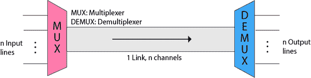
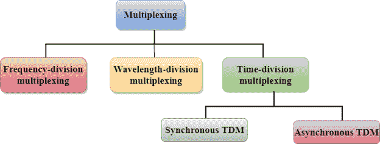
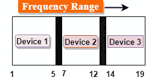
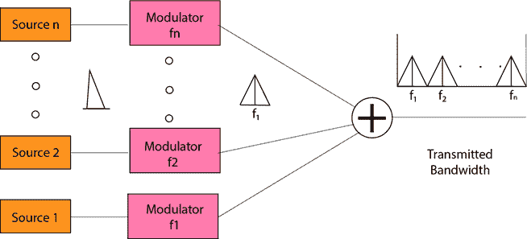
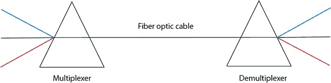
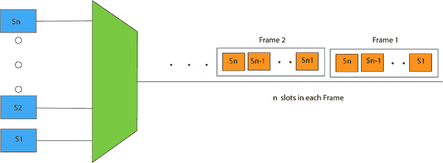
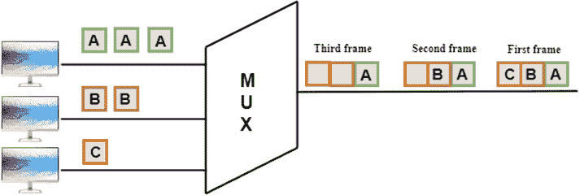
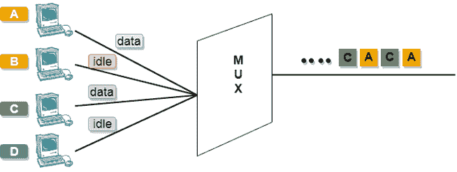
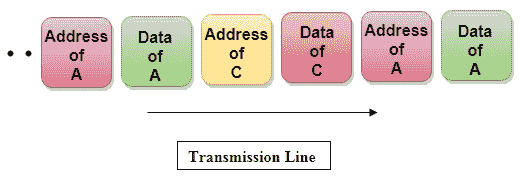

# 什么是多路复用？

> 原文：<https://www.javatpoint.com/multiplexing-in-computer-network>

多路复用是一种用于在单一介质上组合和发送多个数据流的技术。组合数据流的过程称为多路复用，用于多路复用的硬件称为多路复用器。

多路复用是通过使用一种称为多路复用器( **MUX** )的设备来实现的，该设备将 n 条输入线组合在一起以生成一条输出线。多路复用遵循多对一，即 n 条输入线和一条输出线。

解复用是通过使用接收端可用的称为解复用器(T0)的设备来实现的。DEMUX 将一个信号分离成它的分量信号(一个输入和 n 个输出)。因此，我们可以说解复用遵循一对多的方法。

## 为什么是多路复用？

*   传输介质用于将信号从发送者发送到接收者。介质一次只能有一个信号。
*   如果有多个信号共享一个媒体，那么媒体必须以这样一种方式划分，即每个信号被给予可用带宽的某个部分。例如:如果有 10 个信号，介质的带宽是 100 个单位，那么 10 个单位由每个信号共享。
*   当多个信号共享同一介质时，就有可能发生冲突。使用多路复用概念来避免这种冲突。
*   传输服务非常昂贵。

## 多路复用的历史

*   多路复用技术在电信中被广泛使用，其中几个电话呼叫通过一根电线传送。
*   多路复用起源于 19 世纪 70 年代初的电报，现在广泛用于通信。
*   乔治·欧文·施奎尔在 1910 年开发了**电话载波复用**。

## 多路复用的概念

*   “n”条输入线通过多路复用器传输，多路复用器组合信号以形成复合信号。
*   复合信号通过解复用器，解复用器将信号分离成分量信号，并将它们传送到各自的目的地。

## 多路复用的优势:

*   不止一个信号可以通过单一介质发送。
*   可以有效地利用介质的带宽。

* * *

## 多路复用技术

复用技术可分为:

* * *

## 频分复用(FDM)

*   这是一种模拟技术。
*   **频分复用**是一种将单个传输介质的可用带宽细分为多个信道的技术。

*   在上图中，单个传输介质被细分为几个频道，每个频道被分配给不同的设备。设备 1 的频道范围从 1 到 5。
*   输入信号通过使用调制技术被转换成频带，并且它们被多路复用器组合以形成复合信号。
*   FDM 的主要目标是将可用带宽细分为不同的频道，并将其分配给不同的设备。
*   使用调制技术，输入信号被传输到频带中，然后被组合以形成复合信号。
*   用于调制信号的载波称为**子载波**。它们被表示为 f1、f2..fn。
*   **FDM** 主要用于广播电视网络。

**FDM 优势:**

*   FDM 用于模拟信号。
*   FDM 过程非常简单，易于调制。
*   大量的信号可以同时通过 FDM 发送。
*   它不需要发送方和接收方之间的任何同步。

**FDM 的劣势:**

*   FDM 技术仅在需要低速通道时使用。
*   它有相声的问题。
*   需要大量的调制器。
*   它需要高带宽通道。

**FDM 的应用:**

*   FDM 常用于电视网络。
*   它用于调频和调幅广播。每个调频电台都有不同的频率，它们被多路复用以形成复合信号。多路信号在空中传输。

* * *

## 波分复用(WDM)

*   波分复用与 FDM 相同，只是光信号通过光缆传输。
*   WDM 用于光纤，以增加单根光纤的容量。
*   它用于利用光纤电缆的高数据速率能力。
*   这是一种模拟多路复用技术。
*   来自不同光源的光信号在多路复用器的帮助下被组合以形成更宽的光带。
*   在接收端，解复用器分离信号，将它们发送到各自的目的地。
*   复用和解复用可以通过使用棱镜来实现。
*   棱镜可以通过组合各种光信号形成复合信号，并通过光纤电缆传输复合信号，从而发挥多路复用器的作用。
*   Prism 还执行反向操作，即对信号进行解复用。

* * *

## 时分复用

*   这是一种数字技术。
*   在频分复用技术中，所有信号以不同的频率同时工作，但是在时分复用技术的情况下，所有信号以不同的时间以相同的频率工作。
*   在**时分复用技术**中，信道中可用的总时间被分配给不同的用户。因此，为每个用户分配了不同的时间间隔，称为发送方发送数据的时隙。
*   用户在固定的时间内控制频道。
*   在时分复用技术中，数据不是同时传输的，而是逐个传输的。
*   在时分复用中，信号以帧的形式传输。帧包含一个时隙周期，其中每个帧包含一个或多个专用于每个用户的时隙。
*   它可以用于多路复用数字和模拟信号，但主要用于多路复用数字信号。

**TDM 有两种类型:**

*   同步时分复用
*   异步时分复用

## 同步时分复用

*   同步时分复用是一种将时隙预先分配给每个设备的技术。
*   在同步时分复用中，无论设备是否包含数据，都会给每个设备一个时隙。
*   如果设备没有任何数据，则插槽将保持为空。
*   在同步时分复用中，信号以帧的形式发送。时隙以帧的形式组织。如果设备没有特定时隙的数据，那么空时隙将被传输。
*   最流行的同步时分复用是 t1 复用、综合业务数字网复用和同步光网络复用。
*   如果有 n 个设备，那么就有 n 个插槽。

**同步时分复用的概念**

在上图中，实现了同步时分复用技术。每个设备都分配有一些时隙。不管发送者是否有数据要发送，时隙都被发送。

**同步时分复用的缺点:**

*   信道的容量没有被充分利用，因为空时隙也是没有数据传输的。在上图中，第一帧被完全填充，但是在最后两帧中，一些槽是空的。因此，我们可以说通道的容量没有得到有效利用。
*   传输介质的速度应该大于输入线路的总速度。同步时分复用的另一种方法是异步时分复用。

## 异步时分复用

*   异步时分复用也称为统计时分复用。
*   异步时分复用是一种时隙不像同步时分复用那样固定的技术。时隙只分配给那些有数据要发送的设备。因此，我们可以说异步时分多路复用器只传输来自活动工作站的数据。
*   异步时分复用技术将时隙动态分配给设备。
*   在异步时分复用中，输入线路的总速度可能大于信道的容量。
*   异步时分多路复用器接受输入数据流，并创建一个只包含数据而没有空时隙的帧。
*   在异步时分复用中，每个时隙包含一个标识数据源的地址部分。

*   异步时分复用和同步时分复用的区别在于同步时分复用中有很多时隙未被利用，而异步时分复用中时隙被充分利用。这导致较小的传输时间和信道容量的有效利用。
*   在同步时分复用中，如果有 n 个发送设备，那么就有 n 个时隙。在异步时分复用中，如果有 n 个发送设备，则有 m 个时隙，其中 m 小于 n ( **m < n** )。
*   一帧中的时隙数取决于输入行数的统计分析。

**异步时分复用的概念**

在上图中，有 4 个设备，但只有两个设备在发送数据，即 A 和 C。因此，A 和 C 的数据只通过传输线传输。

**上图的框架可以表示为:**

上图显示数据部分包含确定数据源的地址。