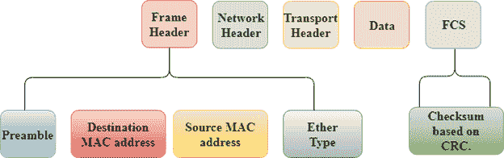
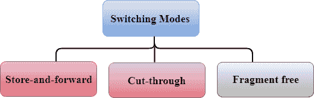
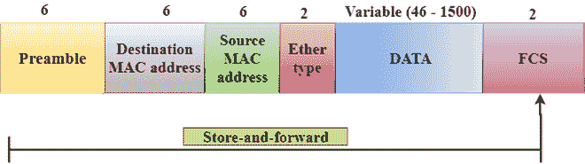
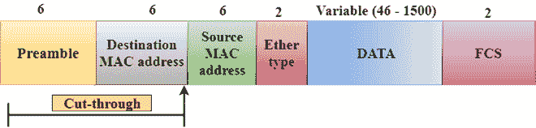
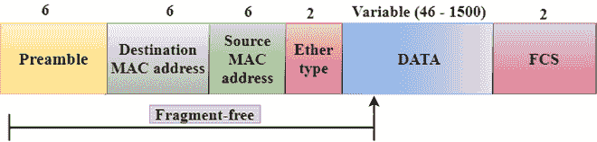

# 切换模式

> 原文：<https://www.javatpoint.com/computer-network-switching-modes>

*   第 2 层交换机用于在数据链路层传输数据，它还对发送和接收的帧执行错误检查。
*   第 2 层交换机在媒体访问控制地址的帮助下转发数据包。
*   不同的模式用于转发数据包，称为**切换模式**。
*   在**切换模式**下，识别一帧的不同部分。帧由几个部分组成，如前导码、目的媒体访问控制地址、源媒体访问控制地址、用户数据、帧控制服务。

**有三种切换模式:**

*   存储转发
*   直通
*   无碎片

* * *

## 存储转发

*   存储转发是一种技术，其中中间节点存储接收到的帧，然后在将数据包转发到下一个节点之前检查错误。
*   第 2 层交换机一直等到收到整个帧。收到整个帧后，交换机将该帧存储到交换机缓冲存储器中。这个过程被称为**存储帧**。
*   存储帧后，将检查帧中的错误。如果发现任何错误，该消息将被丢弃，否则该消息将被转发到下一个节点。这个过程被称为**转发帧**。
*   循环冗余校验(CRC)技术被实现，其使用多个比特来检查接收帧上的错误。
*   存储转发技术确保了高度的安全性，因为目标网络不会受到损坏帧的影响。
*   存储转发交换机非常可靠，因为它不会转发冲突帧。

* * *

## 直通交换

*   直通交换是一种技术，在这种技术中，交换机在确定目的地址后转发数据包，而无需等待整个帧被接收。
*   一旦接收到帧，它会检查前同步码之后的帧的前六个字节，交换机会检查交换表中的目的地以确定输出接口端口，然后将帧转发到目的地。
*   它具有**低延迟**速率，因为交换机在将数据包发送到目的地之前不会等待整个帧被接收。
*   它没有**检错技术**。因此，错误可以在有或没有错误的情况下发送给接收器。
*   直通交换技术的等待时间很短，因为它一识别出目的地媒体访问控制地址就转发数据包。
*   在这种技术中，不会检测到冲突，如果帧发生冲突，也会转发。

* * *

## 无碎片交换

*   无碎片交换是一种先进的直通交换技术。
*   无碎片交换是一种在转发到下一个节点之前读取至少 64 个字节的帧以提供无错误传输的技术。
*   它结合了直通交换的速度和错误检查功能。
*   这种技术检查以太网帧中有寻址信息的 64 个字节。
*   在帧的 64 字节内检测到冲突，被冲突的帧将不会被进一步转发。

* * *

## 存储转发和直通交换的区别。

| 存储转发交换 | 直通交换 |
| 存储转发交换是一种等待直到接收到整个帧的技术。 | 直通交换是一种检查前导码后的前 6 个字节以识别目的地址的技术。 |
| 它执行错误检查功能。如果在帧中发现任何错误，该帧将被丢弃，否则将被转发到下一个节点。 | 它不执行任何错误检查。有或没有错误的帧将被转发。 |
| 它具有高延迟率，因为它在转发到下一个节点之前等待整个帧被接收。 | 它具有低延迟率，因为它只检查帧的六个字节来确定目的地址。 |
| 它非常可靠，因为它只转发无错误的数据包。 | 与存储转发技术相比，它不太可靠，因为它也转发容易出错的数据包。 |
| 它有很长的等待时间，因为它在作出任何转发决定之前等待整个帧被接收。 | 它的等待时间很短，因为直通交换机不存储整个帧或数据包。 |

* * *