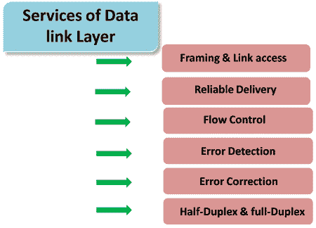

# 数据链路层

> 原文：<https://www.javatpoint.com/data-link-layer>

*   在现场视察模型中，数据链路层是自上而下的第 4层和自下而上的第 2 层。
*   连接相邻节点的通信信道称为链路，为了将数据报从源移动到目的地，数据报必须通过单独的链路移动。
*   数据链路层的主要职责是通过单个链路传输数据报。
*   数据链路层协议定义了节点间交换的数据包格式，以及错误检测、重传、流量控制和随机访问等操作。
*   数据链路层协议有以太网、令牌环、FDDI 和 PPP。
*   数据链路层的一个重要特征是数据报可以由路径中不同链路上的不同链路层协议处理。例如，数据报在第一条链路上由以太网处理，在第二条链路上由 PPP 处理。

### 数据链路层提供以下服务:

*   **成帧&链路接入:**数据链路层协议在通过链路传输之前，将每个网络帧封装在链路层帧中。帧由一个数据字段和多个数据字段组成，网络层数据报插入到数据字段中。它规定了帧的结构以及通过链路传输帧的信道接入协议。
*   **可靠传递:**数据链路层提供可靠的传递服务，即无差错地传输网络层数据报。可靠的交付服务是通过传输和确认来实现的。数据链路层主要通过链路提供可靠的传送服务，因为它们具有较高的错误率，并且可以在发生错误的链路上进行本地纠正，而不是强制重新传输数据。
*   **流量控制:**接收节点接收帧的速度比处理帧的速度快。如果没有流量控制，接收器的缓冲区可能会溢出，帧可能会丢失。为了克服这个问题，数据链路层使用流量控制来防止链路一侧的发送节点压倒链路另一侧的接收节点。
*   **误差检测:**信号衰减和噪声会引入误差。数据链路层协议提供了一种检测一个或多个错误的机制。这是通过在帧中添加错误检测位来实现的，然后接收节点可以执行错误检查。
*   **纠错:**纠错类似于检错，只是接收节点不仅要检测错误，还要确定错误在帧中出现的位置。
*   **半双工&全双工:**在全双工模式下，两个节点可以同时传输数据。在半双工模式下，只有一个节点可以同时传输数据。