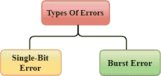
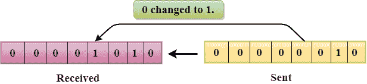
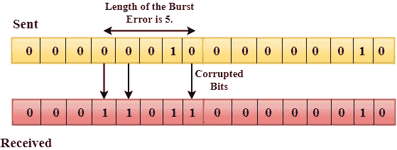
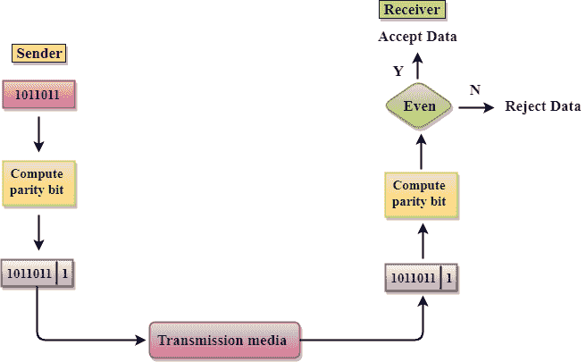
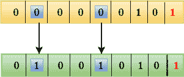
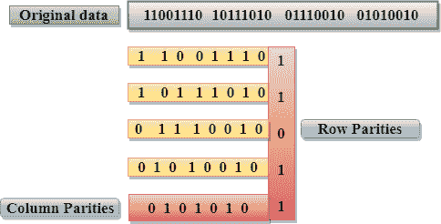
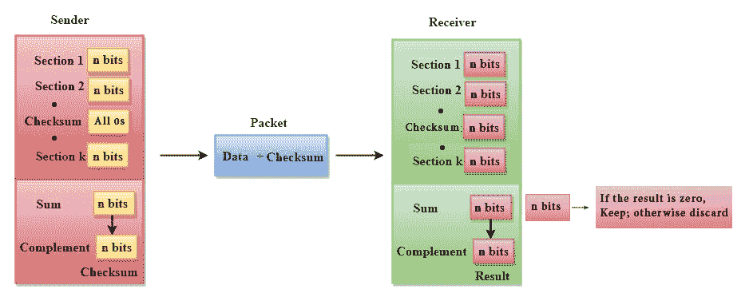
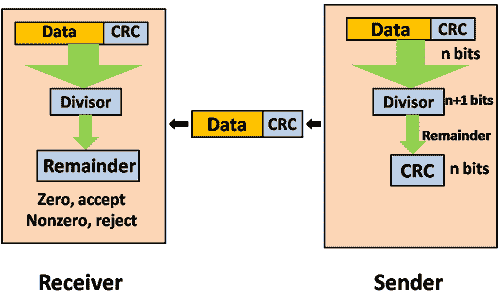
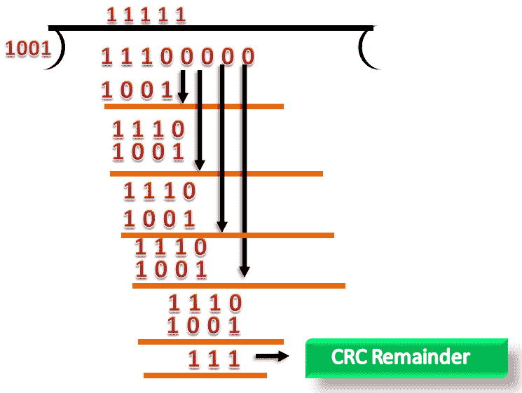
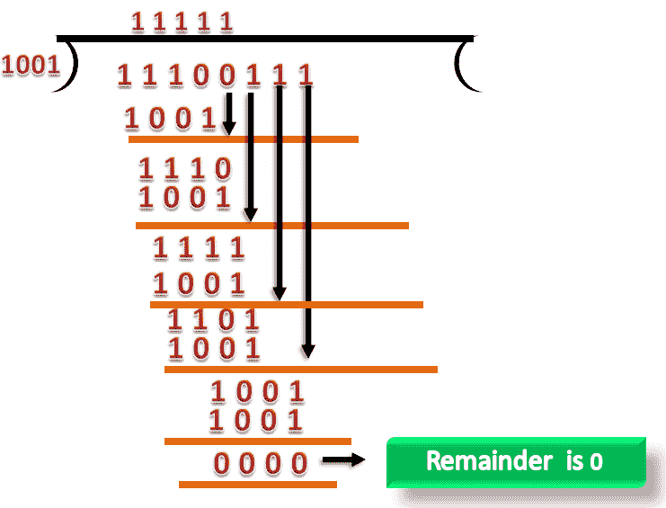

# 误差检测

> 原文：<https://www.javatpoint.com/computer-network-error-detection>

当数据从一个设备传输到另一个设备时，系统不保证该设备接收的数据是否与另一个设备传输的数据相同。错误是指在接收端收到的消息与发送的消息不一致的情况。

## 错误的类型



错误可以分为两类:

*   单比特误差
*   突发差错

## 单比特错误:

给定数据单元的唯一一位从 1 变为 0 或从 0 变为 1。



在上图中，发送的消息被破坏为单比特，即 0 比特被改变为 1。

**单比特错误**在串行数据传输中出现的可能性不大。例如，发送方以 10 Mbps 的速度发送数据，这意味着该位仅持续 1？对于发生的单比特错误，噪声必须大于 1？南

单比特错误主要发生在并行数据传输中。例如，如果使用八条线路发送一个字节的八个位，如果其中一条线路有噪声，则每个字节的单个位被破坏。

## 突发错误:

两个或更多位从 0 变为 1 或从 1 变为 0 称为突发错误。

突发错误是从第一个损坏位到最后一个损坏位确定的。



突发错误中的噪声持续时间大于单比特中的噪声持续时间。

突发错误最有可能发生在串行数据传输中。

受影响的位数取决于噪声的持续时间和数据速率。

* * *

## 错误检测技术:

最流行的错误检测技术有:

*   单一奇偶校验
*   二维奇偶校验
*   校验和
*   循环冗余校验

## 单一奇偶校验

*   单一奇偶校验是检测错误的简单机制，并且成本低廉。
*   在这种技术中，冗余位也被称为奇偶校验位，它被附加在数据单元的末尾，使得 1 的数量变成偶数。因此，传输的比特总数将是 9 比特。
*   如果 1 位数是奇数，则附加奇偶校验位 1，如果 1 位数是偶数，则在数据单元的末尾附加奇偶校验位 0。
*   在接收端，从接收的数据位计算奇偶校验位，并与接收的奇偶校验位进行比较。
*   这种技术产生偶数个 1，因此称为偶校验。



### 单一奇偶校验的缺点

*   它只能检测非常罕见的单比特错误。
*   如果两个位互换，则它无法检测到错误。



## 二维奇偶校验

*   使用**二维奇偶校验**可以提高性能，该校验以表格的形式组织数据。
*   奇偶校验位是为每行计算的，这相当于单奇偶校验。
*   在二维奇偶校验中，一个比特块被分成行，冗余的比特行被添加到整个块中。
*   在接收端，将奇偶校验位与根据接收数据计算的奇偶校验位进行比较。



### 2D 奇偶校验的缺点

*   如果一个数据单元中的两个比特被破坏，而另一个数据单元中完全相同位置的两个比特也被破坏，那么 2D 奇偶校验器将不能检测到错误。
*   在某些情况下，这种技术不能用于检测 4 位或更多的错误。

## 校验和

校验和是一种基于冗余概念的错误检测技术。

**分为两部分:**

### 校验和生成器

发送端生成校验和。校验和发生器将数据细分为相等的 n 位数据段，所有这些数据段通过补码算法相加。总和被补充并附加到原始数据，称为校验和字段。扩展数据通过网络传输。

假设 L 是数据段的总和，那么校验和将是？L



```
The Sender follows the given steps:
  The block unit is divided into k sections, and each of n bits.
  All the k sections are added together by using one's complement to get the sum.
  The sum is complemented and it becomes the checksum field.
  The original data and checksum field are sent across the network.

```

### 校验和检查器

校验和在接收端被验证。接收器将输入数据细分为相等的 n 位数据段，所有这些数据段加在一起，然后对总和进行补充。如果和的补码为零，则数据被接受，否则数据被拒绝。

```
The Receiver follows the given steps:
  The block unit is divided into k sections and each of n bits.
  All the k sections are added together by using one's complement algorithm to get the sum.
  The sum is complemented.
  If the result of the sum is zero, then the data is accepted otherwise the data is discarded.

```

## 循环冗余校验

CRC 是一种冗余错误技术，用于确定错误。

**以下是循环冗余校验中用于错误检测的步骤:**

*   在循环冗余校验技术中，一串 n 个 0 被附加到数据单元上，这个 n 个数小于一个预定数的位数，称为 n+1 位除法。
*   其次，使用称为二进制除法的过程，用除数对新扩展的数据进行除法。这种除法产生的余数称为循环冗余校验余数。
*   第三，循环冗余校验余数替换原始数据末尾附加的 0。这个新生成的单元被发送到接收器。
*   接收器接收数据，然后是循环冗余校验余数。接收器会将整个单元视为一个单独的单元，除以用于计算循环冗余校验余数的除数。

如果这个除法的结果为零，这意味着它没有错误，数据被接受。

如果除法的结果不为零，这意味着数据包含错误。因此，数据被丢弃。



让我们通过一个例子来理解这个概念:

**假设原始数据为 11100，除数为 1001。**

### 循环冗余校验发生器

*   循环冗余校验生成器使用模 2 除法。首先，由于除数的长度是 4，所以在数据的末尾追加三个零，我们知道要追加的字符串 0 的长度总是比除数的长度少一个。
*   现在，字符串变成 11100000，结果字符串除以除数 1001。
*   二进制除法产生的余数称为循环冗余校验余数。循环冗余校验余数的生成值是 111。
*   CRC 余数替换数据单元末尾附加的 0 字符串，最后的字符串是 11100111，通过网络发送。



### 循环冗余校验器

*   循环冗余校验器的功能类似于循环冗余校验生成器。
*   当在接收端接收到字符串 11100111 时，循环冗余校验器执行模 2 除法。
*   字符串除以相同的除数，即 1001。
*   在这种情况下，循环冗余校验器生成零的余数。因此，数据被接受。

