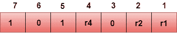
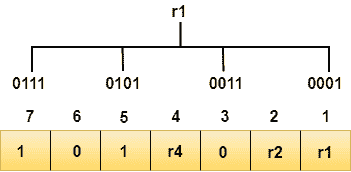
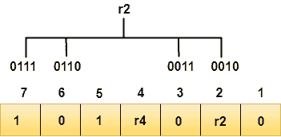
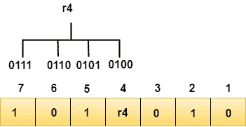
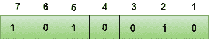
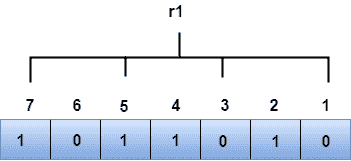
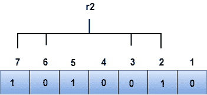
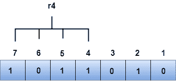

# 纠错

> 原文：<https://www.javatpoint.com/computer-network-error-correction>

纠错码用于在数据从发送方传输到接收方时检测和纠正错误。

纠错有两种方式:

*   **反向纠错:**一旦发现错误，接收方请求发送方重传整个数据单元。
*   **前向纠错:**在这种情况下，接收机使用自动纠正错误的纠错码。

单个附加位可以检测到错误，但不能纠正。

为了纠正错误，必须知道错误的确切位置。例如，如果我们想计算一个单比特错误，纠错码将确定七个比特中的哪一个是错误的。为了实现这一点，我们必须添加一些额外的冗余位。

假设 r 是冗余位数，d 是数据位的总数。冗余位数 r 可以通过以下公式计算:

```
2r>=d+r+1

```

r 的值是用上述公式计算出来的。例如，如果 d 的值是 4，那么满足上述关系的最小可能值是 3。

为了确定出错位的位置，海明公司开发的一种技术是汉明码，它可以应用于任何长度的数据单元，并利用数据单元和冗余单元之间的关系。

* * *

## 汉明码

**奇偶校验位:**附加到二进制位的原始数据上的位，这样 1 的总数是偶数或奇数。

**偶奇偶校验:**要检查偶奇偶校验，如果 1 的总数是偶数，那么奇偶校验位的值是 0。如果 1 出现的总数为奇数，则奇偶校验位的值为 1。

**奇偶性:**要检查奇偶性，如果 1 的总数是偶数，那么奇偶校验位的值是 1。如果 1 的总数为奇数，则奇偶校验位的值为 0。

### 汉明码算法；

*   “d”位的信息被添加到冗余位“r”以形成 d+r。
*   每个(d+r)数字的位置都被赋予一个十进制值。
*   “r”位被放置在位置 1、2，.....2 <sup>k-1</sup> 。
*   在接收端，奇偶校验位被重新计算。奇偶校验位的十进制值决定了错误的位置。

## 关系 b/w 错误位置&二进制数。


让我们通过一个例子来理解汉明码的概念:

假设要发送的原始数据是 1010。

```
Total number of data bits 'd' = 4
Number of redundant bits r : 2r >= d+r+1
                           2r>= 4+r+1
Therefore, the value of r is 3 that satisfies the above relation.
Total number of bits = d+r = 4+3 = 7;

```

## 确定冗余位的位置

冗余位数为 3。这三个位由 r1、r2、r4 表示。计算冗余位的位置，对应于 2 的提升幂。因此，它们对应的位置是 **1、2 <sup>1</sup> ，2 <sup>2</sup>** 。

```

The position of r1 = 1
The position of r2 = 2
The position of r4 = 4

```

添加奇偶校验位时的数据表示:



## 确定奇偶校验位

### 确定 r1 位

r1 位通过对二进制表示在第一个位置包含 1 的位位置执行奇偶校验来计算。



我们从上图中观察到，第一个位置包含 1 的位位置是 1、3、5、7。现在，我们在这些位位置执行偶校验。对应于 r1 的这些位位置的 1 的总数为**偶数，因此，r1 位的值为 0** 。

### 确定 r2 位

r2 位通过对二进制表示在第二个位置包含 1 的位位置执行奇偶校验来计算。



从上图中我们可以观察到，第二个位置包含 1 的比特位置是 **2、3、6、7** 。现在，我们在这些位位置执行偶校验。对应于 r2 的这些位位置的 1 的总数是**奇数，因此，r2 位的值是 1** 。

### 确定 r4 位

r4 位通过对二进制表示在第三个位置包含 1 的位位置执行奇偶校验来计算。



从上图我们可以观察到，第三个位置包含 1 的比特位置是 **4、5、6、7** 。现在，我们在这些位位置执行偶校验。对应于 r4 的这些位位置的 1 的总数是**偶数，因此，r4 位的值是 0** 。

**传输的数据如下:**



假设第 4<sup>位在接收端从 0 变为 1，然后重新计算奇偶校验位。</sup>

* * *

### R1 钻头

r1 位的位位置是 1，3，5，7



我们从上图中观察到 r1 的二进制表示为 1100。现在，我们执行偶校验，r1 位中出现的 1 总数是偶数。因此，r1 的值为 0。

### R2 钻头

r2 位的位位置是 2，3，6，7。



从上图中我们观察到 r2 的二进制表示为 1001。现在，我们执行偶校验，r2 位中出现的 1 总数是偶数。因此，r2 的值为 0。

### R4 钻头

r4 位的位位置是 4，5，6，7。



从上图中我们观察到 r4 的二进制表示为 1011。现在，我们执行奇偶校验，r4 位中出现的 1 总数是奇数。因此，r4 的值为 1。

*   *冗余位的二进制表示，即 r4r2r1 为 100，其对应的十进制值为 4。因此，错误发生在第 4 个<sup>位位置。必须将位值从 1 更改为 0 才能纠正错误。</sup>*