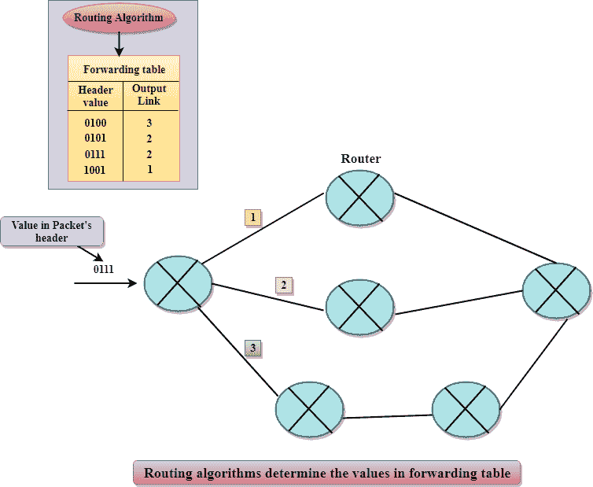

# 网路层

> 原文：<https://www.javatpoint.com/network-layer>

*   网络层是现场视察模型的第三层。
*   它处理来自传输层的服务请求，并进一步将服务请求转发到数据链路层。
*   网络层将逻辑地址转换为物理地址
*   它确定从源到目的地的路由，还管理交换、路由等流量问题，并控制数据包的拥塞。
*   网络层的主要作用是将数据包从发送主机移动到接收主机。

### 网络层执行的主要功能有:

*   **路由:**当数据包到达路由器的输入链路时，路由器会将数据包移动到路由器的输出链路。例如，从 S1 到 R1 的数据包必须转发到通往 S2 路径上的下一台路由器。
*   **逻辑寻址:**数据链路层实现物理寻址，网络层实现逻辑寻址。逻辑寻址也用于区分源系统和目标系统。网络层向数据包添加报头，其中包括发送方和接收方的逻辑地址。
*   **网间互联:**这是网络层的主要作用，它提供不同类型网络之间的逻辑连接。
*   **碎片化:**碎片化是将数据包分解成通过不同网络传输的最小单个数据单元的过程。

* * *

## 转发和路由

在网络层，路由器用于转发数据包。每台路由器都有一个转发表。路由器通过检查数据包的报头字段来转发数据包，然后使用报头字段值在转发表中建立索引。转发表中存储的与报头字段值相对应的值表示数据包要转发到的路由器输出接口链路。

例如，报头字段值为 0111 的路由器到达路由器，然后路由器将该报头值编入转发表，转发表确定输出链路接口为 2。路由器将数据包转发到接口 2。路由算法决定了转发表中插入的值。路由算法可以是集中的，也可以是分散的。

### 网络层提供的服务

*   **保证传送:**该层提供保证数据包到达目的地的服务。
*   **延迟受限的保证传送:**该服务保证数据包将在指定的主机到主机延迟范围内传送。
*   **有序数据包:**该服务确保数据包按照发送顺序到达目的地。
*   **保证最大抖动:**该服务确保发送方两次连续传输之间的时间等于目的地接收之间的时间。
*   **安全服务:**网络层通过使用源主机和目的主机之间的会话密钥来提供安全性。源主机中的网络层对发送到目的主机的数据报的有效负载进行加密。然后，目的主机中的网络层将解密有效负载。通过这种方式，网络层维护数据完整性和源认证服务。