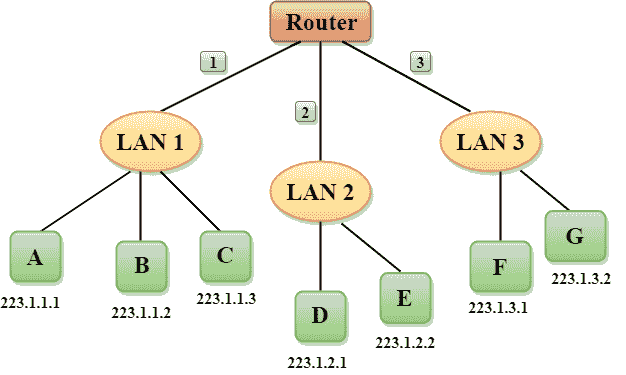
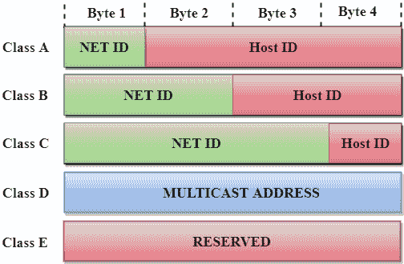
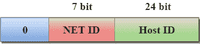
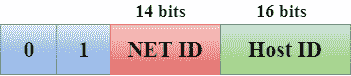
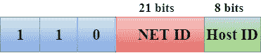
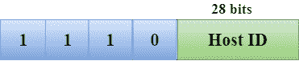
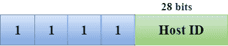

# 网络寻址

> 原文：<https://www.javatpoint.com/network-addressing>

*   网络寻址是网络层的主要职责之一。
*   网络地址总是逻辑地址，即基于软件的地址。
*   主机也称为终端系统，只有一条网络链路。主机和链路之间的边界称为接口。因此，主机只能有一个接口。
*   路由器与主机的不同之处在于它有两条或多条连接到它的链路。当路由器转发数据报时，它会将数据包转发到其中一条链路。路由器和链路之间的边界称为接口，路由器可以有多个接口，每个接口对应一条链路。每个接口都能够发送和接收 IP 数据包，因此 IP 要求每个接口都有一个地址。
*   每个 IP 地址都是 32 位长，它们以“点-十进制记数法”的形式表示，其中每个字节都是以十进制的形式写入的，并且用句点分隔。一个 IP 地址看起来像 193.32.216.9，其中 193 代表地址前 8 位的十进制表示法，32 代表地址后 8 位的十进制表示法。

*   **我们通过一个简单的例子来理解。**

*   在上图中，路由器有三个标为 1、2 和 3 的接口，每个路由器接口都包含自己的 IP 地址。
*   每台主机都包含自己的接口和 IP 地址。
*   连接到局域网 1 的所有接口都具有 223.1.1.xxx 形式的 IP 地址，连接到局域网 2 和局域网 3 的接口分别具有 223.1.2.xxx 和 223.1.3.xxx 形式的 IP 地址。
*   每个 IP 地址由两部分组成。第一部分(IP 地址的前三个字节)指定网络，第二部分(IP 地址的最后一个字节)指定网络中的主机。

## 有类寻址

一个 IP 地址是 32 位长。一个 IP 地址分为几个子类:

*   甲级
*   乙类
*   丙类
*   D 类
*   E 级

**IP 地址分为两部分:**

*   **网络 ID:** 代表网络数量。
*   **主机 ID:** 表示主机数量。

在上图中，我们观察到每个类都有一个特定的 IP 地址范围。IP 地址的类别用于确定一个类别中使用的位数以及该类别中可用的网络和主机的数量。

## 甲级

在 A 类中，IP 地址被分配给那些包含大量主机的网络。

*   网络标识长度为 8 位。
*   主机标识长度为 24 位。

在 A 类中，第一个八位字节的高阶位中的第一位总是设置为 0，其余 7 位确定网络标识。这 24 位决定了任何网络中的主机标识。

A 类网络总数= 2 7 = 128 个网络地址

A 类主机总数= 2 24 - 2 = 16，777，214 主机地址

## 乙类

在 B 类中，IP 地址被分配给从小型网络到大型网络的那些网络。

*   网络标识长度为 16 位。
*   主机标识长度为 16 位。

在 B 类中，第一个二进制八位数的高位总是设置为 10，其余的 14 位决定网络标识。其他 16 位决定主机标识。

B 类网络总数= 2 14 = 16384 网络地址

B 类主机总数= 2 16 - 2 = 65534 个主机地址

## 丙类

在 C 类中，IP 地址只分配给小型网络。

*   网络标识长度为 24 位。
*   主机标识长度为 8 位。

在 C 类中，第一个二进制八位数的高位总是设置为 110，其余 21 位决定网络标识。主机标识的 8 位决定了网络中的主机。

网络总数= 2 21 = 2097152 网络地址

主机总数= 2 8 - 2 = 254 个主机地址

## D 类

在 D 类中，IP 地址是为多播地址保留的。它不具备子网划分。第一个八位字节的高阶位总是设置为 1110，其余位决定了任何网络中的主机标识。

## E 级

在 E 类中，IP 地址用于将来使用或用于研究和开发目的。它没有任何子网划分。第一个八位字节的高阶位总是设置为 1111，其余位决定了任何网络中的主机标识。

* * *

## 分配主机标识的规则:

主机标识用于确定任何网络中的主机。主机标识根据以下规则分配:

*   主机标识在任何网络中都必须是唯一的。
*   无法分配所有位都设置为 0 的主机标识，因为它用于表示 IP 地址的网络标识。
*   无法分配所有位都设置为 1 的主机标识，因为它是为多播地址保留的。

* * *

## 分配网络标识的规则:

如果主机位于同一个本地网络中，则会为它们分配相同的网络标识。以下是分配网络标识的规则:

*   网络标识不能以 127 开头，因为 127 由 a 类使用
*   无法分配所有位都设置为 0 的网络标识，因为它用于指定本地网络上的特定主机。
*   无法分配所有位都设置为 1 的网络标识，因为它是为多播地址保留的。

* * *

## 有类网络架构

| 班级 | 高位 | 网络标识位 | 主机标识位 | 网络数量 | 每个网络的主机数量 | 范围 |
| A | Zero | eight | Twenty-four | 2 7 | 2 24 | 0.0.0.0 至 127.255.255.255 |
| B | Ten | Sixteen | Sixteen | 2 14 | 2 16 | 128.0.0.0 至 191.255.255.255 |
| C | One hundred and ten | Twenty-four | eight | 2 21 | 2 8 | 192.0.0.0 至 223.255.255.255 |
| D | One thousand one hundred and ten | 未定义 | 未定义 | 未定义 | 未定义 | 224.0.0.0 至 239.255.255.255 |
| E | One thousand one hundred and eleven | 未定义 | 未定义 | 未定义 | 未定义 | 240.0.0.0 至 255.255.255.255 |