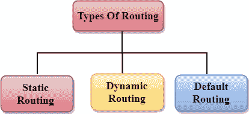

# 选择途径

> 原文：<https://www.javatpoint.com/computer-network-routing>

*   路由器是选择数据从源传输到目的地的路径的过程。路由是由一种称为路由器的特殊设备执行的。
*   路由器工作在现场视察模型的网络层和传输控制协议模型的互联网层
*   路由器是一种网络设备，它根据数据包报头和转发表中的可用信息转发数据包。
*   路由算法用于路由数据包。路由算法只不过是一个负责决定数据包传输最佳路径的软件。
*   路由协议使用该度量来确定数据包传送的最佳路径。度量是测量标准，如跳数、带宽、延迟、路径上的当前负载等。路由算法用来确定到达目的地的最佳路径。
*   路由算法为路径确定过程初始化并维护路由表。

* * *

## 路由度量和成本

路由度量和成本用于确定到达目的地的最佳路由。协议用来确定最短路径的因素，这些因素被称为度量。

指标是用于确定到达目的地的最佳路径的网络变量。对于某些协议，使用静态度量意味着其值不能更改，而对于其他一些路由协议，使用动态度量意味着其值可以由系统管理员分配。

**最常见的度量值如下:**

*   **跳数:**跳数被定义为一种度量，它指定数据包从源移动到目的地所必须经过的网间设备(如路由器)的数量。如果路由协议将跳数视为主要度量值，则跳数最少的路径将被视为从源移动到目的地的最佳路径。
*   **延迟:**是路由器处理、排队并将数据报传输到接口所花费的时间。协议使用该度量来确定路径上所有端到端链路的延迟值。具有最低延迟值的路径将被认为是最佳路径。
*   **带宽:**链路的容量称为链路的带宽。带宽以每秒位数来衡量。传输速率较高的链路(如千兆位)比容量较低的链路(如 56 kb)更受青睐。该协议将确定路径上所有链路的带宽容量，整体较高的带宽将被视为最佳路由。
*   **负载:**负载是指路由器或网络链路等网络资源繁忙的程度。负载可以通过多种方式计算，例如中央处理器利用率、每秒处理的数据包。如果流量增加，那么负载值也会增加。负载值随着流量的变化而变化。
*   **可靠性:**可靠性是一个可能由固定值组成的度量因子。它取决于网络链接，其值是动态测量的。有些网络比其他网络更容易瘫痪。网络故障后，一些网络链路比其他网络链路更容易修复。在分配可靠性等级时，可以考虑任何可靠性因素，可靠性等级通常是由系统管理员分配的数值。

* * *

## 路由的类型

路由可以分为三类:

*   静态路由
*   默认路由
*   动态路由

## 静态路由

*   静态路由也称为非自适应路由。
*   这是一种管理员在路由表中手动添加路由的技术。
*   路由器可以沿着管理员定义的路由向目的地发送数据包。
*   在这种技术中，路由决策不是基于网络的状况或拓扑做出的

### 静态路由的优势

静态路由的优势如下:

*   **无开销:**对路由器的 CPU 使用有 ho 开销。因此，可以使用更便宜的路由器来获得静态路由。
*   **带宽:**路由器之间没有带宽使用。
*   **安全性:**它提供安全性，因为系统管理员只能控制到特定网络的路由。

### 静态路由的缺点:

静态路由的缺点如下:

*   对于大型网络，手动将每条路由添加到路由表中变得非常困难。
*   系统管理员应该对拓扑有很好的了解，因为他必须手动添加每条路由。

## 默认路由

*   默认路由是一种路由器被配置为将所有数据包发送到同一跳设备的技术，它是否属于特定网络并不重要。数据包被传输到默认路由中为其配置的设备。
*   当网络处理单个出口点时，使用默认路由。
*   当大量传输网络必须将数据传输到同一台 hp 设备时，这也很有用。
*   当路由表中提到特定路由时，路由器会选择特定路由，而不是默认路由。只有在路由表中没有提到特定路由时，才会选择默认路由。

## 动态路由

*   它也被称为自适应路由。
*   这是一种路由器在路由表中为每个数据包添加新路由以响应网络条件或拓扑变化的技术。
*   动态协议用于发现到达目的地的新路由。
*   在动态路由中，RIP 和 OSPF 是用来发现新路由的协议。
*   如果有任何路线下降，将自动调整到达目的地。

**动态协议应具有以下特征:**

*   为了交换路由，所有路由器必须使用相同的动态路由协议。
*   如果路由器发现条件或拓扑有任何变化，路由器会将此信息广播给所有其他路由器。

### 动态路由的优势:

*   更容易配置。
*   根据条件或拓扑的变化来选择最佳路由会更有效。

### 动态路由的缺点:

*   就 CPU 和带宽使用而言，它更贵。
*   与默认路由和静态路由相比，它不太安全。