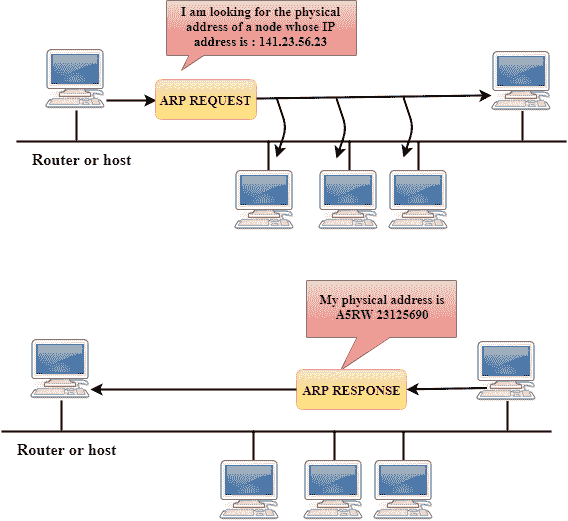
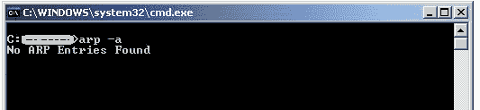
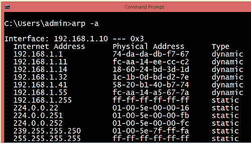
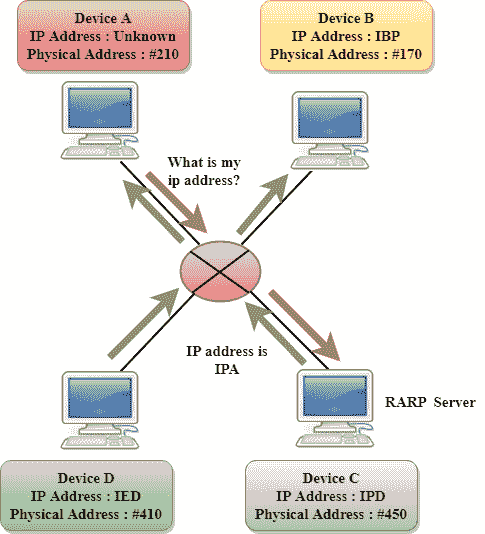
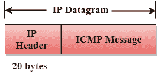
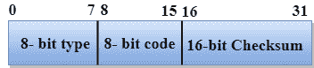
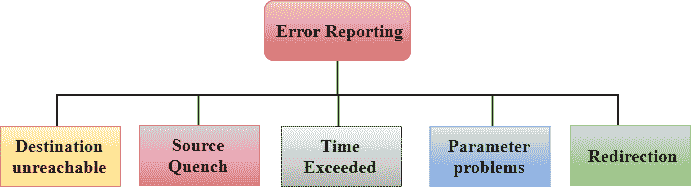
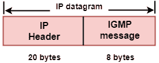
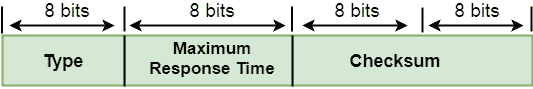
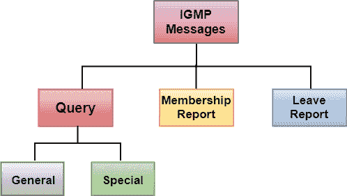

# 网络层协议

> 原文：<https://www.javatpoint.com/network-layer-protocols>

TCP/IP 支持以下协议:

## 空袭预防措施

*   ARP 代表地址解析协议。
*   它用于将 IP 地址与媒体访问控制地址相关联。
*   网络上的每台设备都可以通过网卡上的媒体访问控制地址识别。因此，我们可以说设备在局域网上进行通信需要 MAC 地址。MAC 地址可以轻松更改。例如，如果特定机器上的网卡出现故障，媒体访问控制地址会改变，但 IP 地址不会改变。当一个互联网地址已知时，ARP 被用来查找节点的 MAC 地址。

#### 注意:媒体访问控制地址:媒体访问控制地址用于识别实际设备。
IP 地址:是网络上用来定位设备的地址。

### ARP 是如何工作的

如果主机想知道其网络上另一台主机的物理地址，它会发送一个包含该 IP 地址的 ARP 查询数据包，并通过网络广播。网络上的每台主机都接收并处理 ARP 数据包，但只有目标接收方能够识别 IP 地址并发回物理地址。持有数据报的主机将物理地址添加到缓存和数据报报头中，然后发送回发送方。

### ARP 协议采取的步骤

如果一台设备想要与另一台设备通信，该设备将采取以下步骤:

*   该设备将首先查看其互联网列表，称为 ARP 缓存，以检查一个 IP 地址是否包含匹配的 MAC 地址。它将使用命令 **arp-a** 在命令提示符下检查 ARP 缓存。

*   如果 ARP 缓存为空，设备会向整个网络广播消息，要求每个设备提供匹配的 MAC 地址。
*   具有匹配 IP 地址的设备随后会用其 MAC 地址回复发送方
*   一旦设备接收到媒体访问控制地址，就可以在两台设备之间进行通信。
*   如果设备接收到媒体访问控制地址，则媒体访问控制地址会存储在 ARP 缓存中。我们可以使用命令 arp -a 在命令提示符下检查 ARP 缓存。

#### 注意:ARP 缓存用于提高网络效率。

在上面的截图中，我们观察到了 IP 地址和 MAC 地址的关联。

### 有两种类型的 ARP 条目:

*   **动态条目:**是发送方向全网广播消息时自动创建的条目。动态条目不是永久的，它们会定期删除。
*   **静态条目:**是有人使用 ARP 命令实用程序手动输入 IP 到 MAC 地址关联的条目。

* * *

## 怪怪的

*   RARP 代表**反向地址解析协议**。
*   如果主机想要知道它的 IP 地址，那么它就向整个网络广播包含它的物理地址的 RARP 查询包。网络上的 RARP 服务器识别 RARP 数据包，并以主机 IP 地址作为响应。
*   用于从服务器获取 IP 地址的协议称为**反向地址解析协议**。
*   RARP 协议的消息格式类似于 ARP 协议。
*   像 ARP 帧一样，RARP 帧从一台机器发送到另一台机器，封装在帧的数据部分。

* * *

## 网间控制报文协议(Internet Control Messages Protocol)

*   ICMP 代表互联网控制消息协议。
*   ICMP 是一种网络层协议，由主机和路由器用来将 IP 数据报问题的通知发送回发送方。
*   ICMP 使用回应测试/回复来检查目的地是否可达并做出响应。
*   ICMP 处理控制和错误消息，但它的主要功能是报告错误，而不是纠正错误。
*   IP 数据报包含源地址和目的地址，但它不知道它所经过的前一台路由器的地址。由于这个原因，ICMP 只能将消息发送到源，而不能发送到直接的路由器。
*   ICMP 协议将错误消息传送给发送方。ICMP 消息导致错误返回给用户进程。
*   ICMP 消息在 IP 数据报中传输。

### ICMP 消息的格式

*   第一个字段指定消息的类型。
*   第二个字段指定特定消息类型的原因。
*   校验和字段覆盖整个 ICMP 消息。

### 错误报告

ICMP 协议向发送方报告错误消息。

**ICMP 协议处理五种类型的错误:**

*   无法到达目的地
*   源抑制
*   超过时间
*   参数问题
*   重寄

*   **目的地不可达:**当目的地无法到达时，从接收方向发送方发送“目的地不可达”的消息，或者当目的地无法到达时丢弃数据包。
*   **源抑制:**源抑制消息的目的是拥塞控制。从拥塞的路由器发送到源主机以降低传输速率的消息。ICMP 将获取丢弃数据包的 IP，然后将源抑制消息添加到 IP 数据报中，以通知源主机降低其传输速率。源主机将降低传输速率，这样路由器就不会拥塞。
*   **超时:**超时也称为“生存时间”。它是一个参数，定义了数据包在被丢弃之前应该存在多长时间。

**有两种方式可以生成超时消息:**

有时，由于一些糟糕的路由实施，数据包被丢弃，这导致了循环问题和网络拥塞。由于循环问题，TTL 的值不断递减，当它达到零时，路由器会丢弃数据报。但是，当路由器丢弃数据报时，超时消息将由路由器发送到源主机。

当目的主机在一定的时间限制内没有收到所有的片段时，那么收到的片段也会被丢弃，目的主机会向源主机发送 time oversized 消息。

*   **参数问题:**当路由器或主机发现 IP 数据报中有任何缺失值时，路由器会丢弃该数据报，并将“参数问题”消息发回源主机。
*   **重定向:**当主机由一个小路由表组成时，会生成重定向消息。当主机包含有限数量的条目时，它会将数据报发送到错误的路由器。收到数据报的路由器会将数据报转发到正确的路由器，并向主机发送“重定向消息”以更新其路由表。

* * *

## 协议

*   IGMP 代表**互联网组消息协议**。
*   IP 协议支持两种类型的通信:
    *   **单播:**是一个发送方和一个接收方之间的通信。所以，我们可以说是一对一的沟通。
    *   **多播:**有时发送方希望同时向大量接收方发送相同的消息。这个过程被称为多播，它具有一对多的通信。
*   主机和路由器使用 IGMP 协议来支持多播。
*   主机和路由器使用 IGMP 协议来识别局域网中属于组成员的主机。

*   IGMP 是 IP 层的一部分，IGMP 有一个固定大小的消息。
*   IGMP 消息被封装在一个 IP 数据报中。

### IGMP 信息的格式

**其中**，

**类型:**决定 IGMP 消息的类型。有三种类型的 IGMP 消息:会员查询，会员报告和休假报告。

**最大响应时间:**此字段仅用于成员资格查询消息。它确定主机可以发送成员资格报告消息以响应成员资格查询消息的最长时间。

**校验和:**它确定封装 IGMP 消息的 IP 数据报的整个有效载荷。

**组地址:**该字段的行为取决于发送的消息类型。

*   **对于成员资格查询**，对于一般查询，组地址设置为零，对于特定查询，组地址设置为组播组地址。
*   **对于成员报告**，组地址被设置为组播组地址。
*   **对于离开组**，设置为组播组地址。

### IGMP 信息

*   **会员查询消息**
    *   该消息由路由器发送到局域网上的所有主机，以确定主机已经加入的所有多播组的集合。
    *   它还确定特定的多播组是否已被连接接口上的主机加入。
    *   查询中的组地址为零，因为路由器希望主机对该主机上包含一个或多个成员的每个组做出一个响应。
*   **会员报告消息**
    *   主机用成员资格报告消息来响应成员资格查询消息。
    *   当主机想要加入多播组而不等待来自路由器的成员资格查询消息时，主机也可以生成成员资格报告消息。
    *   成员报告消息由路由器以及连接接口上的所有主机接收。
    *   每个成员报告消息包括主机想要加入的单个组的多播地址。
    *   IGMP 协议不关心哪个主机加入了组，也不关心单个组中有多少台主机。它只关心一个或多个连接的主机是否属于单个多播组。
    *   路由器发送的成员查询消息还包括“**最大响应时间**”。收到成员资格查询消息后，在发送成员资格报告消息前，主机等待从 0 到最大响应时间的随机时间。如果主机观察到某个其他连接的主机已经发送了“**最大报告消息**，那么它将丢弃其“**最大报告消息**，因为它知道连接的路由器已经知道一个或多个主机已经加入了单个多播组。这个过程被称为反馈抑制。它提供了性能优化，从而避免了不必要的“**成员报告消息**”的传输。
*   **离开报告**
    当主机没有发送“成员报告消息”时，表示主机已经离开群组。主机知道组中没有成员，所以即使它收到下一个查询，它也不会报告该组。