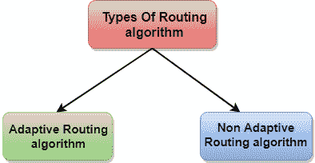

# 路由算法

> 原文：<https://www.javatpoint.com/computer-network-routing-algorithm>

*   为了将数据包从源传输到目的地，网络层必须确定传输数据包的最佳路由。
*   无论网络层提供数据报服务还是虚电路服务，网络层的主要工作就是提供最佳路由。路由协议提供了这项工作。
*   路由协议是一种路由算法，提供从源到目的地的最佳路径。最佳路径是从源到目的地具有“最小成本路径”的路径。
*   路由是将数据包从源转发到目的地的过程，但发送数据包的最佳路由由路由算法决定。

## 路由算法的分类

路由算法分为两类:

*   自适应路由算法
*   非自适应路由算法

* * *

## 自适应路由算法

*   自适应路由算法也称为动态路由算法。
*   该算法基于拓扑和网络流量做出路由决策。
*   与该算法相关的主要参数是跳数、距离和估计的通过时间。

**自适应路由算法可以分为三个部分:**

*   **集中式算法:**它也称为全局路由算法，因为它通过使用关于网络的完整和全局知识来计算源和目的地之间的最小成本路径。该算法以节点之间的连通性和链路成本为输入，在实际执行任何计算之前获得该信息。**链路状态算法**被称为集中式算法，因为它知道网络中每个链路的成本。
*   **隔离算法:**是利用本地信息获取路由信息，而不是从其他节点收集信息的算法。
*   **分布式算法:**它也称为分散算法，因为它以迭代和分布式的方式计算源和目的地之间的最小成本路径。在分散算法中，没有节点知道所有网络链路的成本。首先，一个节点只包含它自己直接连接的链路的信息，并通过迭代计算过程计算出到达目的地的最小成本路径。距离矢量算法是一种分散的算法，因为它永远不知道从源到目的地的完整路径，而是知道数据包将沿着成本最低的路径转发的方向。

* * *

## 非自适应路由算法

*   非自适应路由算法也称为静态路由算法。
*   启动网络时，路由信息存储到路由器。
*   非自适应路由算法不会根据网络拓扑或网络流量做出路由决定。

**非自适应路由算法有两种类型:**

**泛洪:**在泛洪的情况下，每个传入的数据包都被发送到所有传出链路，但到达的那个除外。泛洪的缺点是节点可能包含特定数据包的多个副本。

**随机游走:**在随机游走的情况下，节点随机发送给其一个邻居的数据包。使用随机漫步的一个优点是它可以非常有效地使用替代路线。

## 自适应和非自适应路由算法的区别

| 比较的基础 | 自适应路由算法 | 非自适应路由算法 |
| 规定 | 自适应路由算法是一种根据网络条件构建路由表的算法。 | 非自适应路由算法是一种构建静态表来确定发送数据包的节点的算法。 |
| 使用 | 动态路由采用自适应路由算法。 | 静态路由使用非自适应路由算法。 |
| 路由决策 | 路由决策是基于拓扑和网络流量做出的。 | 路由决策是静态表。 |
| 分门别类 | 自适应路由算法的类型有集中式、隔离式和分布式算法。 | 非自适应路由算法的类型有泛洪和随机游走。 |
| 复杂性 | 自适应路由算法更加复杂。 | 非自适应路由算法很简单。 |