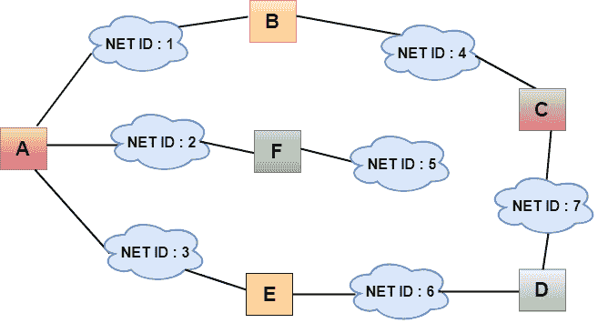
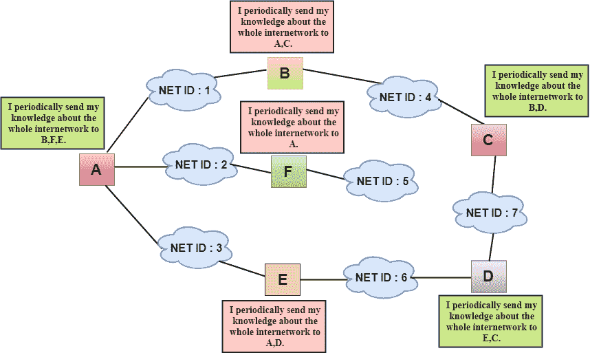
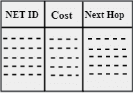
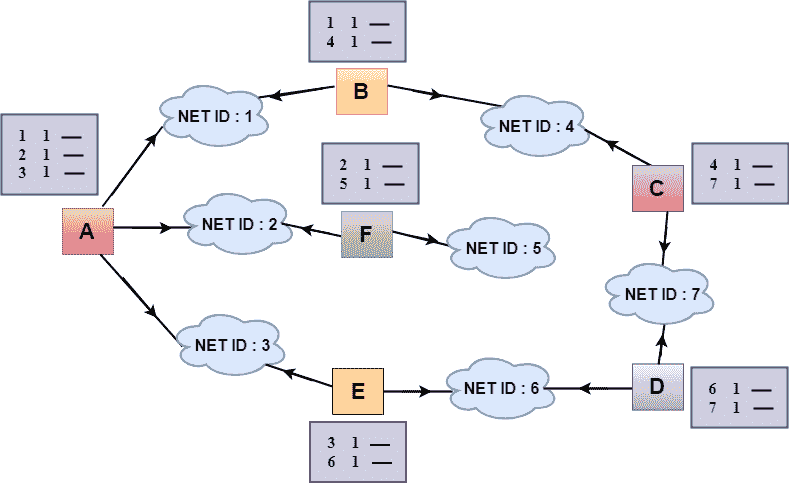
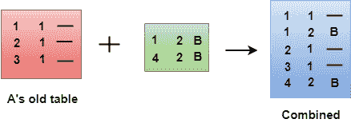
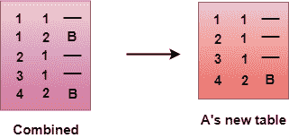

# 距离矢量路由算法

> 原文：<https://www.javatpoint.com/distance-vector-routing-algorithm>

*   **距离矢量算法是迭代的、异步的、分布式的。**
    *   **Distributed:** 它是分布式的，每个节点从其一个或多个直接连接的邻居接收信息，执行计算，然后将结果分配回其邻居。
    *   **迭代:**它是迭代的，因为它的过程一直持续到没有更多的信息可在邻居之间交换。
    *   **异步:**它不要求它的所有节点彼此在锁定步骤中操作。
*   距离矢量算法是一种动态算法。
*   主要用于 ARPANET，和 RIP。
*   每台路由器都维护一个名为**向量**的距离表。

### 理解距离矢量路由算法工作的三个关键:

*   **关于整个网络的知识:**每台路由器通过整个网络分享自己的知识。路由器将其收集的网络知识发送给邻居。
*   **只向邻居路由:**路由器只向那些有直接链路的路由器发送网络信息。路由器通过端口发送网络中的任何信息。路由器接收该信息，并使用该信息更新自己的路由表。
*   **定期信息共享:**30 秒内，路由器将信息发送给相邻路由器。

## 距离矢量路由算法

设 d <sub>x</sub> (y)为从节点 x 到节点 y 的最小成本路径的成本，最小成本由 Bellman-Ford 方程关联，

```
dx(y) = minv{c(x,v) + dv(y)}

```

**其中**米女是所有 x 个邻居的方程式。从 x 行进到 v 之后，如果考虑从 v 到 y 的成本最低的路径，则路径成本为 c(x，v)+d <sub>v</sub> (y)。从 x 到 y 的最小成本是 c(x，v)+d <sub>v</sub> (y)接管所有邻居的最小成本。

**通过距离矢量路由算法，节点 x 包含以下路由信息:**

*   对于每个邻居 v，成本 c(x，v)是从 x 到直接连接的邻居 v 的路径成本。
*   距离向量 x，即 D<sub>x</sub>=【D<sub>x</sub>(y):N 中的 y，包含其到所有目的地的成本，N 中的 y
*   其每个邻居的距离向量，即，对于 x 的每个邻居 v，D<sub>v</sub>=[D<sub>v</sub>(y):y in N]

距离矢量路由是一种异步算法，其中节点 x 将其距离矢量的副本发送给其所有邻居。当节点 x 从它的一个相邻向量 v 接收到新的距离向量时，它保存 v 的距离向量，并使用贝尔曼-福特方程来更新它自己的距离向量。等式如下:

```
dx(y) = minv{ c(x,v) + dv(y)}     for each node y in N

```

节点 x 已经通过使用上面的等式更新了它自己的距离矢量表，并将其更新的表发送给它的所有邻居，以便他们可以更新他们自己的距离矢量。

## 算法

```
At each node x,
**初始化**
for all destinations y in N:
Dx(y) = c(x,y)     // If y is not a neighbor then c(x,y) = ∞
for each neighbor w
Dw(y) = ?     for all destination y in N.
for each neighbor w
send distance vector Dx = [ Dx(y)  : y in N ] to w
loop
  wait(until I receive any distance vector from some neighbor w)
  for each y in N:
  Dx(y) = minv{c(x,v)+Dv(y)}
If Dx(y) is changed for any destination y
Send distance vector Dx = [ Dx(y) : y in N ] to all neighbors
forever

```

#### 注意:在距离向量算法中，当节点 x 在一个直接链接的节点中看到任何成本变化或者从某个邻居接收到任何向量更新时，它就更新它的表。

**我们通过一个例子来了解一下:**

## 共享信息



*   上图中，每个云代表网络，云内的数字代表网络 ID。
*   所有的局域网都由路由器连接，它们用标有 A、B、C、D、E、f 的方框表示
*   距离矢量路由算法通过假设每条链路的成本为一个单位来简化路由过程。因此，传输效率可以通过到达目的地的链路数量来衡量。
*   在距离矢量路由中，开销基于跳数。



在上图中，我们观察到路由器将知识发送给直接邻居。邻居将这些知识添加到他们自己的知识中，并将更新后的表发送给他们自己的邻居。通过这种方式，路由器获得自己的信息以及邻居的新信息。

## 路由选择表

发生两个过程:

*   创建表格
*   更新表格

### 创建表格

最初，为每台路由器创建路由表，其中包含至少三种类型的信息，如网络标识、成本和下一跳。



*   **网络标识:**网络标识定义了数据包的最终目的地。
*   **成本:**成本是数据包到达目的地必须经过的跳数。
*   **下一跳:**是数据包必须送达的路由器。



*   在上图中，显示了所有路由器的原始路由表。在路由表中，第一列代表网络标识，第二列代表链路成本，第三列为空。
*   这些路由表被发送给所有邻居。

**例如:**

```

A sends its routing table to B, F & E.
B sends its routing table to A & C.
C sends its routing table to B & D.
D sends its routing table to E & C.
E sends its routing table to A & D.
F sends its routing table to A.

```

### 更新表格

*   当 A 从 B 收到路由表时，它会使用其信息来更新该表。
*   B 的路由表显示了数据包如何移动到网络 1 和 4。
*   B 是 A 路由器的邻居，从 A 到 B 的数据包一跳就能到达。因此，将 1 加到 B 表中给出的所有成本上，总和将是到达特定网络的成本。


*   调整后，A 然后将该表与其自己的表合并，以创建一个组合表。



*   组合表可能包含一些重复数据。在上图中，路由器 A 的组合表包含重复数据，因此它只保留那些成本最低的数据。例如，A 可以通过两种方式将数据发送到网络 1。第一个，不使用下一个路由器，所以需要一跳。第二种需要两跳(A 到 B，然后 B 到网络 1)。第一个选项成本最低，因此保留，第二个选项放弃。



*   为所有路由器创建路由表的过程仍在继续。每台路由器都从邻居那里接收信息，并更新路由表。

**所有路由器的最终路由表如下:**

