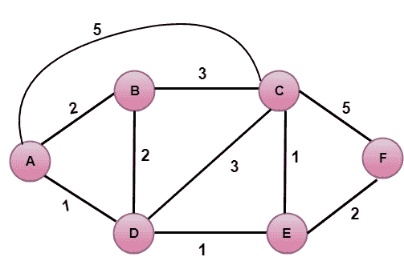

# 链路状态路由

> 原文：<https://www.javatpoint.com/link-state-routing-algorithm>

链路状态路由是一种技术，在这种技术中，每台路由器都与互联网络中的其他每台路由器共享其邻居的知识。

**理解链路状态路由算法的三个关键:**

*   **关于邻居的知识:**路由器不发送路由表，只发送关于邻居的信息。路由器向其他路由器广播其身份和直连链路的成本。
*   **泛洪:**每台路由器都会将信息发送到互联网上除邻居之外的其他每台路由器。这个过程被称为洪水。收到数据包的每台路由器都会将副本发送给所有邻居。最后，每台路由器都会收到相同信息的副本。
*   **信息共享:**只有当信息发生变化时，路由器才会将信息发送给每隔一台路由器。

## 链路状态路由有两个阶段:

### 可靠的注水

*   **初始状态:**每个节点都知道其邻居的开销。
*   **最终状态:**每个节点都知道整个图。

### 路线计算

每个节点使用图上的 Dijkstra 算法来计算到所有节点的最佳路由。

*   链路状态路由算法也称为 Dijkstra 算法，用于查找网络中从一个节点到所有其他节点的最短路径。
*   Dijkstra 算法是一种迭代算法，它的性质是在算法的第 k 次<sup>次</sup>迭代后，k 个目的节点的最小代价路径是众所周知的。

## 让我们描述一些符号:

*   **c( i，j):** 从节点 I 到节点 j 的链路开销，如果 I 和 j 节点没有直接链接，那么 c( i，j) = ∞。
*   **D(v):** 它定义了当前开销最小的从源代码到目的地 v 的路径的开销。
*   **P(v):** 它定义了前一个节点(v 的邻居)以及当前从源到 v 的最小开销路径。
*   **N:** 是网络中可用的节点总数。

## 算法

```
Initialization
N = {A}     // A is a root node.
for all nodes v
if v adjacent to A
then D(v) = c(A,v)
else D(v) = infinity
loop
find w not in N such that D(w) is a minimum.
Add w to N
Update D(v) for all v adjacent to w and not in N:
D(v) = min(D(v) , D(w) + c(w,v))
Until all nodes in N

```

在上述算法中，初始化步骤之后是循环。循环执行的次数等于网络中可用节点的总数。

**我们通过一个例子来了解一下:**



**上图中，源顶点为 A.**

### 第一步:

第一步是初始化步骤。目前已知的从 A 到其直接连接的邻居 B、C、D 的最小开销路径分别是 2、5、1。从 A 到 B 的成本设置为 2，从 A 到 D 设置为 1，从 A 到 C 设置为 5。从 A 到 E 和 F 的成本设置为无穷大，因为它们与 A 没有直接联系

| 步骤 | 普通 | 丁(乙)、丙(乙) | 丁(丙)、丙(丙) | D(D)，P(D) | 丁(戊)，戊(戊) | 丁(氟)、丙(氟) |
| one | A | 2、甲 | 5、甲 | 1、甲 | ∞ | ∞ |

### 第二步:

在上表中，我们观察到顶点 D 包含步骤 1 中的最小代价路径。因此，它被添加在 n 中。现在，我们需要确定一条通过 D 顶点的最小成本路径。

**a)计算从 A 到 B 的最短路径**

```

v = B, w = D
D(B) = min( D(B) , D(D) + c(D,B) )
     = min( 2, 1+2)>
     = min( 2, 3)
The minimum value is 2\. Therefore, the currently shortest path from A to B is 2.

```

**b)计算从 A 到 C 的最短路径**

```

v = C, w = D
D(B) = min( D(C) , D(D) + c(D,C) )
     = min( 5, 1+3)
     = min( 5, 4)
The minimum value is 4\. Therefore, the currently shortest path from A to C is 4.

```

**c)计算从 A 到 E 的最短路径**

```

v = E, w = D
D(B) = min( D(E) , D(D) + c(D,E) )
     = min( ∞,  1+1)
     = min(∞, 2)
The minimum value is 2\. Therefore, the currently shortest path from A to E is 2.

```

#### 注:顶点 D 与顶点 e 没有直接联系，因此 D(F)的值为无穷大。

| 步骤 | 普通 | 丁(乙)、丙(乙) | 丁(丙)、丙(丙) | D(D)，P(D) | 丁(戊)，戊(戊) | 丁(氟)、丙(氟) |
| one | A | 2、甲 | 5、甲 | 1、甲 | ∞ | ∞ |
| Two | 广告 | 2、甲 | 4、D |  | 2、D | ∞ |

### 第三步:

在上表中，我们观察到 E 和 B 在步骤 2 中都具有最小成本路径。让我们考虑 E 顶点。现在，我们确定剩余顶点通过 e 的最小成本路径。

**a)计算从 A 到 b 的最短路径**

```

v = B, w = E
D(B) = min( D(B) , D(E) + c(E,B) )
     = min( 2 , 2+ ∞ )
     = min( 2, ∞)
The minimum value is 2\. Therefore, the currently shortest path from A to B is 2.

```

**b)计算从 A 到 c 的最短路径**

```

v = C, w = E
D(B) = min( D(C) , D(E) + c(E,C) )
     = min( 4 , 2+1 )
     = min( 4,3)
The minimum value is 3\. Therefore, the currently shortest path from A to C is 3.

```

**c)计算从 A 到 f 的最短路径**

```

v = F, w = E
D(B) = min( D(F) , D(E) + c(E,F) )
     = min( ∞ , 2+2 )
     = min(∞ ,4)
The minimum value is 4\. Therefore, the currently shortest path from A to F is 4.

```

| 步骤 | 普通 | 丁(乙)、丙(乙) | 丁(丙)、丙(丙) | D(D)，P(D) | 丁(戊)，戊(戊) | 丁(氟)、丙(氟) |
| one | A | 2、甲 | 5、甲 | 1、甲 | ∞ | ∞ |
| Two | 广告 | 2、甲 | 4、D |  | 2、D | ∞ |
| three | 自动数据输入 | 2、甲 | 3、E |  |  | 4、E |

### 第四步:

在上表中，我们观察到 B 顶点在步骤 3 中具有最小代价路径。因此，它被添加在 n 中。现在，我们确定剩余顶点通过 b 的最小成本路径。

**a)计算从 A 到 c 的最短路径**

```

v = C, w = B
D(B) = min( D(C) , D(B) + c(B,C) )
     = min( 3 , 2+3 )
     = min( 3,5)
The minimum value is 3\. Therefore, the currently shortest path from A to C is 3.

```

**b)计算从 A 到 f 的最短路径**

```

v = F, w = B
D(B) = min( D(F) , D(B) + c(B,F) )
     = min( 4, ∞)
     = min(4, ∞)
The minimum value is 4\. Therefore, the currently shortest path from A to F is 4.

```

| 步骤 | 普通 | 丁(乙)、丙(乙) | 丁(丙)、丙(丙) | D(D)，P(D) | 丁(戊)，戊(戊) | 丁(氟)、丙(氟) |
| one | A | 2、甲 | 5、甲 | 1、甲 | ∞ | ∞ |
| Two | 广告 | 2、甲 | 4、D |  | 2、D | ∞ |
| three | 自动数据输入 | 2、甲 | 3、E |  |  | 4、E |
| four | -再见 |  | 3、E |  |  | 4、E |

### 第五步:

在上表中，我们观察到 C 顶点在步骤 4 中具有最小代价路径。因此，它被添加在 n 中。现在，我们通过 c 来确定剩余顶点的最小成本路径。

**a)计算从 A 到 f 的最短路径**

```

v = F, w = C
D(B) = min( D(F) , D(C) + c(C,F) )
     = min( 4, 3+5)
     = min(4,8)
The minimum value is 4\. Therefore, the currently shortest path from A to F is 4.

```

| 步骤 | 普通 | 丁(乙)、丙(乙) | 丁(丙)、丙(丙) | D(D)，P(D) | 丁(戊)，戊(戊) | 丁(氟)、丙(氟) |
| one | A | 2、甲 | 5、甲 | 1、甲 | ∞ | ∞ |
| Two | 广告 | 2、甲 | 4、D |  | 2、D | ∞ |
| three | 自动数据输入 | 2、甲 | 3、E |  |  | 4、E |
| four | -再见 |  | 3、E |  |  | 4、E |
| five | 砖坯黏土 |  |  |  |  | 4、E |

### 最终表格:

| 步骤 | 普通 | 丁(乙)、丙(乙) | 丁(丙)、丙(丙) | D(D)，P(D) | 丁(戊)，戊(戊) | 丁(氟)、丙(氟) |
| one | A | 2、甲 | 5、甲 | 1、甲 | ∞ | ∞ |
| Two | 广告 | 2、甲 | 4、D |  | 2、D | ∞ |
| three | 自动数据输入 | 2、甲 | 3、E |  |  | 4、E |
| four | -再见 |  | 3、E |  |  | 4、E |
| five | 砖坯黏土 |  |  |  |  | 4、E |
| six | adbecf |  |  |  |  |  |

### 缺点:

由于泛洪，线路状态路由中产生了大量流量。泛洪会导致无限循环，这个问题可以通过使用离开时间字段来解决