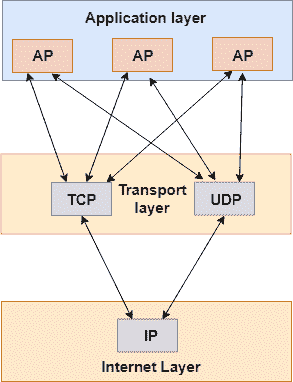
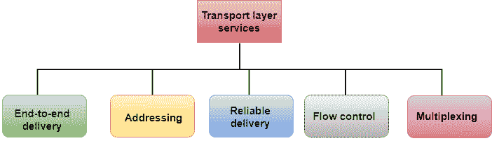
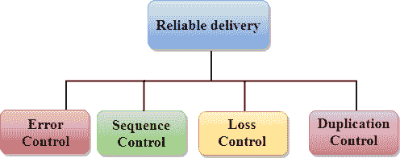
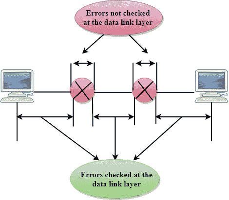
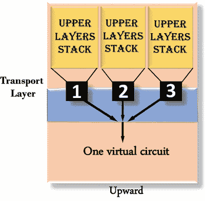
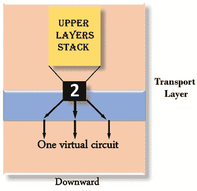
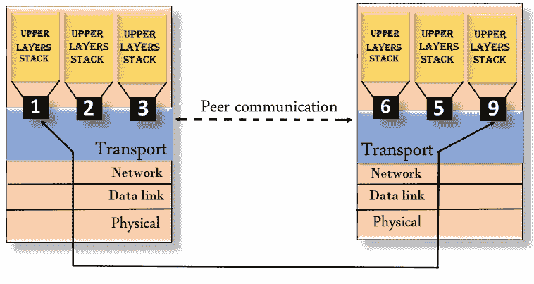

# 传输层

> 原文：<https://www.javatpoint.com/computer-network-transport-layer>

*   传输层是自上而下的第 4 层。
*   传输层的主要作用是直接向运行在不同主机上的应用程序进程提供通信服务。
*   传输层提供运行在不同主机上的应用程序进程之间的逻辑通信。尽管不同主机上的应用程序进程没有物理连接，但应用程序进程使用传输层提供的逻辑通信相互发送消息。
*   传输层协议在终端系统中实现，但不在网络路由器中实现。
*   计算机网络向网络应用程序提供不止一种协议。例如，TCP 和 UDP 是两种传输层协议，它们为网络层提供一组不同的服务。
*   所有传输层协议都提供复用/解复用服务。它还提供其他服务，如可靠的数据传输、带宽保证和延迟保证。
*   应用层中的每个应用程序都能够使用 TCP 或 UDP 发送消息。应用程序通过使用这两种协议中的任何一种进行通信。然后，TCP 和 UDP 都将与互联网层中的互联网协议进行通信。应用程序可以读写传输层。因此，我们可以说沟通是一个双向的过程。

## 传输层提供的服务

传输层提供的服务类似于数据链路层。数据链路层在单个网络中提供服务，而传输层在由多个网络组成的互联网络中提供服务。数据链路层控制物理层，而传输层控制所有低层。

**传输层协议提供的服务可以分为五类:**

*   端到端交付
*   访问
*   可靠的交付
*   流控制
*   多路技术

## 端到端交付:

传输层将整个消息传输到目的地。因此，它确保了从源到目的地的整个消息的端到端传递。

## 可靠的交付:

传输层通过重传丢失和损坏的数据包来提供可靠性服务。

**可靠交付有四个方面:**

*   错误控制
*   程序控制
*   失去控制
*   复制控制

**误差控制**

*   可靠性的主要作用是**误差控制**。实际上，没有一次传输是 100%无差错的。因此，传输层协议旨在提供无差错传输。
*   数据链路层也提供了错误处理机制，但它只确保节点到节点的无错误传递。然而，节点到节点的可靠性并不能保证端到端的可靠性。
*   数据链路层检查每个网络之间的错误。如果某个路由器内部出现错误，则数据链路层不会发现该错误。它只检测那些在链接开始和结束之间引入的错误。因此，传输层端到端地检查错误，以确保数据包正确到达。

**顺序控制**

*   可靠性的第二个方面是在传输层实现的顺序控制。
*   在发送端，传输层负责确保从上层接收的数据包可以被下层使用。在接收端，它确保传输的各个部分可以正确地重新组装。

**损耗控制**

损失控制是可靠性的第三个方面。传输层确保传输的所有片段都到达目的地，而不是部分片段。在发送端，传输层给所有传输片段赋予序列号。这些序列号允许接收器？的传输层来识别丢失的段。

**复制控制**

复制控制是可靠性的第四个方面。传输层保证没有重复数据到达目的地。序列号用于识别丢失的数据包；类似地，它允许接收者识别和丢弃重复的段。

## 流控制

流量控制用于防止发送方压倒接收方。如果接收方过载了太多的数据，那么接收方就会丢弃数据包，并要求重新传输数据包。这会增加网络拥塞，从而降低系统性能。传输层负责流量控制。它使用滑动窗口协议，使数据传输更有效，并控制数据流，使接收器不会不堪重负。滑动窗口协议是面向字节的，而不是面向帧的。

## 多路技术

传输层使用多路复用来提高传输效率。

**复用有两种方式:**

*   **上行复用:**上行复用是指多个传输层连接使用同一个网络连接。为了提高成本效益，传输层沿着相同的路径发送去往相同目的地的多个传输；这是通过上行复用实现的。

*   **下行复用:**下行复用是指一个传输层连接使用多个网络连接。向下多路复用允许传输层在几条路径之间分割连接，以提高吞吐量。当网络容量较低或较慢时，使用这种类型的多路复用。

## 访问

*   根据分层模型，传输层与会话层的功能交互。许多协议将会话、表示和应用层协议组合成一个称为应用层的单一层。在这些情况下，向会话层的交付意味着向应用层的交付。一台机器上的应用程序生成的数据必须传输到另一台机器上的正确应用程序。在这种情况下，寻址由传输层提供。
*   传输层提供指定为站或端口的用户地址。端口变量表示被称为传输服务接入点(TSAP)的指定站点的特定终端服务用户。每个站点只有一个传输实体。
*   传输层协议需要知道哪些上层协议正在通信。

