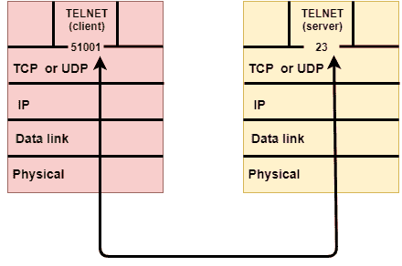
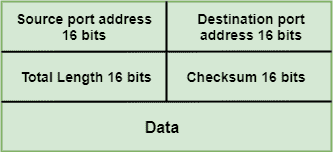
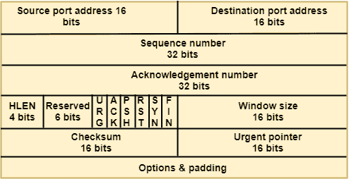

# 传输层协议

> 原文：<https://www.javatpoint.com/computer-network-transport-layer-protocols>

*   传输层由两个协议表示:TCP 和 UDP。
*   网络层的 IP 协议将数据报从源主机传送到目的主机。
*   如今，操作系统支持多用户和多处理环境，正在执行的程序称为进程。当主机向其他主机发送消息时，意味着源进程正在向目标进程发送一个进程。传输层协议定义了一些到单个端口的连接，称为协议端口。
*   IP 协议是一种主机到主机的协议，用于将数据包从源主机传送到目的主机，而传输层协议是端口到端口的协议，在 IP 协议之上工作，将数据包从始发端口传送到 IP 服务，从 IP 服务传送到目的端口。
*   每个端口由一个正整数地址定义，它有 16 位。

## 用户数据报协议(User Datagram Protocol)

*   UDP 代表**用户数据报协议**。
*   UDP 是一种简单的协议，它提供无序列传输功能。
*   UDP 是一种无连接协议。
*   当可靠性和安全性不如速度和大小重要时，就使用这种协议。
*   UDP 是一种端到端的传输层协议，它从上层向数据添加传输层地址、校验和错误控制以及长度信息。
*   由 UDP 协议产生的数据包被称为用户数据报。

## 用户数据报格式

用户数据报有一个 16 字节的报头，如下所示:

**在哪里，**

*   **源端口地址:**定义已经传递消息的应用进程的地址。源端口地址是 16 位地址。
*   **目的端口地址:**定义将接收消息的应用进程的地址。目的端口地址是 16 位地址。
*   **总长度:**以字节为单位定义用户数据报的总长度。这是一个 16 位字段。
*   **校验和:**校验和是一个 16 位字段，用于错误检测。

### UDP 协议的缺点

*   UDP 提供了端到端传输所需的基本功能。
*   它不提供任何排序或重新排序功能，并且在报告错误时不指定损坏的数据包。
*   UDP 可以发现发生了错误，但它不指定哪个数据包丢失了，因为它不包含特定数据段的标识或序列号。

* * *

## 三氯苯酚

*   TCP 代表传输控制协议。
*   它为应用程序提供完整的传输层服务。
*   它是一种面向连接的协议，意味着在传输的两端之间建立连接。为了建立连接，TCP 在传输期间在发送方和接收方之间生成一个虚电路。

## 传输控制协议的特点

*   **流数据传输:** TCP 协议以连续字节流的形式传输数据。TCP 以 TCP 段的形式对字节进行分组，然后将其传递到 IP 层以传输到目的地。TCP 本身将数据分段并转发到 IP。
*   **可靠性:** TCP 为传输的每个字节分配一个序列号，并期待接收 TCP 的肯定确认。如果在超时间隔内没有收到确认，则数据会重新传输到目的地。
    接收的 TCP 使用序列号来重组无序到达的数据段，或者消除重复的数据段。
*   **流量控制:**接收时，TCP 向发送方发回一个确认，指示它可以接收的字节数，而不会溢出其内部缓冲区。字节数以最高序列号的形式在确认中发送，它可以毫无问题地接收。这种机制也被称为窗口机制。
*   **复用:**复用是接受来自不同应用的数据，转发到不同计算机上不同应用的过程。在接收端，数据被转发到正确的应用程序。这个过程被称为解复用。TCP 通过使用称为端口的逻辑通道将数据包传输到正确的应用程序。
*   **逻辑连接:**套接字、序列号和窗口大小的组合称为逻辑连接。每个连接都由发送和接收进程使用的套接字对来标识。
*   **全双工:** TCP 提供全双工服务，即数据同时双向流动。为了实现全双工服务，每个 TCP 都应该有发送和接收缓冲区，以便数据段可以双向流动。TCP 是一种面向连接的协议。假设进程 A 想要发送和接收来自进程 b 的数据。发生以下步骤:
    *   在两个 TCp 之间建立连接。
    *   数据双向交换。
    *   连接被终止。

## 传输控制协议段格式

**在哪里，**

*   **源端口地址:**用于定义应用程序在源计算机中的地址。这是一个 16 位字段。
*   **目的端口地址:**用于定义目的计算机中应用程序的地址。这是一个 16 位字段。
*   **序列号:**数据流被分成两个或多个 TCP 段。32 位序列号字段表示数据在原始数据流中的位置。
*   **确认号:**一个 32 字段的确认号确认来自其他通信设备的数据。如果确认字段设置为 1，则它指定接收方期望接收的序列号。
*   **报头长度(HLEN):** 它以 32 位字指定 TCP 报头的大小。标题的最小长度为 5 个字，最大长度为 15 个字。因此，TCP 报头的最大大小是 60 字节，TCP 报头的最小大小是 20 字节。
*   **保留:**是一个六位字段，保留供将来使用。
*   **控制位:**控制字段的每一位都独立运行。一个控制位定义了一个段的使用，或者作为其他字段的有效性检查。

### 控制字段中总共有六种标志:

*   **URG:**URG 字段表示段中的数据是紧急的。
*   **确认:**当设置了确认字段时，它将验证确认号。
*   **PSH:**PSH 字段用于通知发送方需要更高的吞吐量，因此如果可能，必须以更高的吞吐量推送数据。
*   **RST:** 当序列号出现任何混淆时，重置位用于重置 TCP 连接。
*   **SYN:**SYN 字段用于同步三种类型段中的序列号:连接请求、连接确认(设置确认位)和确认确认。
*   **FIN:**FIN 字段用于通知接收 TCP 模块发送方已经发送完数据。它用于三种类型的连接终止:终止请求、终止确认和终止确认确认。
    *   **窗口大小:**窗口是定义窗口大小的 16 位字段。
    *   **校验和:**校验和是用于错误检测的 16 位字段。
    *   **紧急指针:**如果 URG 标志设置为 1，那么这个 16 位字段是从序列号的偏移，表示它是最后一个紧急数据字节。
    *   **选项和填充:**它定义了可选字段，用于将附加信息传递给接收者。

* * *

## 传输控制协议和用户数据协议的差异

| 比较的基础 | 三氯苯酚 | 用户数据报协议(User Datagram Protocol) |
| 定义 | TCP 在传输数据之前会建立一个虚拟电路。 | UDP 将数据直接传输到目标计算机，而不验证接收器是否准备好接收数据。 |
| 连接类型 | 这是一个面向连接的协议 | 这是一个无连接协议 |
| 速度 | 慢的 | 高的 |
| 可靠性 | 这是一个可靠的协议。 | 这是一个不可靠的协议。 |
| 标题大小 | 20 字节 | 8 字节 |
| 确认 | 它等待数据的确认，并有能力重新发送丢失的数据包。 | 它既不接受确认，也不转发损坏的帧。 |