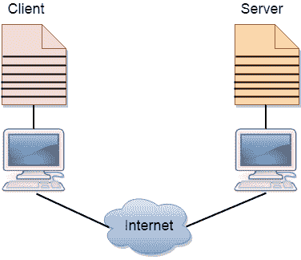

# 客户端和服务器模型

> 原文：<https://www.javatpoint.com/computer-network-client-and-server-model>

*   客户机和服务器网络模型是这样一种模型，其中诸如服务器的计算机向诸如客户机的其他计算机提供网络服务，以执行基于用户的任务。这种模式被称为客户端-服务器网络模式。
*   使用客户机-服务器模型的应用程序应该遵循下面给出的策略:

*   运行在本地机器上的应用程序被称为客户端程序，它向运行在远程机器上的被称为服务器程序的应用程序请求服务。
*   客户端程序仅在向服务器请求服务时运行，而服务器程序始终运行，因为它不知道何时需要其服务。
*   服务器为许多客户端提供服务，而不仅仅是为单个客户端。因此，我们可以说客户机-服务器遵循多对一的关系。许多客户端可以使用一台服务器的服务。
*   服务是经常需要的，许多用户都有一个特定的客户机-服务器应用程序。例如，客户机-服务器应用程序允许用户访问文件、发送电子邮件等。如果服务更加定制化，那么我们应该有一个通用的应用程序，允许用户访问远程计算机上可用的服务。

## 客户

客户端是在本地机器上运行的程序，向服务器请求服务。客户端程序是一个有限程序，意味着服务由用户启动，并在服务完成时终止。

## 计算机网络服务器

服务器是在远程机器上运行的程序，为客户端提供服务。当客户端请求服务时，服务器为传入的请求打开大门，但它从不启动服务。

服务器程序是一个无限程序，意味着当它启动时，它无限运行，除非出现问题。服务器等待来自客户端的传入请求。当请求到达服务器时，它会响应请求。

### 客户端-服务器网络的优势:

*   **集中式:**在客户端-服务器网络中，集中式备份是可能的，即所有数据都存储在服务器中。
*   **安全性:**这些网络更加安全，因为所有共享资源都集中管理。
*   **性能:**专用服务器的使用提高了资源共享的速度。这提高了整个系统的性能。
*   **扩展性:**我们可以分别增加客户端和服务器的数量，即可以增加新元素，也可以随时在网络中增加一个新节点。

### 客户端-服务器网络的缺点:

*   **流量拥堵**是客户端/服务器网络的一大问题。当大量客户端向同一服务器发送请求时，可能会导致流量拥塞的问题。
*   它不具有网络的健壮性，即当服务器关闭时，客户端请求无法得到满足。
*   客户机/服务器网络非常重要。有时，常规的计算机硬件不能为一定数量的客户端服务。在这种情况下，服务器端需要特定的硬件来完成工作。
*   有时资源存在于服务器中，但可能不存在于客户机中。例如，如果应用程序是 web，那么我们不能在不取出 web 上的打印视图窗口的情况下，直接在打印机上打印出来。