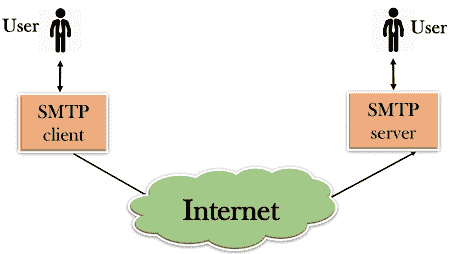
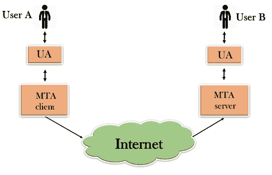
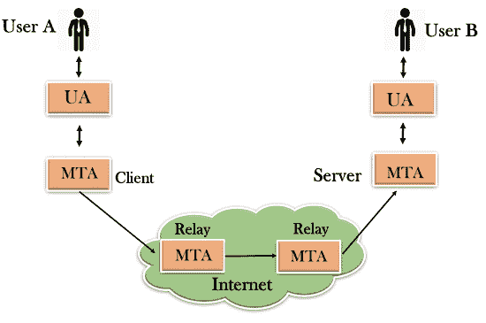
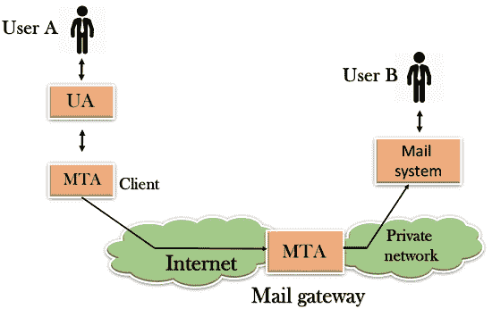

# 简单邮件传输协议

> 原文：<https://www.javatpoint.com/simple-mail-transfer-protocol>

*   SMTP 代表简单邮件传输协议。
*   SMTP 是一套允许软件通过互联网传输电子邮件的通信准则，称为**简单邮件传输协议**。
*   它是一个用于根据电子邮件地址向其他计算机用户发送消息的程序。
*   它在同一台或不同计算机上的用户之间提供邮件交换，并且它还支持:
    *   它可以向一个或多个收件人发送一封邮件。
    *   发送消息可以包括文本、语音、视频或图形。
    *   它也可以在互联网之外的网络上发送信息。
*   SMTP 的主要目的是用来设置服务器之间的通信规则。服务器有一种方式来识别自己，并宣布他们试图执行什么样的通信。他们也有办法处理错误，如不正确的电子邮件地址。例如，如果收件人地址错误，则接收服务器会用某种错误消息进行回复。

## SMTP 的组件

*   首先，我们将把 SMTP 客户端和 SMTP 服务器分成两个组件，如用户代理(UA)和邮件传输代理(MTA)。用户代理(UA)准备邮件，创建信封，然后将邮件放入信封。邮件传输代理(MTA)通过互联网传输邮件。

*   通过添加中继系统，SMTP 允许更复杂的系统。不是只有一个 MTA 在发送端，一个在接收端，可以添加更多的 MTA，充当客户端或服务器来转发电子邮件。

*   没有 TCP/IP 协议的中继系统也可以用于向用户发送电子邮件，这是通过使用邮件网关来实现的。邮件网关是一个中继 MTA，可用于接收电子邮件。

## SMTP 的工作方式

1.  **邮件合成:**用户通过使用邮件用户代理(MUA)合成电子邮件消息来发送电子邮件。邮件用户代理是一个用来发送和接收邮件的程序。消息包含两部分:正文和标题。邮件正文是邮件的主要部分，而邮件头包含发件人和收件人地址等信息。报头还包括描述性信息，例如消息的主题。在这种情况下，邮件正文就像一封信，邮件头就像一个包含收件人地址的信封。
2.  **邮件的提交:**邮件客户端在撰写完一封邮件后，通过使用 TCP 端口 25 上的 SMTP 将完成的电子邮件提交给 SMTP 服务器。
3.  **邮件传递:**电子邮件地址包含两部分:收件人的用户名和域名。例如:[【邮件保护】](/cdn-cgi/l/email-protection)，其中“vivek”是收件人的用户名，“gmail.com”是域名。
    如果收件人电子邮件地址的域名与发件人的域名不同，则 MSA 会将邮件发送到邮件传输代理(MTA)。为了转发电子邮件，MTA 将找到目标域。它检查域名系统中的 MX 记录以获得目标域。MX 记录包含收件人域的域名和 IP 地址。一旦找到记录，MTA 就连接到交换服务器来转发消息。
4.  **邮件的接收和处理:**一旦接收到传入消息，交换服务器就将其传递给传入服务器(邮件传递代理)，该服务器存储电子邮件，并在那里等待用户检索。
5.  **邮件的访问和检索:**MDA 中存储的邮件可以使用 MUA(邮件用户代理)进行检索。可以使用登录名和密码访问 MUA。