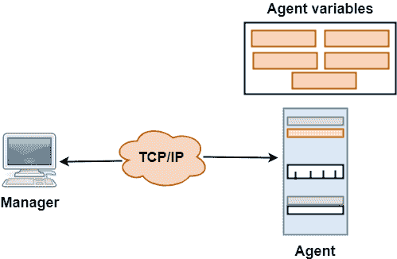
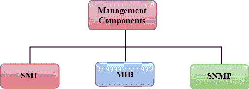
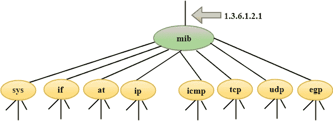

# 简单网络管理协议(Simple Network Management Protocol)

> 原文：<https://www.javatpoint.com/simple-network-management-protocol>

*   SNMP 代表**简单网络管理协议**。
*   SNMP 是一个用于管理互联网上设备的框架。
*   它提供了一套监控和管理互联网的操作。

## 简单网络管理协议概念

*   SNMP 有两个组件:管理器和代理。
*   管理器是控制和监视一组代理(如路由器)的主机。
*   这是一种应用层协议，其中几个管理站可以处理一组代理。
*   在应用层设计的协议可以监控由不同制造商制造并安装在不同物理网络上的设备。
*   它用于由路由器或网关连接的不同局域网和广域网组成的异构网络。

## 经理和代理

*   管理器是运行 SNMP 客户端程序的主机，而代理是运行 SNMP 服务器程序的路由器。
*   互联网的管理是通过管理者和代理之间的简单交互来实现的。
*   代理用于将信息保存在数据库中，而管理器用于访问数据库中的值。例如，路由器可以存储适当的变量，例如接收和转发的数据包数量，而管理器可以比较这些变量来确定路由器是否拥塞。
*   代理也可以对管理过程做出贡献。代理上的服务器程序会检查环境，如果出现问题，代理会向管理器发送警告消息。

## 使用 SNMP 进行管理有三个基本思想:

*   经理通过请求反映代理行为的信息来检查代理。
*   管理器还通过重置代理数据库中的值来强制代理执行某项功能。
*   代理还通过就异常情况向经理发出警告来促进管理过程。

## 管理组件

*   管理不仅是通过 SNMP 协议实现的，还通过使用其他可以与 SNMP 协议协作的协议来实现的。管理是通过使用另外两个协议来实现的:SMI(管理信息结构)和 MIB(管理信息库)。
*   管理是 SMI、MIB 和 SNMP 的组合。抽象语法符号 1 (ASN.1)和基本编码规则(BER)等所有这三种协议。

### 标准测量仪器(Standard Measuring Instruments)

管理信息结构是网络管理中使用的一个组件。它的主要功能是定义可以存储在对象中的数据类型，并展示如何对数据进行编码以便通过网络传输。

### 管理信息库

*   管理信息库是网络管理的第二个组成部分。
*   每个代理都有自己的 MIB，它是管理器可以管理的所有对象的集合。MIB 分为八组:系统、接口、地址转换、ip、icmp、tcp、udp 和 egp。这些组在 mib 对象下。

### 简单网络管理协议(Simple Network Management Protocol)

SNMP 定义了五种类型的消息:GetRequest、GetNextRequest、SetRequest、GetResponse 和 Trap。

**GetRequest:**GetRequest 消息从管理器(客户端)发送到代理(服务器)，以检索变量值。

**getnext request:**getnext request 消息从管理器发送到代理，以检索变量值。这种类型的消息用于检索表中条目的值。如果管理器不知道条目的索引，那么它将无法检索值。在这种情况下，GetNextRequest 消息用于定义一个对象。

**GetResponse:** 响应于 GetRequest 和 GetNextRequest 消息，GetResponse 消息从代理发送到管理器。此消息包含管理员请求的变量值。

**SetRequest:**SetRequest 消息从管理器发送到代理，以在变量中设置一个值。

**Trap:**Trap 消息从代理发送到管理器以报告事件。例如，如果代理重新启动，它会通知管理器并发送重新启动的时间。