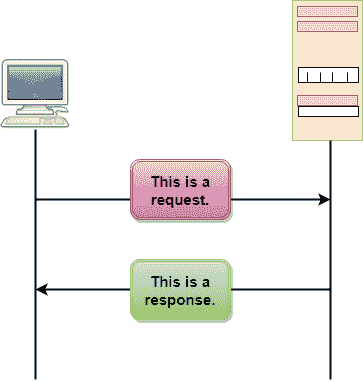
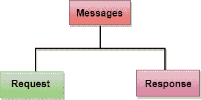
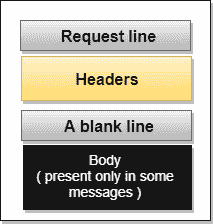
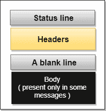
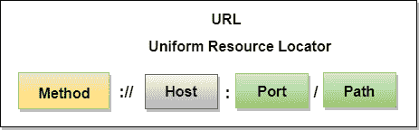

# 超文本传送协议

> 原文：<https://www.javatpoint.com/computer-network-http>

*   HTTP 代表**超文本传输协议**。
*   这是一种用于访问万维网(www)上的数据的协议。
*   HTTP 协议可以用来以纯文本、超文本、音频、视频等形式传输数据。
*   这种协议被称为超文本传输协议，因为它的效率允许我们在超文本环境中使用，在超文本环境中，从一个文档到另一个文档有快速的跳转。
*   HTTP 类似于 FTP，因为它也将文件从一台主机传输到另一台主机。但是，HTTP 比 FTP 简单，因为 HTTP 只使用一个连接，即没有控制连接来传输文件。
*   HTTP 用于以类似 MIME 的格式携带数据。
*   HTTP 类似于 SMTP，因为数据是在客户端和服务器之间传输的。HTTP 与 SMTP 的不同之处在于消息从客户端发送到服务器以及从服务器发送到客户端的方式。存储和转发 SMTP 消息，同时立即传递 HTTP 消息。

## HTTP 的特点:

*   **无连接协议:** HTTP 是无连接协议。HTTP 客户端发起请求并等待服务器的响应。当服务器收到请求时，服务器处理该请求并将响应发送回 HTTP 客户端，之后客户端断开连接。客户端和服务器之间的连接仅在当前请求和响应期间存在。
*   **媒体无关:** HTTP 协议是一种媒体无关的协议，因为只要客户端和服务器都知道如何处理数据内容，就可以发送数据。客户端和服务器都需要在 MIME 类型头中指定内容类型。
*   **无状态:** HTTP 是一种无状态协议，因为客户端和服务器都只在当前请求期间相互了解。由于协议的这种性质，客户端和服务器都不保留网页的各种请求之间的信息。

## HTTP 事务

上图显示了客户端和服务器之间的 HTTP 事务。客户端通过向服务器发送请求消息来启动事务。服务器通过发送响应消息来回复请求消息。

## 信息

HTTP 消息有两种类型:请求和响应。这两种消息类型遵循相同的消息格式。

**请求消息:**请求消息由客户端发送，它由请求行、标题，有时还有正文组成。

**响应消息:**响应消息由服务器发送给客户端，由状态行、标题，有时还有正文组成。

## 统一资源定位符

*   想要访问互联网中的文档的客户端需要一个地址，为了便于访问文档，HTTP 使用了统一资源定位符(URL)的概念。
*   统一资源定位符是在互联网上指定任何类型信息的标准方式。
*   URL 定义了四个部分:方法、主机、端口和路径。

*   **方法:**方法是用于从服务器检索文档的协议。比如 HTTP。
*   **主机:**主机是存储信息的计算机，计算机被赋予别名。网页主要存储在计算机中，计算机有一个以“www”开头的别名。此字段不是必需的。
*   **端口:**URL 也可以包含服务器的端口号，但它是一个可选字段。如果包含端口号，则它必须位于主机和路径之间，并且应该用冒号与主机隔开。
*   **路径:**路径是存储信息的文件的路径名。路径本身包含将目录与子目录和文件分开的斜线。