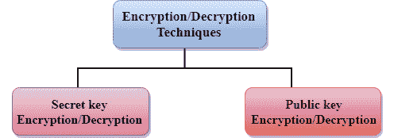
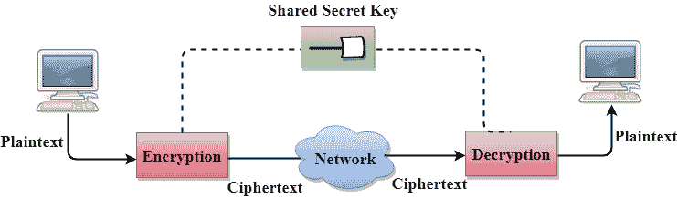
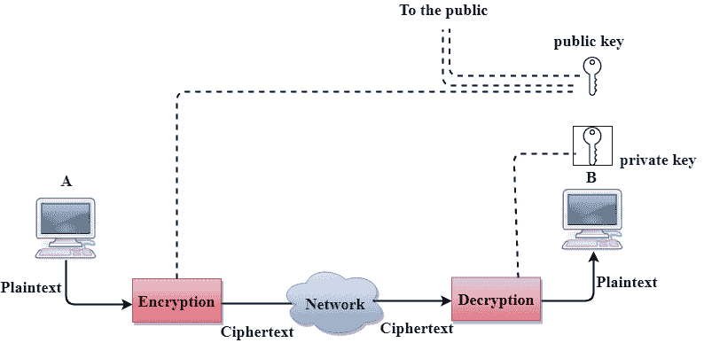

# 隐私

> 原文：<https://www.javatpoint.com/computer-network-privacy>

如何实现隐私的概念几千年来一直没有改变:消息不能加密。消息必须对所有未授权方不透明。一个好的加密/解密技术被用来在某种程度上实现隐私。这种技术确保窃听者无法理解消息的内容。

## 加密/解密

**加密:**加密是指发送方将原始信息转换成另一种形式，并通过网络发送无法理解的消息。

**解密:**解密颠倒加密过程，以便将消息转换回原始形式。

要在发送方加密的数据称为明文，加密的数据称为密文。数据在接收站点被解密。

**有两种类型的加密/解密技术:**

*   使用密钥加密/解密的隐私
*   使用公钥加密/解密的隐私

## 密钥加密/解密技术

*   在密钥加密/解密技术中，发送方和接收方使用相同的密钥。
*   发送方使用密钥和加密算法对数据进行加密；接收器使用这个密钥和解密算法来解密数据。
*   在密钥加密/解密技术中，用于加密的算法是用于解密的算法的逆算法。这意味着如果加密算法使用加法和乘法的组合，那么解密算法使用减法和除法的组合。
*   密钥加密算法也称为对称加密算法，因为在双向通信中使用相同的密钥。
*   在密钥加密/解密算法中，在信息通过网络发送到另一台计算机之前，计算机使用密码对信息进行加密。
*   秘密密钥要求我们应该知道哪些计算机正在相互对话，这样我们就可以在每台计算机上安装密钥。

### 数据加密标准

*   数据加密标准(DES)由 IBM 设计，并被美国政府作为非军事和非经典用途的标准加密方法。
*   数据加密标准是一种用于加密的标准，是秘密**密钥加密**的一种形式。

### 优势

**高效:**密钥算法更高效，因为加密消息比使用公钥加密算法加密消息花费的时间更少。这样做的原因是钥匙的尺寸很小。由于这个原因，密钥算法主要用于加密和解密。

### 密钥加密的缺点

**密钥加密/解密有以下缺点:**

*   每对用户必须有一个密钥。如果世界上想用这种方法的人数是 N，那么就有 N(N-1)/2 个秘钥。例如，对于一百万人来说，那么就有 5 亿个秘密密钥。
*   密钥在不同方之间的分配可能非常困难。这个问题可以通过将密钥加密/解密与公钥加密/解密算法相结合来解决。

## 公钥加密/解密技术

*   公钥加密有两个密钥:私钥和公钥。
*   私钥提供给接收者，而公钥提供给公众。

在上图中，我们看到 A 正在向用户 B 发送消息，“A”使用公钥加密数据，“B”使用私钥解密数据。

*   在公钥加密/解密中，发送方使用的公钥不同于接收方使用的私钥。
*   公钥对公众可用，而私钥由每个人保管。
*   最常用的公钥算法称为 RSA。

### 公钥加密的优势

*   私钥加密的主要限制是共享密钥。第三方不能使用此密钥。在公钥加密中，每个实体创建一对密钥，他们保留私钥并分发公钥。
*   公钥加密中的密钥数量大大减少。例如，100 万用户进行通信，只需要 200 万个密钥，而不是像密钥加密那样需要 5 亿个密钥。

### 公钥加密的缺点

*   **速度:**公开密钥加密的一个主要缺点是它比秘密密钥加密慢。在秘密密钥加密中，使用单个共享密钥来加密和解密消息，这加快了过程，而在公开密钥加密中，使用不同的两个密钥，两者通过复杂的数学过程相互关联。因此，我们可以说，在公钥加密中，加密和解密需要更多的时间。
*   **认证:**公钥加密没有内置认证。如果没有身份验证，消息可能会在用户不知情的情况下被解释或拦截。
*   **低效:**公钥的主要缺点是它的复杂性。如果我们想让这个方法有效，就需要大量的数据。但是在公钥加密中，使用长密钥将明文转换为密文需要花费大量时间。因此，公钥加密算法对短消息有效，而对长消息无效。

## 秘密密钥加密和公开密钥加密的区别

| 比较的基础 | 秘密密钥加密 | 公钥加密 |
| 规定 | 密钥加密被定义为使用单个共享密钥来加密和解密消息的技术。 | 公钥加密被定义为使用两种不同的密钥进行加密和解密的技术。 |
| 高效的 | 这是有效的，因为这种技术被推荐用于大量文本。 | 这是低效的，因为这种技术仅用于短消息。 |
| 其他名称 | 它也被称为对称密钥加密。 | 它也被称为非对称密钥加密。 |
| 速度 | 它的速度很快，因为它使用单个密钥进行加密和解密。 | 它的速度很慢，因为它使用了两个不同的键，这两个键通过复杂的数学过程相互关联。 |
| 算法 | 密钥算法有 DES、3DES、AES 和 RCA。 | 公钥算法有迪菲-赫尔曼算法和 RSA 算法。 |
| 目的 | 密钥算法的主要目的是传输大量数据。 | 公钥算法的主要目的是安全地共享密钥。 |