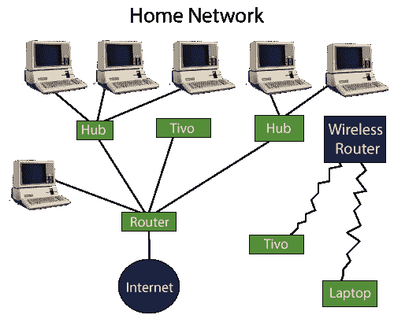
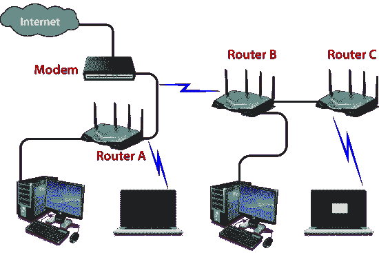
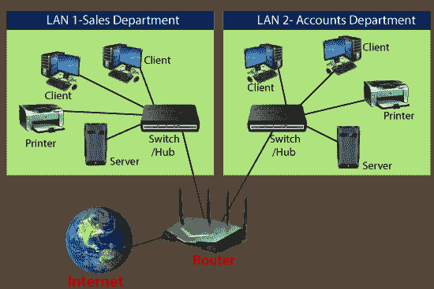

# 什么是路由器？

> 原文：<https://www.javatpoint.com/router>

路由器是一种物理或虚拟互联设备，用于在计算机网络之间接收、分析和转发数据包。路由器检查给定数据包的目的 IP 地址，并使用报头和转发表来决定传输数据包的最佳方式。有一些很受欢迎的公司开发路由器；如**思科****3Com****惠普****瞻博****D-Link****北电**等。路由器的一些要点如下:

*   路由器用于**局域网**(局域网)和**广域网**(广域网)环境。例如，它用于**办公室**进行连接，您还可以建立远程网络之间的连接，例如从**博帕尔**到
*   它与网络中的其他路由器共享信息。
*   它使用路由协议在网络上传输数据。
*   此外，它比交换机和集线器等其他网络设备更贵。

路由器工作在 OSI 模型的**第三层**上，它基于一台计算机的 IP 地址。它使用 ICMP 等协议在两个或多个网络之间进行通信。*它也被称为**智能设备**，因为它可以自动计算网络数据包从源到目的地的最佳路由。*

虚拟路由器是执行与物理路由器相同功能的软件功能或基于软件的框架。它可以通过虚拟路由器冗余协议来提高网络的可靠性，这是通过将虚拟路由器配置为默认网关来实现的。虚拟路由器运行在商用服务器上，它与单独或其他网络功能打包在一起，如负载平衡、防火墙包过滤和广域网优化功能。

## 为什么是路由器？

与集线器、交换机等其他网络设备相比，路由器的能力更强。，因为这些设备只能执行网络的基本功能。例如，集线器是一种基本的网络设备，主要用于在连接的设备之间转发数据，但它不能分析或更改传输数据的任何内容。另一方面，路由器能够在通过网络传输数据的同时分析和修改数据，并且可以将其发送到另一个网络。例如，通常，路由器允许在多个设备之间共享单个网络连接。

## 路由器是如何工作的？

路由器分析给定数据包报头的目的 IP 地址，并将其与路由表进行比较，以决定数据包的下一条路径。路由表列表提供了将数据传输到特定网络目的地的方向。他们有一套规则来计算将数据转发到给定 IP 地址的最佳路径。

路由器使用**调制解调器**，如电缆、光纤或 DSL 调制解调器，以允许其他设备和互联网之间的通信。大多数路由器都有几个端口，可以同时将不同的设备连接到互联网。它使用**路由表**来确定从哪里发送数据以及流量来自哪里。

路由表主要定义路由器使用的默认路径。因此，它可能无法找到转发给定数据包的数据的最佳方式。例如，办公室路由器沿着一条默认路径指示所有网络到其互联网服务提供商。

路由器中有两种类型的表，分别是**静态表和**动态表。静态路由表是手动配置的，动态路由表是由动态路由器根据网络活动自动更新的。

## 路由器的特点

*   路由器工作在现场视察模型的第三层(网络层)，它能够在 IP 地址和子网的帮助下与其相邻设备通信。
*   路由器通过不同类型的端口提供高速互联网连接，如千兆位、快速以太网和 STM 链路端口。
*   它允许用户根据他们在网络中的要求配置端口。
*   路由器的主要组件是中央处理器、闪存、随机存取存储器、非易失性随机存取存储器、控制台、网络和接口卡。
*   路由器能够通过将子网视为完整的网络来路由大型网络系统中的流量。
*   路由器过滤掉不需要的干扰，并执行数据封装和解封装过程。
*   路由器提供冗余，因为它总是在主模式和从模式下工作。
*   它允许用户连接多个局域网和广域网。
*   此外，路由器会创建各种路径来转发数据。

## 路由器的应用

路由器有多种用途:

*   路由器用于连接硬件设备与远程位置网络，如 **BSC、MGW、IN、SGSN** 和其他服务器。
*   它支持高速数据传输，因为它使用高 STM 链路进行连接；这就是为什么它被用于有线或无线通信。
*   互联网服务提供商广泛使用路由器将数据以电子邮件、网页、图像、语音或视频文件的形式从源发送到目的地。此外，借助目的地的 IP 地址，它可以将数据发送到世界各地。
*   路由器提供访问限制。它可以配置为允许少数用户访问全部数据，而允许其他人只访问为他们定义的少数数据。
*   软件测试人员也将路由器用于广域网通信。例如，一个组织的软件经理位于阿格拉，其主管位于不同的地方，如浦那或班加罗尔。然后，路由器通过使用广域网架构将管理者的个人电脑连接到路由器，从而为管理者提供了在路由器的帮助下与管理者共享其软件工具和其他应用程序的方法。
*   在无线网络中，通过在路由器中配置虚拟专用网络，它可以在客户端-服务器模型中使用，该模型允许共享互联网、视频、数据、语音和硬件资源。如下图所示:

*   在现代，路由器在硬件中内置了 USB 端口。他们有足够的内部存储容量。路由器可以使用外部存储设备来存储和共享数据。
*   路由器是用来建立一个组织的运维中心，也就是我们所说的 NOC 中心。位于远处的所有设备都由位于中心位置的光缆上的路由器连接，这些路由器还通过主链路和保护链路拓扑提供冗余。

## 路由器的类型

网络中有各种类型的路由器；下面给出了这些例子:

**1。无线路由器:**无线路由器用于为笔记本电脑、智能手机和其他具有 Wi-Fi 网络功能的设备提供 Wi-Fi 连接，它还可以为少量有线网络系统提供标准以太网路由。

无线路由器能够在您的家庭或办公室中产生无线信号，它允许计算机与一定范围内的路由器连接，并使用互联网。如果连接在室内，无线路由器的范围约为 150 英尺，当连接在室外时，其范围可达 300 英尺。

此外，您可以使用密码或获取您的 IP 地址来制造更安全的无线路由器。此后，您可以使用路由器附带的用户标识和密码登录路由器。

**2。brouter:**brouter 是网桥和路由器的组合。它允许像桥一样在网络之间传输数据。像路由器一样，它也可以将网络中的数据路由到各个系统。因此，它结合了网桥和路由器的这两种功能，将一些传入数据路由到正确的系统，同时将其他数据传输到另一个网络。

**3。核心路由器:**核心路由器是一种可以在网络内路由数据，但不能在网络之间路由数据的路由器。它是计算机通信系统设备，也是网络的主干，因为它有助于链接所有网络设备。它由互联网服务提供商(ISPs)使用，还提供各种类型的快速而强大的数据通信接口。

**4。边缘路由器:**边缘路由器是位于网络边界的低容量设备。它允许内部网络与外部网络连接。它也被称为接入路由器。它使用外部边界网关协议通过互联网提供与远程网络的连接。

网络中有两种类型的边缘路由器:

*   **用户边缘路由器**
*   **标签边缘路由器**

**用户边缘路由器**属于终端用户组织，它在作用于边界设备的情况下工作。

**标签边缘路由器**用于多协议标签交换(MPLS)网络的边界。它充当局域网、广域网或互联网之间的网关。

**5。宽带路由器:**宽带路由器主要用于为计算机提供高速互联网接入。当您通过电话连接到互联网并使用基于 IP 的语音技术(VOIP)时，就需要它。

所有宽带路由器都可以选择三个或四个以太网端口来连接笔记本电脑和台式机系统。宽带路由器由互联网服务提供商配置和提供。也称为**宽带调制解调器**、非对称数字用户线路( **ADSL** )或数字用户线路( **DSL** )调制解调器。

## 路由器的优势

路由器有很多好处，如下所示:

*   **安全性:**路由器提供安全性，因为局域网在广播模式下工作。信息通过网络传输，并穿过整个电缆系统。虽然数据对每个站都可用，但是特定寻址的站读取数据。
*   **性能增强:**它增强了单个网络内的性能。例如，如果一个网络有 14 个工作站，所有工作站产生的流量大致相同。14 个工作站的流量通过单一网络中的同一条电缆传输。但是如果网络被分成两个子网络，每个子网络有 7 个工作站，那么流量负载就会减少一半。由于每个网络都有自己的服务器和硬盘，因此需要网络布线系统的电脑会更少。
*   **可靠性:**路由器提供可靠性。如果一个网络在服务器停止运行时出现故障，或者电缆有缺陷，那么路由器服务和其他网络将不会受到影响。路由器隔离受影响的网络，而未受影响的网络保持连接，不会中断工作和任何数据丢失。
*   **组网范围:**组网时，用一根电缆连接设备，但长度不能超过 1000 米。路由器可以通过执行中继器的功能(重新生成信号)来克服这一限制。物理范围可以根据特定安装的要求，只要在最大电缆范围超出之前安装路由器。

## 路由协议

路由协议为路由器指定了一种方式来识别网络上的其他路由器，并做出发送所有网络消息的动态决定。下面给出了几种协议:

**开放最短路径优先(OSPF):** 用于计算给定数据包通过一组相连网络时到达目的地的最佳路由。它被互联网工程任务组 **(IETF)** 确定为内部网关协议。

**边界网关协议(BGP):** 它通过边缘路由器之间的信息交换，帮助管理数据包在互联网上的路由方式。它为路由器提供了网络稳定性，如果一个互联网连接在转发数据包时中断，它可以快速调整另一个网络连接来发送数据包。

**内部网关路由协议(IGRP):** 它指定独立网络内网关之间如何交换路由信息。然后，其他网络协议可以使用路由信息来确定应该如何路由传输。

**增强型内部网关路由协议(EIGRP** **):** 在该协议中，如果路由器无法从表中找到到达目的地的路径，它会向邻居询问路由，邻居会将查询传递给邻居，直到路由器找到该路径。当其中一台路由器的路由表条目发生变化时，它只通知邻居这些变化，而不发送整个表。

**外部网关协议(EGP):** 它决定如何在两台邻居网关主机之间交换路由信息，每台主机都有自己的路由器。此外，它通常用于在互联网上的主机之间交换路由表信息。

**路由信息协议(RIP):** 它决定了路由器在连接的局域网组之间传输流量时如何共享信息。RIP 可以允许的最大跳数是 15，这限制了 RIP 可以支持的网络大小。

## 网桥和路由器的区别

| 桥 | 路由器 |
| 网桥是一种网络设备，通过使用媒体访问控制地址来连接两个局域网，并在它们之间传输数据。 | 路由器也是一种网络设备，它借助网络的 IP 地址将数据从一个网络发送到另一个网络。 |
| 网桥只能连接两个不同的局域网网段。 | 路由器能够连接局域网和广域网。 |
| 网桥以帧的形式传输数据。 | 路由器以数据包的形式传输数据。 |
| 它根据设备的媒体访问控制地址发送数据。 | 它根据设备的 IP 地址发送数据。 |
| 网桥只有一个端口来连接设备。 | 路由器有几个连接设备的端口。 |
| 网桥不使用任何表来转发数据。 | 路由器使用路由表发送数据。 |

## 集线器、交换机和路由器之间的区别

有三种主要的网络设备将计算机从一台连接到另一台。这些设备是集线器、交换机和路由器。这些都具有将一台计算机连接到另一台计算机的能力，但它们之间存在一些差异。集线器、交换机和路由器之间区别如下:

**集线器:**集线器是一种基本的网络设备，用于将计算机或其他网络设备连接在一起。集线器不使用任何路由表将数据发送到目的地。虽然它可以识别网络的基本错误，如冲突，但将所有信息广播到多个端口可能会带来安全风险。由于集线器是一个哑设备，它不需要 IP 地址。此外，集线器比交换机或路由器便宜。

**交换机:**交换机是一种硬件设备，也可以将计算机相互连接。与集线器相比，交换机在这方面有所不同；它处理数据包。每当交换机收到数据包时，它会决定数据包可以发送到哪个设备，并且只将数据包发送到该设备。集线器将数据包广播到所有计算机，但交换机不会将数据包循环到所有设备，这意味着带宽不会与网络共享，从而提高了网络效率。这就是为什么交换机比集线器更受欢迎的原因。

**路由器:**路由器与交换机或集线器的区别更大。它主要用于将数据包路由到另一个网络，而不是仅将数据传输到本地网络。路由器常见于家庭和办公室，因为它允许您的网络通过互联网与其他网络通信。基本上，路由器为您的网络提供了更多功能，如防火墙、虚拟专用网络、服务质量、流量监控等。

## 什么是路由器中的路由表？

路由表借助设备的 IP 地址和表中的必要信息来确定给定数据包的路径，并将数据包发送到目的网络。路由器具有称为随机存取存储器的内部存储器。路由表的所有信息都存储在路由器的内存中。

**例如:**

| 目的地(网络标识) | 子网掩码 | 连接 |
| 200.1.2.0 | 255.255.255.0 | Eth0 |
| 200.1.2.64 | 255.255.255.128 | Eth1 |
| 200.1.2.128 | 255.255.255.255 | Eth2 |
| 默认 |  | Eth3 |

**路由表包含以下实体:**

*   它包含所有路由器的 IP 地址，这些路由器需要决定到达目的网络的方式。
*   它包括内向者界面信息。
*   此外，它还包含目标主机的 IP 地址和子网掩码。

## 路由器中的网元

路由器中有两种类型的网元，如下所示:

**控制平面:**路由器支持一个路由表，确定应该使用哪条路径和物理接口连接来发送数据包。这是通过使用内部预先配置的指令(称为静态路由)或借助路由协议学习路由来实现的。路由表存储静态和动态路由。然后，控制平面逻辑从表中删除不必要的指令，并构建转发平面使用的转发信息库。

**转发平面:**路由器在传入和传出接口连接之间发送数据包。它使用存储在数据包报头中的信息，并将其与由控制平面提供的 FIB 中的条目进行匹配；因此，它将数据包转发到正确的网络类型。它也被称为用户平面或数据平面。

## 如何购买路由器？

购买路由器时，需要记住许多要点:

1.  **连接类型:**应该买哪种路由器取决于你的连接类型。例如，如果您想使用来自 BSNL 或 MTNL 等电话服务提供商的互联网连接，您将需要一台 ADSL 路由器。在此路由器中，您必须使用连接时提供给您的硬件。虽然这款路由器在某些方面功能有限。
    或者，您可以购买高级路由器，通过无线连接共享存储，包括打印机。如果您使用本地有线电视运营商提供的连接，您将需要一台非 ADSL 路由器。
2.  **标准:**路由器支持 802.11ac、802.11n 等标准。支持 802.11ac 标准的路由器将数据传输速度提高到 802.11n 标准路由器的三倍以上。它使用 5 千兆赫的频带，与普通的 2.4 千兆赫频带相比，它没有那么拥挤。此外，它还为文件传输和流媒体内容提供了更好的网络性能。
    支持 802.11ac 标准的路由器是有益的，因为它们与“n”标准兼容，这样您的旧设备也可以毫无问题地工作。或者；您可以通过购买“n”个标准路由器来节省一些资金并完全满足您的需求。
3.  **双频:**大多数‘n’标准路由器工作在 2.4GHz 频率，但双频路由器更好，因为它支持 5GHz 频段。此外，它还可以在 5 千兆赫上与智能手机和笔记本电脑连接，而其他路由器只能在 2.4 千兆赫上运行。
4.  **USB 端口:**带有 USB 端口的路由器允许您插入闪存驱动器，包括打印机，以便通过网络共享这些资源。这些功能适用于小区域，因为它们可以在不使用互联网的情况下在无线网络中使用。
    当你的主连接中断时，一些路由器通过 3G 数据加密狗提供备用互联网。但是这些路由器只适用于特定的品牌。因此，在购买路由器之前，请检查它是否支持您正在使用的加密狗。
5.  **多天线:**外置天线足够强大，可以增加路由器的整体范围，也适合需要信号跨越多面墙或多扇门的环境。

* * *