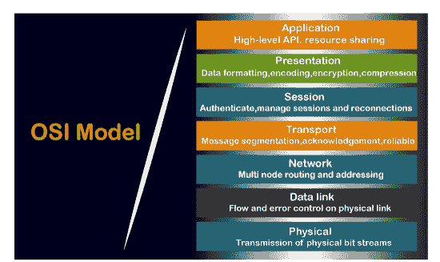
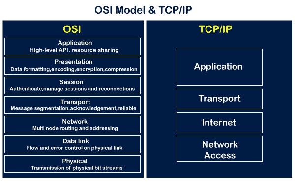
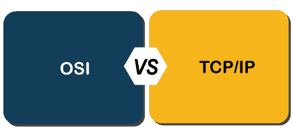

# 现场视察与传输控制协议

> 原文：<https://www.javatpoint.com/osi-vs-tcp-ip>

## 什么是 OSI 模型？

开放系统互连代表开放系统互连，发展于 20 世纪 80 年代。它是用于网络通信的概念模型。它没有完全实现，但今天仍然被引用。这个 OSI 模型由七层组成，每一层都相互连接。数据沿着现场视察模型向下移动，每一层都添加了额外的信息。数据向下移动，直到到达 [OSI 模型](https://www.javatpoint.com/osi-model)的最后一层。当数据在现场视察模型的最后一层接收时，数据通过网络传输。一旦数据到达了另一端，那么这个过程就会发生逆转。

## 什么是 TCP/IP 模式？

TCP 模式代表**传输控制协议，**而 IP 代表**互联网协议**。许多使互联网成为可能的协议都属于 TCP/IP 模式。如今，我们不太听到 TCP/IP 模式的名称，我们通常听到 IPv4 或 IPv6 的名称，但它仍然有效。该模型由 4 层组成。现在，我们来看看 [TCP/IP 模型](https://www.javatpoint.com/computer-network-tcp-ip-model)的图示。

如上图所示，TCP/IP 模型有 4 层，而 OSI 模型由 7 层组成。从图表上看，TCP/IP 模型的 4 层正好符合现场视察模型的 7 层，但这不是事实。 [TCP/IP](https://www.javatpoint.com/tcp-ip-full-form) 模型的应用层映射到 OSI 模型的前三层，即应用、会话和表示层。TCP 的传输层直接映射到现场视察模型的传输层。TCP/IP 模型的互联网层直接映射到现场视察模型的网络层。OSI 模型的最后两层映射到 TCP/IP 模型的网络层。与现场视察模型相比，TCP/IP 是最广泛使用的模型，用于通过[互联网](https://www.javatpoint.com/internet)提供计算机之间的通信。

### 现场视察和传输控制协议/网际协议模型之间的相似之处

**以下是 OSI 和 TCP/IP 模型的相似之处:**

*   **共享通用架构**

这两个模型都是逻辑模型，并且具有相似的体系结构，因为这两个模型都是用层构建的。

*   **定义标准**

这两个层都定义了标准，它们还提供了用于实现标准和设备的框架。

*   **简化故障排除流程**

这两种型号都将复杂的功能分解成更简单的组件，从而简化了故障排除过程。

*   **预定义标准**

已经预先定义的标准和协议；这些模型并没有重新定义它们；他们只是参考或使用它们。例如，在开发这些模型之前，以太网标准已经由 IEEE 定义；模型没有重新创建它们，而是使用了这些预定义的标准。

*   **两者具有相似的“传输”和“网络”层功能**

在**“演示”**和**“网络”**层之间执行的功能类似于在**传输**层执行的功能。

## 现场视察和传输控制协议/网际协议模型的区别

**我们用表格的形式来看看 OSI 和 TCP/IP 模型的区别:**

| 现场视察模型 | TCP/IP 模型 |
| 代表**开放系统互联。** | 代表**传输控制协议。** |
| 现场视察模型是由国际标准化组织开发的。 | 它是由 ARPANET(高级研究项目代理网络)开发的。 |
| 它是一种独立的标准和通用协议，用作网络和最终用户之间的通信网关。 | 它由导致互联网发展的标准协议组成。这是一种在主机之间提供连接的通信协议。 |
| 在现场视察模型中，传输层为数据包的传送提供了保证。 | 传输层不为数据包的传送提供保证。但是，我们仍然可以说它是一个可靠的模型。 |
| 这种模式基于纵向方法。 | 这一模式基于横向方法。 |
| 在这个模型中，会话层和表示层是分开的，也就是说，两个层是不同的。 | 在这个模型中，会话层和表示层不是不同的层。这两层都包含在应用层中。 |
| 它也被认为是一个参考模型，通过它可以构建各种网络。例如，TCP/IP 模型是根据现场视察模型构建的。它也被称为指导工具。 | 它是现场视察模型的一个实现模型。 |
| 在这个模型中，网络层提供面向连接和无连接的服务。 | 网络层只提供无连接服务。 |
| 现场视察模型中的协议是隐藏的，当技术发生变化时，可以很容易地替换。 | 在这个模型中，协议不容易被替换。 |
| 它由 7 层组成。 | 它由 4 层组成。 |
| 现场视察模型定义了服务、协议和接口，并对它们进行了适当的区分。它与协议无关。 | 在 TCP/IP 模型中，服务、协议和接口没有正确分开。它依赖于协议。 |
| 这种型号的使用率很低。 | 这种模式被广泛使用。 |
| 它为路由器、主板、交换机和其他硬件设备提供标准化。 | 它没有为设备提供标准化。它提供了各种计算机之间的连接。 |

* * *