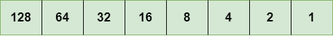
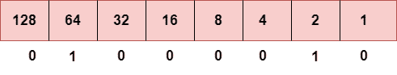
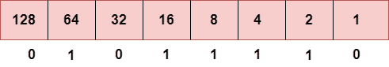
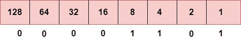
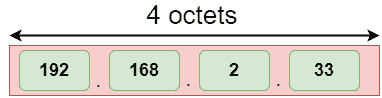
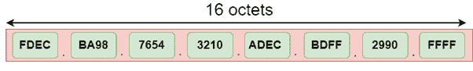
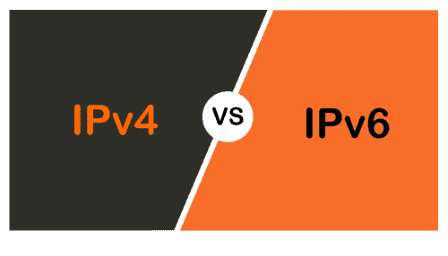

# IPv4 与 IPv6

> 原文：<https://www.javatpoint.com/ipv4-vs-ipv6>

## 什么是 IP？

IP 代表互联网协议。为连接到网络的每个设备分配一个 IP 地址。每个设备都使用一个 IP 地址进行通信。它还充当标识符，因为该地址用于识别网络上的设备。它定义了数据包的技术格式。主要是两个网络，即 IP 和 TCP，结合在一起，所以合起来称为一个 [TCP/IP](https://www.javatpoint.com/tcp-ip-full-form) 。它在源和目标之间创建虚拟连接。

我们还可以将 IP 地址定义为分配给网络上每个设备的数字地址。为每台设备分配一个 IP 地址，以便网络上的设备可以被唯一地识别。为了便于数据包的路由，TCP/IP 协议使用一个 32 位的逻辑地址，称为 IPv4(互联网协议版本 4)。

一个 [IP](https://www.javatpoint.com/ip-full-form) 地址由两部分组成，第一部分是网络地址，第二部分是主机地址。

有两种类型的 IP 地址:

*   IPv4
*   IPv6

### 什么是 IPv4？

IPv4 是 IP 的第 4 版。它是当前版本，也是最常用的 IP 地址。它是一个 32 位地址，由四个数字组成，用“点”分隔，即句点。该地址对于每个设备都是唯一的。

例如**66.94.29.13**

上面的例子代表了 IP 地址，其中每组用句点分隔的数字被称为八位字节。八位字节中的每个数字都在 0-255 的范围内。这个地址可以产生 4，294，967，296 个可能的唯一地址。

在当今的计算机网络世界中，计算机无法理解标准数字格式的 IP 地址，因为计算机只能理解二进制形式的数字。二进制数可以是 1 或 0。IPv4 由四组组成，这些组代表八位字节。每个八位字节中的位代表一个数字。

八位字节中的每个位可以是 1 或 0。如果该位为 1，则它所代表的数字将会计数，如果该位为 0，则它所代表的数字不会计数。

**8 位八位字节的表示**

上面的表示显示了 8 位八位字节的结构。

现在，我们将看到如何获得上述 IP 地址的二进制表示，即 66.94.29.13

**第一步:首先，我们找到二进制数 66。**

为了得到 66，我们把 1 放在 64 和 2 下面，因为 64 和 2 的和等于 66 (64+2=66)，剩下的比特将为零，如上所示。因此，66 的二进制位版本是 01000010。

**第二步:现在，我们计算二进制数 94。**

为了得到 94，我们把 1 放在 64、16、8、4 和 2 下面，因为这些数的和等于 94，剩下的位将为零。因此，94 的二进制位版本是 01011110。

**第三步:下一个数字是 29。**

为了得到 29，我们把 1 放在 16、8、4 和 1 下面，因为这些数的和等于 29，剩下的位将为零。因此，29 的二进制位版本是 00011101。

**第四步:最后一个数字是 13。**

为了得到 13，我们把 1 放在 8、4 和 1 下面，因为这些数的和等于 13，剩下的位将为零。因此，13 的二进制位版本是 00001101。

### IPv4 的缺点

目前，世界人口为 76 亿。每个用户都有不止一台设备连接到互联网，私营公司也依赖互联网。正如我们所知，IPv4 产生 40 亿个地址，这对一个星球上连接到互联网的每台设备来说都是不够的。尽管发明了各种技术，例如可变长度掩码、网络地址转换、端口地址转换、类、域间转换，以节省 IP 地址的带宽并减缓 IP 地址的耗尽。在这些技术中，公共 IP 被转换成私有 IP，因此拥有公共 IP 的用户也可以使用互联网。但是，这仍然不是那么有效，所以它导致了下一代 IP 地址的发展，即 IPv6。

### 什么是 IPv6？

IPv4 产生 40 亿个地址，开发者认为这些地址足够了，但他们错了。IPv6 是下一代 IP 地址。IPv4 和 IPv6 的主要区别在于 IP 地址的地址大小。IPv4 是 32 位地址，而 IPv6 是 128 位十六进制地址。IPv6 提供了很大的地址空间，与 IPv4 相比，它包含一个简单的报头。

它提供了将 IPv4 转换为 IPv6 的过渡策略，这些策略如下:

*   **双堆叠:**它允许我们在同一台设备上同时拥有两个版本，即 IPv4 和 IPv6。
*   **隧道化:**在这种方法中，所有拥有 IPv6 的用户都与一个 IPv4 网络通信，以到达 IPv6。
*   **网络地址转换:**该转换允许具有不同版本 IP 的主机之间的通信。

这个十六进制地址包含数字和字母。由于数字和字母的使用，IPv6 能够产生超过 340 个十一位(3.4*10 38 )地址。

IPv6 是一个 128 位的十六进制地址，由 8 组 16 位组成，这 8 组用冒号分隔。在 IPv6 中，每个十六进制字符代表 4 位。因此，我们需要一次将 4 位转换为十六进制数

### 地址形式

**IP v4 的地址格式:**

**IPv6 的地址格式:**

上图显示了 IPv4 和 IPv6 的地址格式。IPv4 是一个 32 位十进制地址。它包含 4 个八位字节或由“点”分隔的字段，每个字段的大小为 8 位。每个字段包含的数字应该在 0-255 的范围内。而 IPv6 是 128 位十六进制地址。它包含由冒号分隔的 8 个字段，每个字段的大小为 16 位。

### IPv4 和 IPv6 的区别

|  | Ipv4 | Ipv6 |
| **地址长度** | IPv4 是一个 32 位地址。 | IPv6 是一个 128 位地址。 |
| **字段** | IPv4 是一个数字地址，由 4 个字段组成，用点(。). | IPv6 是由 8 个字段组成的字母数字地址，用冒号分隔。 |
| **类** | IPv4 有 5 种不同类别的 IP 地址，包括 A 类、B 类、C 类、D 类和 e 类 | IPv6 不包含 IP 地址类别。 |
| **IP 地址数量** | IPv4 的 IP 地址数量有限。 | IPv6 有大量的 IP 地址。 |
| vlsm | 它支持 VLSM(虚拟长度子网掩码)。在这里，VLSM 意味着 Ipv4 将 IP 地址转换成不同大小的子网。 | 它不支持 VLSM。 |
| **地址配置** | 它支持手动和 DHCP 配置。 | 它支持手动、DHCP、自动配置和重新编号。 |
| **地址空间** | 它生成 40 亿个唯一地址 | 它生成 340 个不定的唯一地址。 |
| **端到端连接完整性** | 在 IPv4 中，无法实现端到端的连接完整性。 | 在 IPv6 的情况下，端到端连接完整性是可以实现的。 |
| **安全功能** | 在 IPv4 中，安全性取决于应用程序。该 IP 地址的开发没有考虑到安全特性。 | 在 IPv6 中，IPSEC 是出于安全目的而开发的。 |
| **地址表示** | 在 IPv4 中，IP 地址以十进制表示。 | 在 IPv6 中，以十六进制表示的 IP 地址。 |
| **碎片化** | 分片是由发送方和转发路由器完成的。 | 分片仅由发送方完成。 |
| **包流识别** | 它不提供任何数据包流识别机制。 | 它使用报头中的流标签字段来识别数据包流。 |
| **校验和字段** | 校验和字段在 IPv4 中可用。 | 校验和字段在 IPv6 中不可用。 |
| **传输方案** | IPv4 正在广播。 | 另一方面，IPv6 是多播，它提供了高效的网络操作。 |
| **加密和认证** | 它不提供加密和身份验证。 | 它提供加密和身份验证。 |
| **八位字节数** | 它由 4 个八位字节组成。 | 它由 8 个字段组成，每个字段包含 2 个八位字节。因此，IPv6 中的八位字节总数为 16。 |

* * *