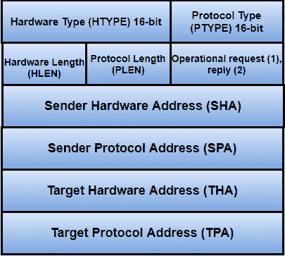

# ARP 数据包格式

> 原文：<https://www.javatpoint.com/arp-packet-format>

地址解析协议(ARP)使用包含地址解析请求或地址解析响应的基本消息格式。ARP 消息的大小取决于链路层和网络层的地址大小。消息头描述了每层使用的网络类型和每层的地址大小。消息头在操作码的帮助下完成，操作码为**请求**的 **1** ，响应的 **2** 。数据包的有效负载有四个地址，它们是:

*   发送方主机的硬件地址
*   接收主机的硬件地址
*   发送方主机的协议地址
*   接收主机的协议地址

**地址解析协议的数据包格式如图所示:**

**HTYPE(硬件类型)-** 硬件类型字段的大小为 16 位。此字段定义本地网络传输 ARP 消息所需的网络类型。该字段有一些典型值，如下所示:

| 硬件类型 | 价值 |
| 以太网 | one |
| IEEE 802 网络 | six |
| ARCNET(消歧义) | seven |
| 帧中继 | Fifteen |
| 异步传输模式 | Sixteen |
| 高级数据链路控制(High - level Data Link Control) | Seventeen |
| 光纤通道 | Eighteen |
| 异步传输模式 | Nineteen |
| 串行线 | Twenty |

**PTYPE(协议类型)-** 协议类型是用于指定协议类型的 16 位字段。

#### 注意:ARP 可以与任何更高级别的协议一起使用，如 IPv4、IPv6 等。

**HLEN(硬件长度)-** 硬件长度字段的大小为 8 位。该字段以字节为单位指定物理地址的长度。

**例:**对此，以太网的地址长度为 6。

**PLEN(协议长度)-** 协议长度字段的长度为 8 位。它以字节为单位定义了 IP 地址的长度。

**OPER(操作)-** 这是一个 16 位字段，用于确定 ARP 数据包的类型。ARP 数据包有两种类型，即 ARP 请求和 ARP 回复。在给定的表中，前两个值用于 ARP 请求和回复。其他 ARP 帧格式的值，如 r ARP、DRARP 等。也在该表中指定。

| ARP 消息类型 | 操作码 |
| ARP 请求 | one |
| ARP 回复 | Two |
| 请求 | three |
| RARP 回复 | four |
| DRARP 请求 | five |
| DRARP 回复 | six |
| DRARP 错误 | seven |
| InARP 请求 | eight |
| InARP 回复 | nine |

**SHA(发送方硬件地址)-** 该字段指定发送方的物理地址，该字段长度不固定。

**SPA(发送方协议地址)-** 该字段用于确定发送方的逻辑地址，该字段长度不固定。

**THA(目标硬件地址)-** 目标硬件地址指定目标的物理地址。这是一个可变长度字段。对于 ARP 请求数据包，该字段包含全零，因为发送方不知道接收方的物理地址。

#### 注意:默认目标硬件地址为零。

**TPA(目标协议地址)-** 该字段决定目标的逻辑地址。TPA 是一个可变长度字段。

* * *