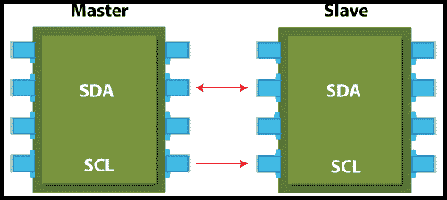

# I2C 议定书

> 原文：<https://www.javatpoint.com/i2p-protocol>

I2C 代表内部集成控制器。I2C 协议是一种串行通信协议，用于连接低速设备。例如 **EEPROMs、微控制器、A/D 和 D/A 转换器、**和**输入/输出接口**。由**飞利浦半导体**于 **1980** 开发，用于芯片间通信。现在几乎所有的主要集成电路制造商都在使用它。这是一种主从通信，您可以从一个主机连接和控制多个从机。在这种情况下，每个从设备都有一个特定的地址。它根据版本支持各种数据速率，从 100 Kbps、400 Kbps、1 Mbps 到 3.4 Mbps。它像 SPI 一样是同步通信。

## I2C 界面

I2C 协议仅使用两根电缆进行通信，其中一根电缆用于数据(SDA)，另一根电缆用于时钟(SCL)。两条电缆都需要用+ Vdd 的电阻上拉。它可以用来连接两个不同电压的 I2C 总线。

## I2C 的应用

对于那些需要更低成本和更容易实现而不是高速的应用，它是最佳选择。

1.  读取某些存储器集成电路
2.  访问 DAC 和 ADC
3.  传输和控制用户引导的动作
4.  读取硬件传感器
5.  与多个微控制器通信

## I2C 的优势

有以下优点:

1.  它提供灵活的数据传输速率。
2.  它提供了比 SPI 更远距离的通信。
3.  总线上的每个设备都是独立控制的。
4.  它增加了固件或低级硬件的复杂性。
5.  这种协议增加了开销，也降低了吞吐量。
6.  这个协议只需要两根电缆。
7.  它可以通过仲裁和冲突检测来适应几个主交互。

## I2C 的缺点

1.  当电路中的主/从设备数量较多时，硬件的复杂性会增加。
2.  它提供半双工通信模式。
3.  它由堆栈管理。
4.  许多设备存储了多个地址，这可能会导致冲突。

## I2C 协议和 SPI 协议的区别。

| I2C | 精力 |
| I2C 代表内部集成控制器。 | SPI 代表串行外设接口。 |
| 它是飞利浦半导体在 1980 年开发的。 | 它是摩托罗拉在 1980 年中期开发的。 |
| 这是一个半双工协议。 | 这是一个全双工协议。 |
| 它支持多主机配置。 | 它不支持多主机配置。 |
| 更多开销。 | 开销更少。 |
| I2C 协议使用两根电缆进行通信(CCL 和 SDA)。 | SPI 协议使用四根电缆进行通信(MISO、MOSI、CS 和 CLK)。 |
| 它的数据传输速度从 100 千赫到 400 千赫不等。 | 它的数据传输速度高达 25 兆赫。 |
| 这是一个多主协议。 | 这是一个单一的主协议。 |

* * *