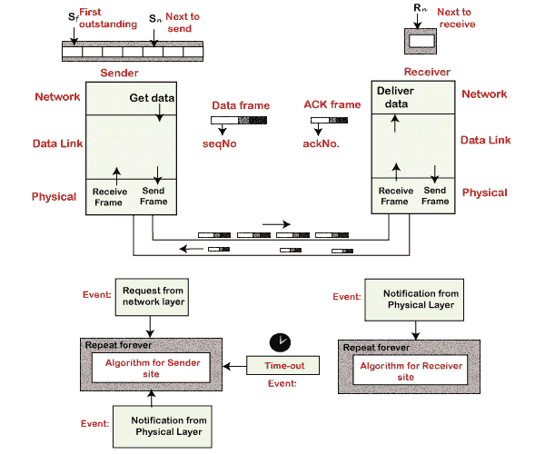
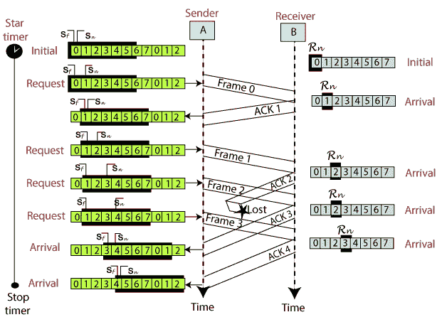
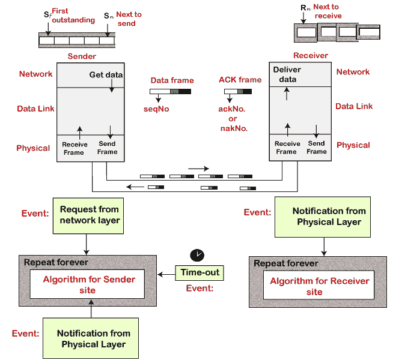
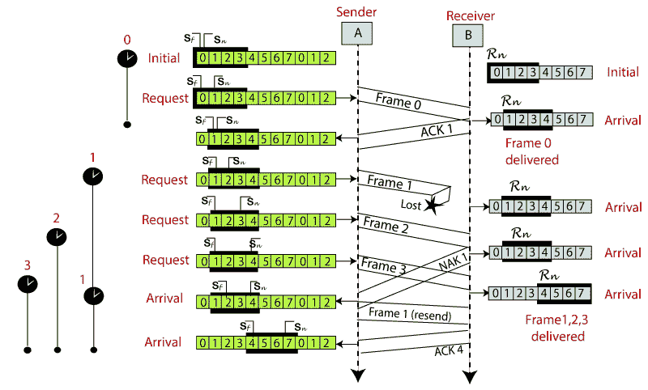

# 滑动窗口协议

> 原文：<https://www.javatpoint.com/sliding-window-protocol>

滑动窗口是一种一次发送多个帧的技术。它控制两个设备之间的数据包，在这两个设备中需要可靠和渐进的数据帧传送。也用于 [TCP(传输控制协议)](https://www.javatpoint.com/tcp)。

在这种技术中，每一帧都从序号开始发送。序列号用于在接收端找到丢失的数据。滑动窗口技术的目的是避免重复数据，因此它使用序列号。

## 滑动窗口协议的类型

滑动窗口协议有两种类型:

1.  ARQ 北部
2.  选择性重复 ARQ

### ARQ 北部

ARQ 协议也被称为自动重复请求。这是一种使用滑动窗口方法的数据链路层协议。在这种情况下，如果任何帧损坏或丢失，所有后续帧都必须再次发送。

在此协议中，发送方窗口的大小为 N。例如，“返回-8”，即发件人窗口的大小，将为 8。接收器窗口大小始终为 1。

如果接收器收到损坏的帧，它会将其取消。接收器不接受损坏的帧。当定时器到期时，发送方再次发送正确的帧。ARQ 协议的设计如下所示。

下图显示了 ARQ 北部的例子。

### 选择性重复 ARQ

选择性重复 ARQ 也称为选择性重复自动重复请求。这是一种使用滑动窗口方法的数据链路层协议。如果 ARQ 协议的错误较少，它就能很好地工作。但是如果帧中有很多错误，再次发送帧会损失很多带宽。所以，我们使用选择性重复 ARQ 协议。在这个协议中，发送方窗口的大小总是等于接收方窗口的大小。滑动窗口的大小总是大于 1。

如果接收器收到损坏的帧，它不会直接丢弃它。它向发送方发送否定确认。一旦收到否定确认，发送方就会再次发送该帧。没有等待任何超时来发送该帧。选择性重复 ARQ 协议的设计如下所示。

下图显示了选择性重复 ARQ 协议的示例。

### 反向 ARQ 和选择性重复 ARQ 的区别？

| ARQ 北部 | 选择性重复 ARQ |
| 如果一个帧损坏或丢失，所有后续帧都必须再次发送。 | 在这种情况下，只有帧被再次发送，这是损坏或丢失。 |
| 如果错误率高，会浪费大量带宽。 | 低带宽有损失。 |
| 它不太复杂。 | 它更复杂，因为它还必须进行排序和搜索。而且还需要更多的存储空间。 |
| 它不需要排序。 | 在这种情况下，排序是为了以正确的顺序获得帧。 |
| 它不需要搜索。 | 搜索操作在其中执行。 |
| 用的比较多。 | 它使用较少，因为它更复杂。 |

* * *