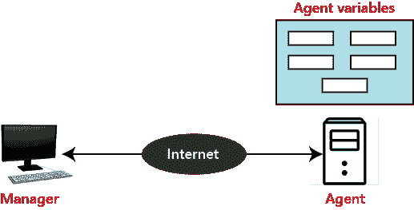
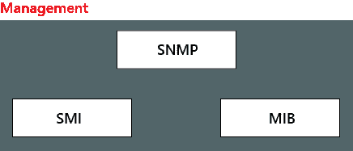

# 简单网络管理协议

> 原文：<https://www.javatpoint.com/snmp>

SNMP 由 **IETF(互联网工程任务组)**定义。它用于管理网络。它是一种互联网标准协议，用于监控 IP 网络中的设备，并收集和组织这些设备的信息(数据)。大多数网络设备都支持 SNMP，如集线器、交换机、路由器、网桥、服务器、调制解调器和打印机等。

SNMP 的概念基于管理器和代理。管理器就像控制一组代理(如路由器)的主机。

**SNMP 管理器:**它是一个通过 SNMP 代理监控网络流量的计算机系统，它查询这些代理，获取答案，并控制它们。

**SNMP 代理:**它是一个位于网元中的软件程序。它从设备收集实时信息，并将这些信息传递给 SNMP 管理器。

## 管理组件

它有两个组成部分

1.  标准测量仪器(Standard Measuring Instruments)
2.  管理信息库

**SNMP:** 它定义了管理器和代理之间共享的数据包结构。

**SMI(管理信息的结构):** SMI 是一个网络管理组件，它定义了命名对象和对象类型(包括范围和长度)的标准规则，还显示了如何对对象和值进行编码。

**MIB(管理信息库):** MIB 是网络管理的第二个组成部分。它是存储管理信息的虚拟信息存储。

## SNMP 基本操作

*   **GetRequest:**SNMP 管理器使用 GetRequest 操作从 SNMP 代理导出一个或多个值。
*   **getnext request:**getnext request 类似于 GetRequest 操作，但它用于从 SNMP 代理获取下一个值。
*   **SetRequest:** 管理器用于设置代理设备的值。
*   **陷阱:**SNMP 代理使用该命令向 SNMP 管理器发送确认消息。
*   **GetBulkRequest:** 它被 SNMP 管理器用来从 SNMP 代理中检索大数据。

## 所有版本的 SNMP 之间的差异？

| 特征 | SNMP 版本 1 | SNMP 版本 2 | SNMP 版本 3 |
| **发展年** | One thousand nine hundred and eighty-eight | One thousand nine hundred and ninety-three | Two thousand and two |
| **访问控制** | 它基于 SNMP 社区和 MIB 视图。 | 它基于 SNMP 社区和 MIB 视图。 | 它基于 SNMP 用户、组和 MIB 视图。 |
| **认证和隐私** | SNMP v1 不安全，因为任何人都可以访问网络。 | SNMPv2 未能提高安全性。 | 它的主要特点是增强了安全性。 |
| **标准** | RFC-1155.1157.1212 | RFC 1441.1452 RFC 1909.1910 RFC-1901 至 1908 | RFC-1902 至 1908，2271 至 2275 |
| **消息格式** | SNMP 版本 1 中有五种消息格式(GetRequest、GetNextRequest、SetRequest、Trap、Response)。 | 七条消息而不是五条(通知请求、获取批量请求) | 实施 SNMP v1 和 v2 规范以及建议的新功能 |
| **默认/已知密码** | 是 | 是 | 不 |
| **易受重放攻击** | 是 | 不 | 不 |
| **易受注射攻击** | 是 | 不 | 不 |
| **易受蛮力攻击** | 是 | 是 | 不 |
| **易受缓冲区溢出攻击** | 是 | 是 | 不 |
| **容易嗅探会话密钥** | 是 | 不 | 不 |

## 简单网络管理协议端口

SNMP 使用端口 161 和端口 162 发送指令和消息。SNMP 代理使用端口 161，SNMP 管理器使用端口 162。

* * *