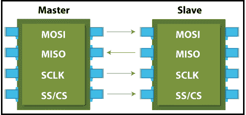

# 串行接口协议

> 原文：<https://www.javatpoint.com/spi-protocol>

SPI 代表**串行外设接口**。这是一种串行通信协议，用于连接低速设备。它是由**摩托罗拉**在**于 1980 年中期**为芯片间通信开发的。它通常用于与闪存、传感器、实时时钟(RTC)、模数转换器等通信。它是一种全双工同步串行通信，这意味着数据可以从两个方向同时传输。

SPI 的主要优点是传输数据没有任何中断。在该协议中，一次可以发送或接收许多位。

在该协议中，设备以主从关系进行通信。主设备控制从设备，从设备从主设备获取指令。串行外设接口(SPI)最简单的配置是单个从机和单个主机的组合。但是，一个主设备可以控制多个从设备。

## 串行接口

SPI 协议使用四条线进行通信。图中有显示。

1.  **MOSI:** MOSI 代表主输出从输入。它用于从主机向从机发送数据。
2.  **MISO:** MISO 代表主输入从输出。它用于从机向主机发送数据。
3.  **SCK 或 SCLK(串行时钟):**用于时钟信号。
4.  **SS/CS(从机选择/片选):**主机通过选择从机发送数据。

#### 注意:如果通信中存在单个从机，则只需要三根导线。其中不需要选择从机。

## SPI 的优势

1.  SPI 的主要优点是传输数据没有任何中断。
2.  它是简单的硬件。
3.  它提供全双工通信。
4.  该协议中不需要唯一的从机地址。
5.  该协议不需要从设备的精确振荡，因为它使用主设备的时钟。
6.  在这方面，软件实现非常简单。
7.  它提供高传输速度。
8.  信号是单向的。
9.  它有单独的 MISO 和 MOSI 线，所以数据可以同时发送和接收。

## SPI 的缺点

1.  通常它只支持一个主控。
2.  它不像通用异步收发器那样检查错误。
3.  它比其他协议使用更多的引脚。
4.  只能近距离使用。
5.  它不会确认是否收到数据。

## SPI 的应用

*   内存:SD 卡、MMC、EEPROM 和闪存。
*   传感器:温度和压力。
*   控制设备:模数转换器、数模转换器、数字电位计和音频编解码器。
*   其他:摄像机镜头架、触摸屏、液晶显示器、RTC、视频游戏控制器等。

* * *