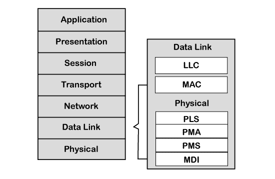
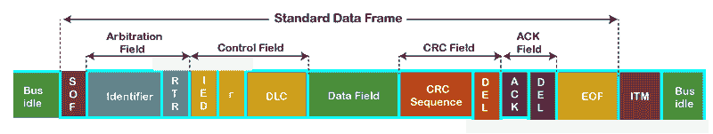
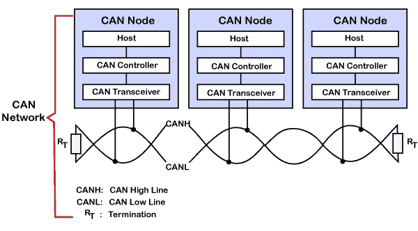
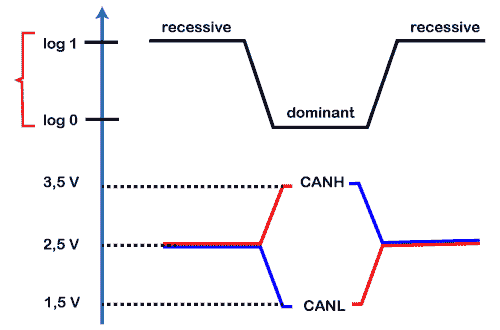
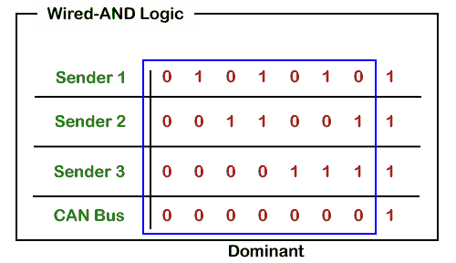
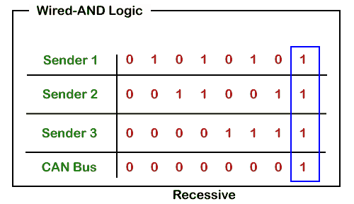
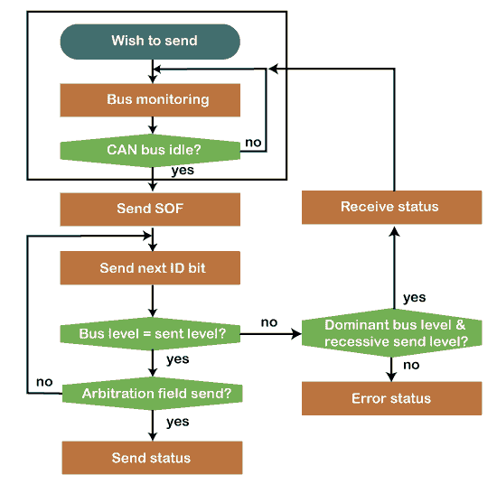
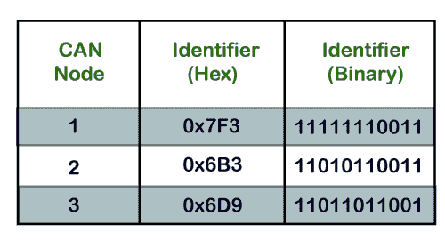
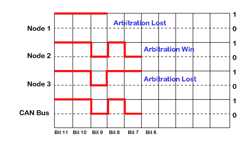

# 控制器局域网协议

> 原文：<https://www.javatpoint.com/can-protocol>

CAN 代表**控制器局域网**协议。这是一个由罗伯特·博世 T2 在 1986 年开发的协议。CAN 协议是一种标准，旨在允许微控制器和其他设备在没有任何主机的情况下相互通信。使 CAN 协议在其他通信协议中独一无二的特点是总线的广播类型。这里，广播意味着信息被传输到所有节点。该节点可以是传感器、微控制器或网关，允许计算机通过 [USB](https://www.javatpoint.com/usb-full-form) 电缆或以太网端口通过网络进行通信。CAN 是一种基于消息的协议，这意味着消息携带消息标识符，并根据标识符决定优先级。在 CAN 网络中不需要节点标识，因此从网络中插入或删除它变得非常容易。它是一种串行半双工和异步类型的通信协议。CAN 是一种双线通信协议，因为 CAN 网络是通过双线总线连接的。导线是双绞线，两端连接有 120ω特性阻抗。最初，它主要是为车内通信而设计的，但现在它被用于许多其他场合。像 UDS 和 KWP 2000 一样，CAN 也可用于车载诊断。

### 为什么是 CAN？

由于电子设备数量的增加，对集中式标准通信协议的需求也随之而来。例如，现代车辆中的各种子系统(如仪表板、变速器控制、发动机控制单元等)可以有 7 个以上的 TCU。如果所有节点都是一对一连接的，那么通信速度将会非常高，但是线路的复杂性和成本将会非常高。在上面的例子中，单个仪表板需要 8 个连接器，因此为了克服这个问题，引入了 CAN 作为集中式解决方案，需要两条线，即 CAN 高和 CAN 低。使用 CAN 协议的解决方案由于其消息优先级而相当高效，并且灵活，因为节点可以插入或移除而不影响网络。

### CAN 协议的应用

最初，CAN 协议旨在解决车辆内部发生的通信问题。但是后来，由于它提供的功能，它被用于其他各种领域。以下是 CAN 协议的应用:

*   汽车(乘用车、卡车、公共汽车)
*   航空和导航电子设备
*   工业自动化和机械控制
*   电梯和自动扶梯
*   建筑自动化
*   医疗仪器和设备
*   海运、医疗、工业、医疗

### CAN 分层架构

我们知道 [OSI 模型](https://www.javatpoint.com/osi-model)将通信系统划分为 7 个不同的层。但是 CAN 分层架构由两层组成，即[数据链路层](https://www.javatpoint.com/data-link-layer)和物理层。

让我们理解这两层。

*   数据链路层:该层负责节点间的数据传输。它允许您建立和终止连接。它还负责检测和纠正物理层可能出现的错误。数据链路层细分为两个子层:
    1.  **MAC:** MAC 代表媒体访问控制。它定义了网络中的设备如何访问介质。它提供数据的封装和解封装、错误检测和信令。
    2.  **LLC:** LLC 代表逻辑链路控制。它负责帧接受过滤、过载通知和恢复管理。
*   物理层:物理层负责原始数据的传输。它定义了电压电平、时序、数据速率和连接器等参数的规格。

CAN 规范定义了 CAN 协议和 CAN 物理层，在 CAN 标准 [ISO](https://www.javatpoint.com/iso-full-form) 11898 中有定义。ISO 11898 有三个部分:

*   ISO 11898-1:这部分包含数据链路层和物理信号链路的规范。
*   ISO 11898-2:这部分属于高速 CAN 的 CAN 物理层。高速 CAN 允许在动力传动系和车辆充电区域使用高达 1 Mbps 的数据速率。
*   ISO 11898-3:这部分也属于低速 CAN 的 CAN 物理层。它允许高达 125 kbps 的数据速率，并且在通信速度不是关键因素的地方使用低速 CAN。

CiA DS-102:CiA 的完整形式是自动化中的 CAN，它定义了 CAN 连接器的规格。

就实现而言，在应用程序、操作系统和网络管理功能的帮助下，CAN 控制器和 CAN 收发器在软件中实现。

### CAN 框架

**我们来了解一下 CAN 帧的结构。**

*   **SOF:** SOF 代表帧的开始，表示新帧进入网络。它是 1 位的。
*   **标识符:**CAN 2.0 A 规范下定义的标准数据格式使用 11 位消息标识符进行仲裁。基本上，这个消息标识符设置了数据帧的优先级。
*   **RTR:** RTR 代表远程传输请求，定义帧类型，是数据帧还是远程帧。它是 1 位的。
*   **控制字段:**有用户自定义功能。
    1.  **IDE:** 控制字段中的 IDE 位代表标识符扩展。一个显性的集成开发环境位定义了 11 位标准标识符，而隐性的集成开发环境位定义了 29 位扩展标识符。
    2.  **DLC:** DLC 代表数据长度代码，定义数据字段中的数据长度。它是 4 位的。
    3.  **数据字段:**数据字段最多可包含 8 个字节。
*   **CRC 字段:**数据帧还包含一个 15 位的循环冗余校验字段，用于检测传输期间是否发生损坏。发送方将在发送数据帧之前计算循环冗余校验，接收方也将计算循环冗余校验，然后将计算的循环冗余校验与从发送方接收的循环冗余校验进行比较。如果循环冗余校验不匹配，那么接收器将产生错误。
*   **确认字段:**这是接收方的确认。在其他协议中，接收到所有数据包后会发送一个单独的确认数据包，但在 CAN 协议中，不会发送单独的确认数据包。
*   **EOF:** EOF 代表帧尾。它包含 7 个连续的隐性位，称为帧尾。

**现在我们来看看数据是如何通过 CAN 网络传输的。**

一个 CAN 网络由多个 CAN 节点组成。在上述情况下，我们考虑了三个 CAN 节点，并将其命名为节点 A、节点 B 和节点 c。CAN 节点由三个元素组成，如下所示:

*   主机
    主机是一个微控制器或微处理器，它运行一些应用程序来完成特定的工作。主机决定接收到的消息是什么意思，接下来应该发送什么消息。
*   CAN 控制器
    CAN 控制器处理 CAN 协议描述的通信功能。它还会触发 CAN 消息的传输或接收。
*   CAN 收发器
    CAN 收发器负责 CAN 总线上数据的发送或接收。它将数据信号转换成从 CAN 总线收集的数据流，以便 CAN 控制器能够理解。

在上图中，使用非屏蔽双绞线传输或接收数据。又称 CAN 总线，CAN 总线由两条线路组成，即 CAN 低线和 CAN 高线，也分别称为 CANH 和 CANL。传输是由于施加到这些线路上的差分电压而发生的。由于其环境，CAN 使用双绞线电缆和差分电压。例如，在汽车中，电机、点火系统和许多其他设备会因噪音而导致数据丢失和数据损坏。两条线的扭曲也会降低磁场。总线两端均以 120ω电阻端接。

### CAN 特性

借助差分电压，我们将确定 0 和 1 如何通过 CAN 总线传输。上图是显示 CAN 低电平和 CAN 高电平的电压图。在 CAN 术语中，逻辑 1 是隐性的，而逻辑 0 是显性的。当向 CAN 高线路和 CAN 低线路施加 2.5 伏电压时，实际差分电压将为零伏。CAN 总线上的零电压被 CAN 收发器读取为隐性或逻辑 1。CAN 总线上的零电压是总线的理想状态。当 CAN 高位线被拉至 3.5 伏，CAN 低位线被拉至 1.5 伏时，总线的实际差分电压将为 2 伏。它被 CAN 收发器视为主导位或逻辑 0。如果总线状态达到显性或逻辑 0，则任何其他节点都不可能移动到隐性状态。

**从 CAN 特性中学习到的要点**

*   逻辑 1 是隐性状态。要在 CAN 总线上传输 1，CAN 高电平和 CAN 低电平都应施加 2.5V
*   逻辑 0 是主导状态。要在 CAN 总线上传输 0，CAN 高电平应施加在 3.5V，CAN 低电平应施加在 1.5V
*   公交车的理想状态是隐性的。
*   如果节点达到显性状态，它就不能被任何其他节点移回隐性状态。

### CAN 总线逻辑

从上面的场景中，我们了解到显性状态覆盖了隐性状态。当节点同时发送显性和隐性位时，总线保持显性。隐性电平仅在所有节点发送隐性位时出现。这种逻辑被称为“与”逻辑，在物理上它被实现为开路集电极电路。

### CAN 通信原理

我们知道，消息是根据仲裁字段中设置的优先级发送的。对于标准帧，消息标识符是 11 位，而对于扩展帧，消息标识符是 29 位。它允许系统设计者在设计本身设计消息标识符。消息标识符越小，消息优先级越高。

**我们通过流程图来了解仲裁是如何工作的。**

发送方希望发送消息并等待 CAN 总线空闲。如果 CAN 总线空闲，则发送器发送 SOF 或总线访问的主导位。然后，它发送最高有效位的消息标识符位。如果节点在传输隐性位的同时检测到总线上的显性位，则意味着该节点已失去仲裁并停止传输更多位。一旦总线空闲，发送者将等待并重新发送消息。

### CAN 仲裁示例

如果我们考虑三个节点，即节点 1、节点 2 和节点 3，这些节点的消息标识符分别是 0x7F3、0x6B3 和 0x6D9。

具有最高有效位的所有三个节点的传输如上图所示。

11 第位:由于节点的三位都是隐性的，所以总线位也将保持隐性。

10 第位:所有节点都有第 10 位为隐性，所以总线也会保持隐性。

9 第位:节点 1 有隐性位，而其他节点有显性位，所以总线也将保持显性。在这种情况下，节点 1 失去了仲裁，因此它停止发送位。

8 第位:节点 2 和节点 3 都发送隐性位，总线状态保持隐性。

7 第位:节点 2 发送显性位，节点 3 发送隐性位，总线状态保持显性。在这种情况下，节点 3 失去了仲裁，因此它停止发送消息，而节点 2 赢得了仲裁，这意味着它将继续保持总线，直到接收到消息。

* * *