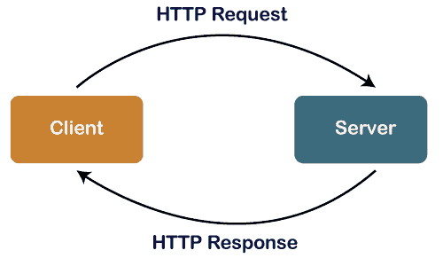
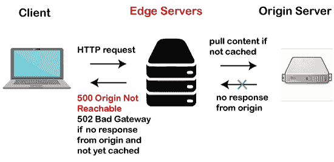

# 超文本传输协议状态码

> 原文：<https://www.javatpoint.com/http-status-codes>

HTTP 状态代码确定客户端发出的请求是否已成功完成。服务器的状态代码是响应客户端对服务器的请求而提供的。简而言之，我们可以说，当客户端发出请求时，服务器发送的 HTTP 状态代码允许客户端知道请求是成功的、失败的还是介于两者之间的。

**我们来详细了解一下 HTTP 状态码**。

当浏览器向服务器发送请求时，服务器以三位数长的 [HTTP](https://www.javatpoint.com/http) 状态码作为回应。



状态代码分为五类。 [HTTP](https://www.javatpoint.com/http-tutorial) 状态码的第一位数字定义了这五个类中的一个类，而最后两位数字没有任何分类的作用。IANA(互联网分配号码管理局)是一个包含 HTTP 状态码官方注册的组织。以下是 IANA 标准定义的五个类别:

1.  1xx-信息
2.  2xx-成功
3.  3xx-重定向
4.  4xx-客户端错误
5.  5xx-服务器错误

100 个块是信息请求，200 个块是成功请求，300 个块是重定向，400 个块是客户端错误，500 个块是服务器错误。

### 1xx 信息响应

以**一**开始的代码将在连接仍在进行时给出一些信息。这类状态代码定义请求已经被接收，并且处理已经开始。发出信息响应，通知客户端请求处理已经开始，并等待最终响应。响应仅由状态行和可选的标题字段组成。它以空行结束。

**100 继续**

100 continue 是一个信息状态响应代码，指示到目前为止一切正常，客户端应该继续发送请求正文。如果请求完成，则忽略此状态代码。

客户端应该在初始请求中发送 **Expect: 100- continue** 作为标头，以便服务器可以检查请求的标头，客户端将在发送请求正文之前收到响应中的 **100 continue HTTP 状态代码**。

**100 切换协议**

客户端请求服务器切换协议。服务器发送 100 切换协议作为响应代码，通知客户端它正在切换到客户端请求的协议，客户端发送了包含升级请求报头的消息。简而言之，我们可以说服务器响应升级请求头。

102 处理

102 处理状态代码由服务器发送，以通知客户端它已经接受了完整的请求并正在处理该请求，但是仍然没有可用的响应。

### 2xx 成功

2xx 类意味着客户端发出的请求被接收、理解和接受。或者我们可以说 2xx http 状态代码表示 http 请求成功。

**200 OK**

每当服务器响应客户端的请求发回 200 OK 状态码时，该请求被接受并成功。200 OK 的实际响应可能取决于 HTTP 请求方法。可以在 HTTP 请求头中发送以下方法:

**获取方法:**当我们想要从服务器上获得一些东西时，会使用**获取()**方法。例如，我们向服务器请求了一些资源；然后，请求的资源将在响应正文中发送。

**Head 方法:****Head()**方法仅在我们请求标题时使用。请求资源的实体头字段在响应正文中发送，没有任何消息。

**Post 方法:**如果我们将 **post()** 方法发送到服务器，我们正在请求一些新的资源。描述动作结果的实体在消息体中传输。

**201 已创建**

当服务器发回作为响应代码创建的 201 时，表示客户端向服务器发出的创建新资源的请求成功。服务器在标题字段中返回关于新创建的资源的位置的信息。简而言之，我们可以说 201 Created 响应用于在新创建的资源的位置头字段中提供 URI。

**202 接受**

服务器发送 202 accepted 作为响应，通知客户端我们已经接受了请求，并且稍后将进行请求处理。当需要大量的计算处理或者在不久的将来需要处理请求时，使用这种响应。例如，一个客户向服务器发送一个 NEFT 的请求，在那里 NEFT 被用来将钱从一个账户转移到另一个银行的另一个账户。NEFT 的请求一天处理三次，即一次在上午，第二次在下午，第三次在晚上。在这种情况下，会发送一个 202 接受的响应，表示您的转账请求被接受，但我稍后会这样做。

**203 非权威信息**

服务器使用另一个响应代码，即 203 非权威信息，它让客户端知道代理服务器位于客户端和服务器之间。代理可能会也可能不会更改标头信息。

**204 无内容**

当客户端的请求成功时，使用 204 无内容，但是服务器在响应正文中没有要发送的内容。服务器不是简单地说 204，而是说 204 你的请求成功了。在此响应中，消息正文为空。

**205 重置内容**

有时客户端也会得到 205 Reset Content [HTTP](https://www.javatpoint.com/computer-network-http) 响应，这个响应用于服务器希望客户端视口复位的情况。例如，客户端创建一个表单，通过它我们可以创建一个类别，我们提交它，服务器发回 205 响应。该响应意味着客户端需要将输入类别重置为空白，或者将输入类别重置为之前使用的类别名称。

**206 部分内容**

客户端也可以接收 **206 部分内容响应，**，这个响应意味着服务器已经完成了部分 GET 请求，而不是完整的。客户端可以使用指示期望范围的**范围标题字段**，因此 206 可以导航到更大的响应。客户端还可以包含 If-Range 头字段，以使请求有条件。

**207 多状态**

207 多状态是响应代码中的新增内容。例如，客户端向服务器发送请求；然后服务器准备一个响应。为了准备响应，服务器需要连接三个不同的机器，即数据库系统、文件系统和缓存系统。假设数据库系统停机，发送 500；在这种情况下，服务器不能说它成功或不成功，所以它发回 207 个响应。多状态代码作为文本/xml 或应用程序/xml 包含在响应正文中。

**208 已报告**

208 类似于 207，但它仅用于 WebDAV。代表网络分布式创作和版本控制。WebDAV 是超文本传输协议(HTTP)的扩展，允许客户端在分布式网络上执行远程 web 内容创作操作。

### 3xx 重定向

3xx 块是用于重定向的类。它表明客户端需要采取一些额外的措施来完成请求。这里的重定向是指网址转发是向页面提供多个网址的过程。 [HTTP](https://www.javatpoint.com/http-interview-questions) 为这类操作提供了 HTTP 重定向响应。

**重定向主要分为三类:**

*   永久重定向
*   临时重定向
*   特殊重定向

### 永久重发

永久重定向是指新的[网址](https://www.javatpoint.com/url-full-form)替换现有网址的重定向。这意味着原来的网址不再存在，被新的网址取代。

**以下是永久重定向的状态代码:**

**301 永久移动**

301 [HTTP](https://www.javatpoint.com/http-full-form) 状态代码告诉浏览器，资源的 uri 已经永久更改为“位置”响应头中指定的新 uri。如果我们在浏览器中提出新的请求，那么随后浏览器将不会对原始链接提出另一个请求。

例如，

```

Client request:
GET /index.php HTTP/1.1
Host: www.example.org
Server response:
HTTP/1.1 301 Moved Permanently
Location: http://www.example.org/index.asp

```

在上面的例子中，当用户手动输入 url，即**www.example.org/index.php**时，浏览器将呼叫**www.example.org/index.asp**，因为服务器以具有文本“永久移动”的 301 响应代码进行响应，并且新位置是**www.example.org/index.asp**。

http 响应状态代码 301 永久移动用于永久网址重定向，这意味着当前链接被更新。新的网址在响应中包含的“位置”字段中提供。301 HTTP 状态码也用于将用户从 HTTP 升级到 HTTPS。

RFC 2616 指出，如果收到响应 GET 或 HEAD 以外的 301 状态代码，客户端必须在重定向之前询问用户。换句话说，我们可以说 301 响应状态代码没有通知浏览器自动将 POST 方法请求重定向到 GET 方法请求。但是有些浏览器错误地将 POST 方法请求重定向到 GET 方法请求。

**308 永久重定向**

正如 RFC7538 文档规范中提到的 308 状态代码一样，308 状态代码于 2015 年 4 月出现在 HTTP 标准中。308 是一个 HTTP 响应状态代码，它类似于 301 状态代码，这意味着所请求的资源已经被响应中包含的 Location 头中指定的新 uri 所替换。308 很少指示实际问题，但它主要是由于服务器的行为或配置发生了变化而发生的。没有其他状态代码指示永久重定向。308 是唯一一个指示永久重定向的。它还避免了从 POST 方法请求到 GET 方法请求的自动重定向。

所有现代浏览器都检测到 308 永久响应并自动执行重定向。服务器发送 308 HTTP 状态码，该状态码包括位置头作为响应，其中位置头定义了所请求的资源位置。例如，如果客户端发出 POST 请求，那么 web 服务器将配置为重定向到不同的 uri。

### 临时重定向

临时重定向意味着所请求的资源已经分配了一个在位置头中临时指定的新 uri。

**以下是用于临时重定向的 HTTP 状态代码:**

**302 找到**

302 发现通知浏览器资源的 uri 已经被临时改变。当客户端发出请求时，浏览器仅将其重定向到新位置。下一次当请求到来时，浏览器将调用原始 uri。

**303 参见其他**

服务器向客户端发送 303 响应代码，用 get 请求在另一个 **uri 获取请求的资源，这就是为什么这个代码的名字是 see other。303 HTTP 响应**代码通知浏览器重定向到另一个页面，但不重定向到新上传的资源。只有当客户端发出 PUT 或 POST 请求时，才会发送响应。显示请求页面的方法是 GET 方法。

**307 临时重定向**

307 类似于 302；唯一的区别是，它告诉浏览器下一个请求应该使用与原始请求相同的动词。例如，对原始链接发出开机自检请求，然后应该仅通过开机自检将其重定向到新链接。

307 类似于 302，因为两个响应都告诉客户端临时重定向到不同的所请求的资源。307 和 302 之间的唯一区别是，在 307 中，客户端必须再次使用相同的请求。例如，如果客户机将 POST 请求作为原始请求发出，那么客户机应该在下一个请求中遵循相同的 POST 请求。

### 特别信贷

**特殊重定向包括以下 HTTP 状态码:**

**300 多选**

当服务器发送 300 多个选择时，HTTP 响应表示请求有多个响应。[浏览器](https://www.javatpoint.com/browsers)可以选择其中之一。在这些多重回答中没有标准的选择方式。

**304 未修改**

只有在文件自上次访问后没有更改时，服务器才会生成 304“未修改”响应。这种响应基本上提高了用户浏览体验的速度。如果用户正在访问的页面没有被修改，那么客户端将向用户显示本地存储的缓存数据，这样客户端就不会向 web 服务器请求文件。响应于客户端的条件验证请求，发送 304 响应，以指示客户端的副本在高速缓存中可用。

当客户端发出条件验证请求时，客户端会借助“如果修改-自”标头发送其副本的上次修改日期，并借助“如果不匹配”标识符发送缓存副本的 ETag 标识符。服务器检查这些头，以发现缓存中是否有最新的文件。如果是最新的，则服务器发回 304 HTTP 响应。在这种情况下，客户端可以使用缓存中的文件，而不是向服务器发送文件请求。如果服务器在缓存中发现一个过时的文件，它会发回 200 OK 响应和一个新的响应正文。

### 4xx 客户端错误

当客户端发出的请求中出现一些错误时，服务器向客户端发送 4xx HTTP 响应状态代码。此响应表明浏览器发送了一个错误的请求，该请求带有服务器无法处理的错误。为了得到正确的响应，客户端需要再次发送正确的请求。

**以下是 4xx 中使用的状态代码:**

**400 无效请求**

如果由于语法错误，web 服务器无法为请求的资源提供服务，那么服务器会发回 400 HTTP 无效请求作为响应。

**401 未授权请求**

当某个网页需要认证，用户试图访问认证的资源时，服务器会发送 401 未授权请求作为响应。例如，网页通过用户 id 和密码进行验证。

**402 需要付款**

402 支付要求 HTTP 响应指示要求客户端进行在线支付来处理请求。此响应状态代码不是标准的客户端错误，保留供将来使用。

**403 禁止**

当客户端发送正确的请求时，服务器发送 403 禁止的 HTTP 响应，但服务器无法为其提供服务。403 与 402 不同，因为在 402 中，用户应该被授权访问网页，而在 403 中，没有认证的角色。例如，当一些授权用户试图访问受限页面时，发送 403。

**404 未找到**

当请求的资源在服务器上不可用时，服务器发送 404 未找到错误。出现此错误的原因可能是网站所有者删除了该网址，或者用户输入了错误的网址。

**405 不允许的方法**

当服务器知道请求方法，但请求的资源不支持它时，会收到 405 方法不允许响应代码。在这种情况下，服务器生成包含目标资源支持的所有方法的 ALLOW 头字段。

**406 不可接受的请求**

当客户端以不同的格式发出请求时，会生成 406 不可接受的请求 HTTP 响应。原因可能是请求中使用了不同的语言或编码方法。

### 5xx 状态代码

当服务器出现一些问题时，5xx 范围内的错误代码会发送到客户端。当客户端请求某个网站时，浏览器会向该网站的服务器发送请求，如果该网站的服务器无法处理该请求，则会向客户端发送 5xx 错误代码。这些错误主要发生在服务器遇到问题或无法执行请求时。

5xx 错误消息表示服务器端错误消息，其中网站服务器未能成功执行请求。服务器端错误并不意味着问题出现在网站、计算机或互联网连接上。

有多种 5xx 状态代码可供使用，以便识别特定问题:

**500 互联网服务器错误**

当服务器无法确定问题并停止响应请求时，会出现 500 互联网服务器错误状态代码。由于服务器配置不正确，可能会出现此错误。要纠正此错误，网站所有者需要检查服务器的配置，并联系网络托管公司进行修复。

**501 未执行**

501 未实现的 HTTP 错误响应代码表示服务器无法为请求的资源提供服务，因为请求中提到的方法不受支持。

此错误状态代码还会发送重试后标头，告知客户端何时重新检查功能。服务器支持的方法是 GET 和 HEAD。如果服务器识别请求中指定的方法，但不支持它。在这种情况下，405 不允许响应被发送到客户端。

**502 不良网关**

502 坏网关响应代码意味着代理服务器没有得到源或上游服务器的响应。如果边缘服务器从源服务器接收到 502 坏网关，则它向客户端发回 500 源不可达响应。



**503 服务不可用**

当其他请求使服务器过载或服务器正在维护时，会发送 503 服务不可用响应状态代码。500 和 503 之间的区别在于，在 500 中，服务器出现了问题，使其无法处理请求，而在 503 中，服务器工作正常，也能够处理请求，但选择发送 503 响应。

**网站可以用以下方式表示这个错误:**

```

Http/1.1 Service Unavailable
503 Error
503 Service Temporarily Unavailable
503 Service Unavailable
Service Unavailable - DNS Failure
HTTP Error 503
HTTP 503
Error 503 Service Unavailable

```

**504 网关超时**

当服务器没有从另一个上游服务器获得完成请求所需的响应时，会出现 504 网关超时错误。当 web 服务器试图加载一个页面，但没有从第二个服务器获得所需信息的响应时，web 服务器使用 504 作为响应代码。

**不支持 505 HTTP 版本**

不支持 505 HTTP 版本如果服务器不支持请求中指定的 HTTP 版本，则会发送响应代码。

**507 空间不足**

507 空间不足是 WebDAV 规范引入的 HTTP 响应状态代码。它用于通知客户端，由于磁盘上没有可用空间，请求无法继续。

**510 分机丢失**

当客户端发送请求时，它也发送要使用的扩展。如果服务器不支持请求中指定的扩展，则服务器发送 510 作为响应代码。

* * *