# ICMP 协议

> 原文：<https://www.javatpoint.com/icmp-protocol>

ICMP 代表互联网控制消息协议。它是一种网络层协议。它用于网络层的错误处理，主要用于路由器等网络设备。由于网络层可能存在不同类型的错误，因此可以使用 ICMP 来报告这些错误并调试这些错误。

例如，某个发送方想要将消息发送到某个目的地，但路由器无法将消息发送到目的地。在这种情况下，路由器会向发送方发送消息，告知我无法将消息发送到该目的地。

[IP](https://www.javatpoint.com/ip) 协议没有任何错误报告或纠错机制，所以它使用消息来传递信息。例如，如果有人将消息发送到目的地，消息在发送者和目的地之间以某种方式被窃取。如果没有人报告错误，那么发送者可能认为消息已经到达目的地。如果中间有人报告了错误，那么发件人会很快重新发送消息。

### ICMP 在网络层的位置

**ICMP 驻留在 [IP](https://www.javatpoint.com/ip-full-form) 层，如下图所示。**

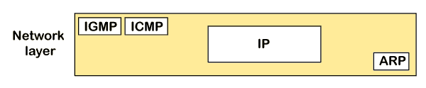

### 信息

**ICMP 消息通常分为两类:**

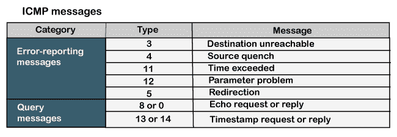

*   **报错信息**

错误报告消息意味着路由器在处理 IP 数据包时遇到问题，然后报告一条消息。

*   **查询消息**

查询消息是那些帮助主机获取另一台主机的特定信息的消息。例如，假设有一台客户机和一台服务器，客户机想知道服务器是否处于活动状态，然后它向服务器发送 ICMP 消息。

### ICMP 消息格式

消息格式有两点；一个是类别，它告诉我们它是哪种类型的消息。如果消息属于错误类型，则错误消息包含类型和代码。类型定义消息的类型，而代码定义消息的子类型。

**ICMP 消息包含以下字段:**

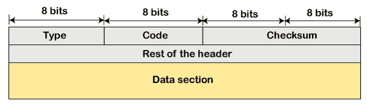

*   **类型:**8 位字段。它定义了 ICMP 消息类型。为 ICMPv6 定义了从 0 到 127 的值，从 128 到 255 的值是信息性消息。
*   **代码:**这是一个 8 位字段，用于定义 ICMP 消息的子类型
*   **校验和:**这是一个 16 位字段，用于检测消息中是否存在错误。

#### 注意:ICMP 协议总是向原始源报告错误消息。例如，当发送方发送消息时，如果消息中出现任何错误，则路由器会向发送方报告，而不是向接收方报告，因为发送方正在发送消息。

### 错误报告消息的类型

**错误报告消息大致分为以下几类:**

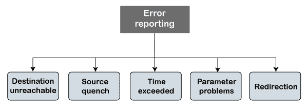

*   **目的地不可达**

当数据包没有到达目的地时，会出现目的地不可达错误。假设发送方发送消息，但是消息没有到达目的地，那么中间路由器向发送方报告目的地不可到达。

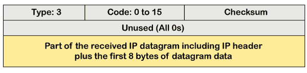

上图显示了目标不可达消息的消息格式。在消息格式中:

**类型:**定义消息的类型。数字 3 表示目的地不可达。

**代码(0 至 15):** 是一个 4 位数字，用于识别消息是来自某个中间路由器还是目的地本身。

#### 注意:如果目的地创建了目的地不可达消息，那么代码可以是 2 或 3。

有时，目的地不想处理该请求，所以它将目的地不可达消息发送给源。路由器不会检测到阻止数据包传送的所有问题。

*   **源失超**

网络层或 IP 协议中没有流量控制或拥塞控制机制。发送方只关心发送数据包，发送方不考虑接收方是否准备好接收这些数据包，也不考虑网络层是否发生任何拥塞，因此发送方可以发送较少数量的数据包，因此没有流量控制或拥塞控制机制。在这种情况下，ICMP 提供反馈，即源抑制。假设发送方以更高的速率重新发送数据包，而路由器无法处理高数据速率。为了克服这种情况，路由器发送源抑制消息，告诉发送方以较低的速率发送数据包。

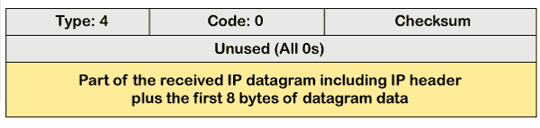

上图显示了源抑制消息的消息格式。它是类型 4 消息，代码为零。

#### 注意:源抑制消息通知发送方，由于网络层发生拥塞，数据报已被丢弃。

因此，发送方必须停止或减慢数据报的发送，直到拥塞减少。路由器为由于网络层拥塞而被丢弃的每个数据报发送一条源抑制消息。

*   **时间超过**

有时，当发送方和接收方之间存在许多路由器时，就会出现这种情况。当发送方发送数据包时，它会在路由环路中移动。超过的时间基于生存时间值。当数据包通过路由器时，每台路由器都会将 TTL 值减少 1。每当路由器将生存时间值为零的数据报减少时，路由器就会丢弃数据报，并将超时消息发送到原始源。

每个媒体访问控制层都有不同的数据单元。例如，有些层最多可以处理 1500 个数据单元，有些层最多可以处理 300 个数据单元。当分组从具有 1500 个单元的层发送到具有 300 个单元的层时，则分组被分成片段；这个过程被称为碎片化。这 1500 个单位分为 5 个片段，即 f1、f2、f3、f4、f5，这些片段按顺序到达目的地。如果所有片段没有在设定的时间内到达目的地，它们会丢弃所有接收到的片段，并向原始源发送一条超时消息。

在碎片化的情况下，代码与 TTL 相比会有所不同。让我们观察超过时间的消息格式。

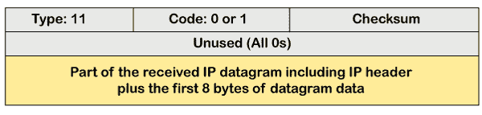

上面的消息格式显示超时的类型是 11，代码可以是 0 也可以是 1。代码 0 表示 TTL，而代码 1 表示碎片。在超时消息中，路由器使用代码 0 来表示生存时间值为零。

目的地使用代码 1 来显示所有片段没有在设定的时间内到达。

**参数问题**

路由器和目的主机可以发送参数问题消息。此消息传达了一些参数设置不正确。

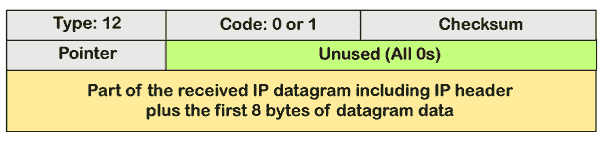

上图显示了参数问题的消息格式。消息的类型是 12，代码可以是 0 或 1。

### 重寄

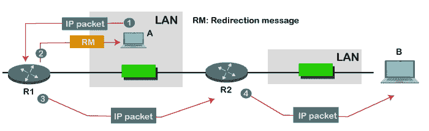

当数据包发送后，路由表会逐渐扩大和更新。用于实现这一点的工具是重定向消息。比如 A 想把数据包发给 B，A 和 B 之间存在两台路由器，首先 A 把数据发给路由器 1。路由器 1 将 IP 数据包发送到路由器 2，并将重定向消息发送到 A，以便 A 可以更新其路由表。

#### 注意:重定向消息从路由器发送到同一网络上的主机。

### ICMP 查询消息

ICMP 查询消息用于错误处理或调试互联网。此消息通常用于 ping 消息。

**回显请求和回显回复消息**

一台[路由器](https://www.javatpoint.com/router)或一台主机可以发送回显请求消息。它用于向另一台主机发出“你还活着”的信息。如果另一台主机还活着，它就会发送回显消息。收到回显请求消息的路由器或主机会发送回显回复消息。

**查询消息要点**

1.  网络管理员可以使用回应请求消息和回应回复消息来检查 IP 协议的操作。假设 A 和 B 两个主机存在，A 想和 B 主机通信，如果 A 和 B 之间的链路没有断开，B 还活着，A 主机可以和 B 主机通信。
2.  回显请求消息和回显回复消息检查主机的可达性，这可以通过调用 ping 命令来完成。

回显请求和回显回复消息的消息格式

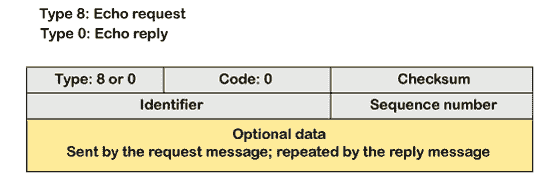

上图显示了回显请求和回显回复消息的消息格式。回应请求的类型是 8，回应回复的请求是 0。此消息的代码是 0。

**时间戳-请求和时间戳-回复消息**

时间戳请求和时间戳回复消息也是一种查询消息。假设计算机 A 想知道计算机 B 上的时间，所以它向计算机 B 发送时间戳请求消息。计算机 B 用时间戳回复消息进行响应。

**时间戳-请求和时间戳-回复的消息格式**

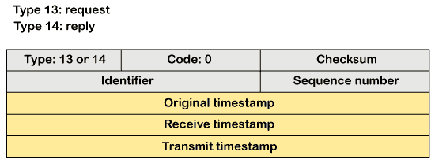

时间戳请求的类型是 13，时间戳回复的类型是 14。这类消息的代码是 0。

**时间戳-请求和时间戳-回复消息相关要点**

*   它可以用来计算源和目的地之间的往返时间，即使时钟不同步。
*   如果确切的传输时间已知，它还可以用来同步两台不同机器的时钟。

如果发送方知道确切的传输时间，那么它可以同步时钟。发送方询问接收方时钟上的时间，然后加上时间和传播延迟。假设时间是 1:00 时钟，传播延迟是 100 毫秒，那么时间就是 1:00 时钟加 100 毫秒。

### 调试工具

有几种用于调试的工具。在本主题中，我们将学习两种使用 ICMP 进行调试的工具。两个工具分别是 **ping** 和 **traceroute** 。我们已经了解了回声请求和回声应答消息中的 ping 操作，这些消息用于检查主机或路由器是否处于活动状态或正在运行。

**现在我们来看看 traceroute。**

Traceroute 是一种工具，用于跟踪数据包在 IP 网络上从源到目的地的路由。它记录数据包在从源到目的地的路由过程中每一跳所花费的时间。Traceroute 使用 ICMP 消息和 TTL 值。计算 TTL 值；如果 TTL 值达到零，数据包将被丢弃。Traceroute 使用小的 TTL 值，因为它们很快就会过期。如果 TTL 值为 1，则消息由路由器 1 产生；如果 TTL 值为 2，则消息由路由器 2 产生，依此类推。

**我们通过一个例子来了解 traceroute。**

假设 A 和 B 是两台不同的主机，A 想将数据包发送给主机 B，A 和 B 之间存在 3 台路由器。为了确定路由器的位置，我们使用 traceroute 工具。

**TTL 值=1:** 首先，主机 A 将 TTL 值为 1 的数据包发送到路由器 1，当数据包到达路由器 1 时，路由器将 TTL 值减少 1，TTL 值变为 0。在这种情况下，路由器 1 生成超时消息，主机 A 知道路由器 1 是路径中的第一个路由器。

**TTL 值=2:** 当主机 A 向路由器 1 发送 TTL 值为 2 的数据包时，当数据包到达路由器 1 时，TTL 值递减 1，TTL 值变为 1。然后路由器 1 将数据包发送到路由器 2，TTL 值变为 0，因此路由器会生成一条超时消息。主机 A 知道路由器 2 是路径上的第二个路由器。

**TTL 值=3:** 当主机 A 向路由器 1 发送 TTL 值为 3 的数据包时，路由器将其值减 1，TTL 值变为 2。然后，路由器 1 将数据包发送到路由器 2，TTL 值变为 1。然后，路由器 2 将数据包发送到路由器 3，TTL 值变为 0。当 TTL 值变为 0 时，路由器 3 会生成一条超时消息。这样，主机 A 就是路径上的第三台路由器。

* * *