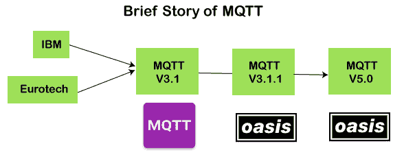
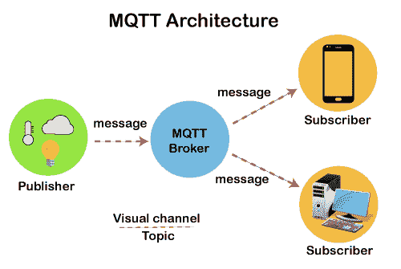
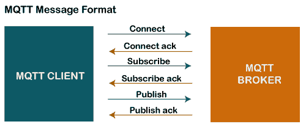
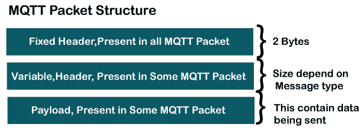
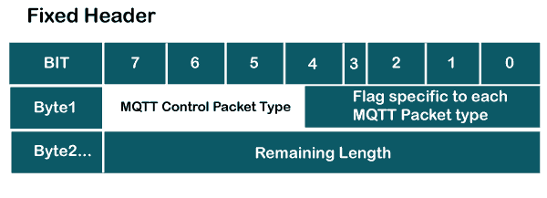
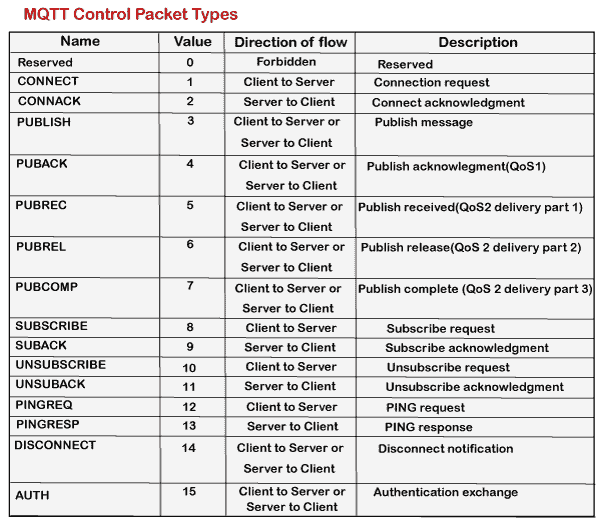
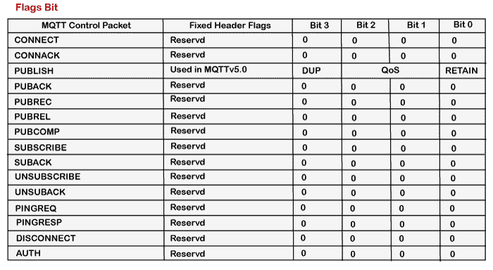
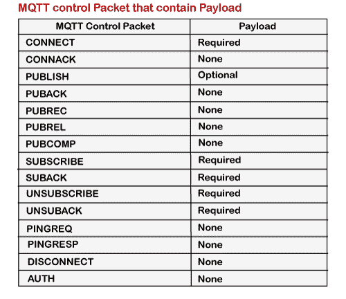

# MQTT 协议

> 原文：<https://www.javatpoint.com/mqtt-protocol>

MQTT 代表**消息队列遥测传输**。MQTT 是一个机器对机器的物联网连接协议。这是一个极其轻量级的发布-订阅消息传输协议。该协议对于与带宽要求较高的远程位置的连接非常有用。这些特性使它在各种情况下都很有用，包括持续的环境，如机器对机器的通信和物联网环境。这是一个发布和订阅系统，我们可以作为客户端发布和接收消息。它使多台设备之间的通信变得容易。这是一个为受限设备设计的简单消息传递协议，具有低带宽，因此是物联网应用的完美解决方案。

### MQTT 的特点

MQTT 有一些在其他协议中几乎找不到的独特特性。MQTT 的一些特性如下:

*   它是一种机器对机器协议，即它提供设备之间的通信。
*   它被设计为一种简单而轻量级的消息传递协议，使用发布/订阅系统在客户端和服务器之间交换信息。
*   它不要求客户端和服务器同时建立连接。
*   它提供了更快的数据传输，就像 WhatsApp/messenger 如何提供更快的交付一样。这是一个实时消息协议。
*   它允许客户订阅狭窄的主题选择，这样他们就可以收到他们正在寻找的信息。

### MQTT 的历史

MQTT 是由安迪·斯坦福-克拉克博士、国际商用机器公司和阿尔伦·尼珀开发的。协议 3.1 和 3.1.1 的早期版本在 MQTT ORG 下提供。2014 年，MQTT 由 OASIS 正式发布。OASIS 成为 MQTT 发展的新家。然后，OASIS 开始了 MQTT 的进一步开发。3.1.1 版本向后兼容 3.1 版本，只带来了一些小的变化，比如对连接消息的更改和对 3.1 版本的澄清。MQTT 的最新版本是 5.0，它是 3.1.1 版本的继承者。5.0 版本不落后，像 3.1.1 版本一样舒服。根据规范，5.0 版本有大量的特性使代码到位。

5.0 版的主要功能目标是:

*   可扩展性和大规模系统的增强，以便与数千或数百万设备一起安装。
*   错误报告的改进

### MQTT 体系结构

**为了理解 MQTT 架构，我们首先看一下 MQTT 的组件。**

*   **消息**
*   **客户端**
*   **服务器或经纪人**
*   **话题**

### 消息

消息是由协议通过网络为应用程序执行的数据。当消息通过网络传输时，该消息包含以下参数:

1.  有效载荷数据
2.  服务质量
3.  属性集合
4.  主题名称

**客户端**

在 MQTT 中，订阅者和发布者是客户端的两个角色。客户端订阅主题以发布和接收消息。简而言之，我们可以说，如果任何程序或设备使用 MQTT，那么该设备被称为客户端。如果设备打开与服务器的网络连接，发布其他客户端希望看到的消息，订阅它感兴趣接收的消息，取消订阅它不感兴趣接收的消息，并关闭与服务器的网络连接，则设备就是客户端。

在 MQTT 中，客户端执行两个操作:

在 MQTT 中，客户端执行两个操作:

**发布:**当客户端将数据发送给服务器时，那么我们称这个操作为发布。

**订阅:**当客户端从服务器端接收到数据时，那么我们称这个操作为订阅。

**服务器**

允许客户端发布消息和订阅消息的设备或程序。服务器接受来自客户端的网络连接，接受来自客户端的消息，处理订阅和取消订阅请求，将应用程序消息转发给客户端，并关闭来自客户端的网络连接。

**话题**

将提供给消息的标签与服务器已知的订阅进行核对，该订阅被称为“主题”。

### MQTT 的体系结构

现在我们来看看 MQTT 的架构。为了更清楚地理解它，我们将看一下这个例子。假设一个设备有一个温度传感器，并希望将评级发送给服务器或代理。如果手机或桌面应用程序希望在另一端接收这个温度值，那么将会发生两件事。发布者首先定义主题；例如，温度随后发布消息，即温度值。发布消息后，电话或另一侧的桌面应用程序会订阅主题，即温度，然后接收发布的消息，即温度的值。服务器或代理的角色是将发布的消息传递给电话或桌面应用程序。

### MQTT 消息格式

MQTT 使用命令和命令确认格式，这意味着每个命令都有一个相关的确认。如上图所示，连接命令有连接确认，订阅命令有订阅确认，发布命令有发布确认。这种机制类似于 TCP 协议中的握手机制。

现在我们来看看 MQTT 的包结构或消息格式。

MQTT 消息格式由 2 个字节的固定头组成，它存在于所有 MQTT 数据包中。第二个字段是变量头，它并不总是存在。第三个字段是有效负载，它也不总是存在。有效载荷字段基本上包含正在发送的数据。我们可能认为有效载荷是一个强制字段，但它并没有发生。有些命令不使用有效负载字段，例如，断开消息。

### 固定标题

让我们观察一下固定标题的格式。

正如我们在上面的格式中可以观察到的，固定头包含两个字节。第一个字节包含以下字段:

*   **MQTT 控制包类型:**占用 4 位，即 7 到 4 位位置。这 4 位是一个赋值，每一位代表 MQTT 控制包类型。
*   **每个 MQTT 数据包类型特有的标志:**其余 4 位代表每个 MQTT 数据包类型特有的标志。

字节 2 包含剩余长度，这是一个可变长度的字节整数。它表示当前控制数据包中剩余的字节数，包括可变报头和有效负载中的数据。因此，我们可以说剩余长度等于可变报头和有效载荷中的数据之和。

**MQTT 控制包类型**

上表显示了具有 4 位值和方向流的控制数据包类型。正如我们可以观察到的，每个命令后面都有确认，比如 CONNECT 有 CONNACK，PUBLISH 有 PUBACK，PUBLISH，PUBLISH 和 PUBCOMP，SUBSCRIBE 有 SUBACK，UNSUBSCRIBE 有 UNSUBACK。

**【标志位】t1㎡**

上表显示了与每个命令相关联的标志值。这里的 reserved 指的是将来使用，也就是说现在没有在使用。在发布命令的情况下，标志位进一步分为 DUP、服务质量和保留，其中 DUP 是发布数据包的重复传送，服务质量是服务质量，保留是保留消息标志。

**剩余长度**

剩余长度是一个可变长度整数，表示当前控制数据包中剩余的字节数，包括可变报头和有效负载中的数据。因此，剩余长度等于可变报头中的数据加上有效载荷。

剩余长度=可变报头长度+有效载荷长度

例如，如果可变报头的长度是 20，有效载荷的长度是 30，那么剩余长度是 50。

剩余长度最多可使用 4 个字节，从 2 个字节开始，最多可使用 4 个字节。

该字段使用 7 位长度，MSB 位可用于延续标志。如果延续标志为 1，则下一个字节也是

剩余长度。如果延续标志为 0，则一个字节是剩余长度的最后一个字节。

### 可变标题

一些类型的 MQTT 控制包类型也包含一个可选字段，即可变头组件。该字段位于固定报头和有效载荷之间。可变报头的内容取决于数据包类型。可变报头包含数据包标识符字段，这在几种数据包类型中很常见。许多 MQTT 控制包类型的可变报头部分包括 2 字节整数，即包标识符字段。

下面给出的列表包含数据包标识符字段:

*   出版
*   放回
*   PUBREC
*   把它出版
*   发布完成
*   订阅
*   订阅确认
*   取消订阅
*   UNSUBACK

**与数据包标识符字段相关的要点:**

*   如果服务质量(服务质量)的值设置为零，发布数据包不应包含数据包标识符字段。这意味着如果服务质量的值大于零，则只有 PUBLISH 数据包将包含数据包标识符字段。
*   当客户端发送新的 SUBSCRIBE、UNSUBSCRIBE 或 PUBLISH MQTT 控制数据包时，它应该分配一个当前未使用的非零数据包标识符。
*   当服务器发送新的 PUBLISH MQTT 控制数据包时，它应该分配一个当前未使用的非零数据包标识符。
*   PUBACK、PUBREC、PUBUREL、PUBREC 是 PUBLISH 命令的确认包，包含与 PUBLISH 包相同的包标识符。
*   SUBACK 和 unback 分别是 SUBSCRIBE 和 UNSUBSCRIBE 的确认包。这两个数据包，即 SUBACK 和 UNSUBACK，使用与 SUBSCRIBE 和 UNSUBSCRIBE 数据包相同的数据包标识符。
*   在处理相应的确认分组之后，分组标识符可以被重用。它可以定义如下:

如果服务质量的值是 1，那么发布的确认包将是 PUBACK。如果它处理 PUBACK，那么 PUBACK 的包标识符可以被重用。

如果服务质量值为 2，则 PUBLISH 的确认包将是 PUBCOMP 或 PUBREC。

### 有效载荷

在 ICMP 消息格式中，最后一个 MQTT 控制数据包是有效负载。此字段包含要发送的数据。例如，在 CONNECT 包的情况下，有效负载是客户端 ID、用户名和密码，而 PUBLISH 包，有效负载只是一个应用程序消息。

* * *