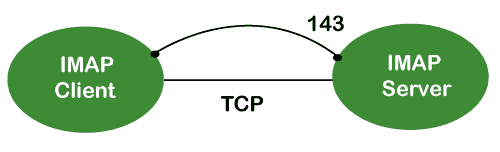
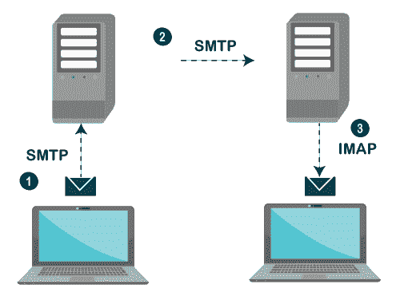
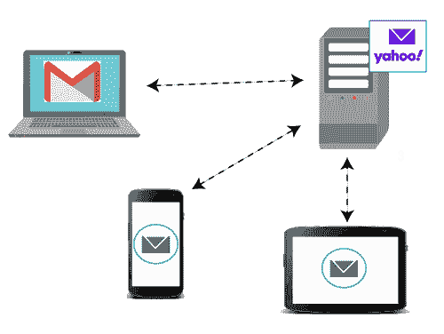

# 协议

> 原文：<https://www.javatpoint.com/imap-protocol>

IMAP 代表**互联网消息访问协议**。它是一个应用层协议，用于接收来自邮件服务器的电子邮件。这是最常用的协议，如 POP3 检索电子邮件。

它也遵循客户机/服务器模型。一方面，我们有一个 IMAP 客户端，这是一个在计算机上运行的进程。另一方面，我们有一个 IMAP 服务器，这也是一个运行在另一台计算机上的进程。两台计算机通过网络连接。

IMAP 协议驻留在 [TCP/IP](https://www.javatpoint.com/computer-network-tcp-ip-model) [传输层](https://www.javatpoint.com/computer-network-transport-layer)上，这意味着它隐含地使用了协议的可靠性。一旦在 IMAP 客户端和 IMAP 服务器之间建立了 [TCP](https://www.javatpoint.com/tcp) 连接，默认情况下，IMAP 服务器监听端口 143，但该端口号也可以更改。

默认情况下，IMAP 使用两个端口:

*   端口 143:是一个非加密的 IMAP 端口。
*   端口 993:当 IMAP 客户端希望通过 IMAP 安全连接时，使用该端口。

### 为什么要用 IMAP 代替 POP3 协议？

POP3 正在成为访问 TCP/IP 邮箱的最流行的协议。它实现了离线邮件访问模型，这意味着邮件从本地机器上的邮件服务器中检索，然后从邮件服务器中删除。如今，数百万用户使用 [POP3 协议](pop-protocol)来访问传入的邮件。由于离线邮件访问模式，它不能被大量使用。理想世界中我们更喜欢的在线模式。在在线模式中，我们需要始终连接到互联网。使用 POP3 进行离线访问的最大问题是邮件会从服务器上永久删除，因此多台计算机无法访问邮件。这个问题的解决方案是将邮件存储在远程服务器上，而不是本地服务器上。POP3 还面临另一个问题，即数据安全性和安全性。这个问题的解决方案是使用断开连接的访问模型，它提供了在线和离线访问的好处。在断开连接的访问模型中，用户可以像在 POP3 协议中一样检索本地使用的邮件，并且用户不需要持续连接到互联网。但是，对邮箱所做的更改在客户端和服务器之间是同步的。邮件保留在服务器上，以便将来不同的应用程序可以访问它。当开发人员认识到这些好处时，他们做了一些尝试来实现断开连接的访问模型。这是通过使用 POP3 命令实现的，该命令提供了将邮件留在服务器上的选项。这是可行的，但仅限于有限的范围，例如，当消息被检索并留在服务器上时，跟踪哪些消息是新的或旧的成为一个问题。因此，POP3 缺少适当的断开连接访问模式所需的一些功能。

20 世纪 80 年代中期，斯坦福大学开始开发一种新的协议，该协议将提供一种更强大的方式来访问用户邮箱。其结果是交互式邮件访问协议的发展，该协议后来被重新命名为**互联网消息访问协议**。

### IMAP 历史和标准

IMAP 的第一个版本被正式记录为互联网标准是 IMAP 第 2 版，在 RFC 1064 中，并于 1988 年 7 月发布。它在 1990 年 8 月的 RFC 1176 中进行了更新，保留了相同的版本。因此，他们创建了一个名为 IMAP3 的版本 3 的新文档。在 1991 年 2 月出版的 RFC 1203 中。但是，IMAP3 从来没有被市场接受，所以人们一直在使用 IMAP2。该协议的扩展后来被创建为 IMAPbis，它为 IMAP 增加了对多用途互联网邮件扩展(MIME)的支持。由于 MIME 的有用性，这是一个非常重要的发展。尽管如此，IMAPbis 从未作为 RFC 发布。这可能是由于与 IMAP3 相关的问题。1994 年 12 月，IMAP 第 4 版即 IMAP4 在两个 RFC 中发布，即描述主协议的 RFC 1730 和描述 IMAP 4 认证机制的 RFC 1731。IMAP 4 是目前广泛使用的 IMAP 的当前版本。它还在继续完善，其最新版本实际上被称为 IMAP4rev1，并在 RFC 2060 中进行了定义。它最近在 RFC 3501 中更新。

### IMAP 功能

IMAP 是为特定目的而设计的，它提供了一种更灵活的用户访问邮箱的方式。它可以在三种模式中的任何一种模式下运行，即在线、离线和断开模式。其中，离线和断开模式是大多数协议用户感兴趣的。

以下是 IMAP 协议的特性:

*   从远程服务器访问和检索邮件:用户可以从远程服务器访问邮件，同时将邮件保留在远程服务器中。
*   设置消息标志:设置消息标志是为了让用户能够跟踪他已经看到的消息。
*   管理多个邮箱:用户可以管理多个邮箱，并将邮件从一个邮箱传输到另一个邮箱。用户可以将它们组织成不同的类别，供从事不同项目的人使用。
*   下载前确定信息:从邮件服务器下载邮件前决定是否检索。
*   下载邮件的一部分:它允许您下载邮件的一部分，例如 mime-multi 部分中的一个正文部分。当消息的短文本元素中有大型多媒体文件时，这可能很有用。
*   在服务器上组织邮件:在 POP3 的情况下，不允许用户管理服务器上的邮件。另一方面，用户可以根据自己的需求组织服务器上的邮件，就像他们可以在服务器上创建、删除或重命名邮箱一样。
*   搜索:用户可以搜索电子邮件的内容。
*   检查邮件头:用户也可以在下载前检查邮件头。
*   创建层次结构:用户也可以创建文件夹来组织层次结构中的邮件。

### 通用操作

1.  IMAP 是一种客户端-服务器协议，类似于 POP3 和大多数其他的 TCP/IP 应用协议。只有当 IMAP4 必须驻留在用户邮箱所在的服务器上时，IMAP4 协议才起作用。在 c 语言中，POP3 不一定需要提供 SMTP 服务的同一台物理服务器。因此，在 IMAP 协议的情况下，邮箱必须对传入邮件的 SMTP 和检索和修改的 IMAP 都是可访问的。
2.  IMAP 使用传输控制协议(TCP)进行通信，以确保数据的交付，并按顺序接收。
3.  IMAP4 在一个众所周知的端口(即端口号 143)上监听来自 IMAP4 客户端的传入连接请求。

**我们通过一个简单的例子来了解一下 IMAP 协议。**

IMAP 协议使所有设备与主服务器同步。让我们假设我们有三个设备桌面、移动和笔记本电脑，如上图所示。如果所有这些设备都在访问同一个邮箱，那么它将与所有设备同步。在这里，同步意味着当邮件被一个设备打开时，它将在所有其他设备中被标记为打开，如果我们删除该邮件，那么该邮件也将从所有其他设备中删除。因此，我们在所有设备之间实现了同步。在 IMAP 中，我们可以看到所有的文件夹，如垃圾邮件、收件箱、已发送邮件等。我们还可以创建我们自己的文件夹，称为自定义文件夹，在所有其他设备中都可见。

* * *