# ARQ 北部

> 原文：<https://www.javatpoint.com/go-back-n-arq>

在了解回退 ARQ 协议的工作原理之前，我们先来看看滑动窗口协议。正如我们所知，滑动窗口协议不同于停止等待协议。在停止等待协议中，发送方一次只能发送一帧，如果没有收到对先前发送的帧的确认，就不能发送下一帧，而在滑动窗口协议的情况下，一次可以发送多个帧。滑动窗口协议的变体有回退 ARQ 和选择性重复 ARQ。让我们来理解“什么是 ARQ 的回归”。

### 什么是回 ARQ？

在 ARQ 北部，发送方的窗口大小为 **N** 。假设我们说 Go-Back-3，这意味着这三个帧可以在等待接收器确认之前一次发送。

它使用协议流水线的原理，在接收到第一帧的确认之前，可以发送多个帧。如果我们有五个帧，并且概念是 Go-Back-3，这意味着可以发送三个帧，即 1 号帧、2 号帧、3 号帧，然后等待 1 号帧的确认。

在回退 N ARQ 中，帧按顺序编号，因为回退 N ARQ 一次发送多个帧，这需要编号方法来区分帧和另一帧，这些编号称为顺序编号。

一次可以发送的帧数完全取决于发送者窗口的大小。因此，我们可以说‘N’是在接收到来自接收器的确认之前一次可以发送的帧数。

如果在约定的时间段内没有收到帧的确认，则当前窗口中所有可用的帧都将被重新传输。假设我们已经发送了第 5 帧，但是没有收到第 5 帧的确认，并且当前窗口保存了三个帧，那么这三个帧将被重传。

出站帧的序列号取决于发送方窗口的大小。假设发送方的窗口大小为 2，我们有十帧要发送，那么序列号将不是 1，2，3，4，5，6，7，8，9，10。让我们通过一个例子来理解。

*   n 是发件人的窗口大小。
*   如果发送方窗口的大小是 4，那么序列号将是 0、1、2、3、0、1、2、3、0、1、2，依此类推。

序列号中的位数是 2，以生成二进制序列 00，01，10，11。

### ARQ 北部的工作

假设有一个发送方和一个接收方，让我们假设有 11 帧要发送。这些帧表示为 0、1、2、3、4、5、6、7、8、9、10，这些是帧的序列号。主要是序列号由发送方的窗口大小决定。但是，为了更好地理解，我们采用了运行序列号，即 0，1，2，3，4，5，6，7，8，9，10。让我们考虑窗口大小为 4，这意味着在期待第一帧的确认之前，可以一次发送四帧。

**第一步:**首先，发送方将发送前四帧给接收方，即 0，1，2，3，现在发送方预计将收到第 0 帧的确认。

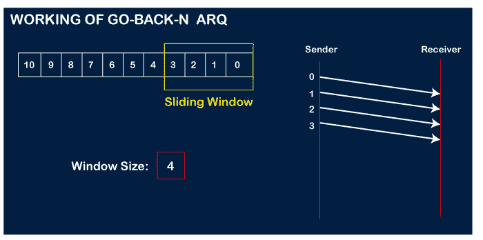

让我们假设接收器已经发送了 0 帧的确认，并且接收器已经成功接收到它。

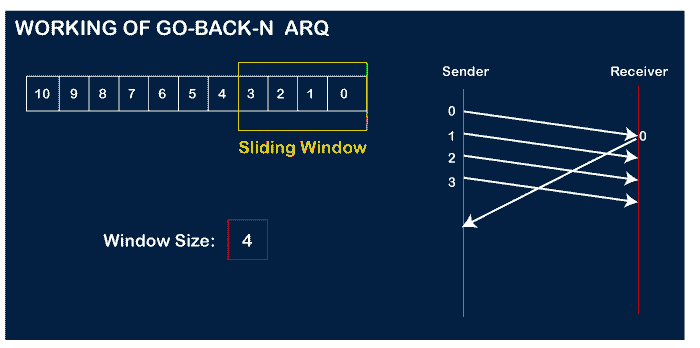

然后发送者将发送下一帧，即 4 帧，并且窗口滑动包含四个帧(1，2，3，4)。

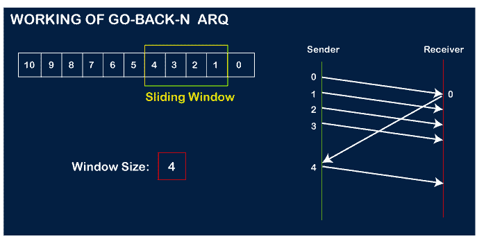

然后，接收器将发送 1 号帧的确认。收到确认后，发送方将发送下一帧，即第 5 帧，窗口将滑动四帧(2，3，4，5)。

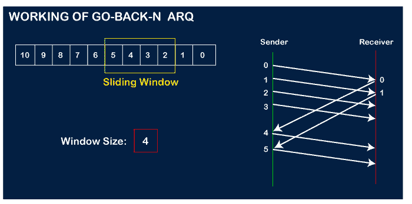

现在，让我们假设接收器没有确认 2 号帧，要么帧丢失，要么确认丢失。发送方不是发送 6 号帧，而是返回 2 号帧，即当前窗口的第一帧，重新发送当前窗口中的所有帧，即 2，3，4，5。

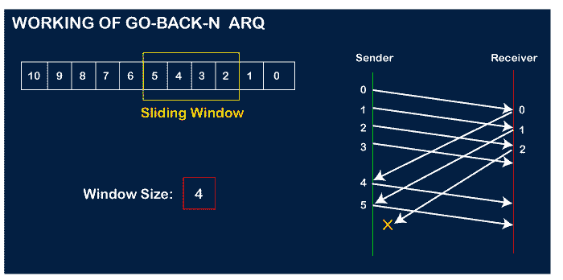
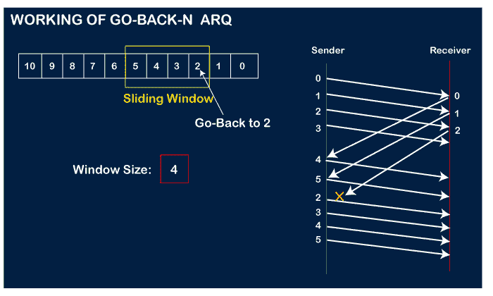

### 与 ARQ 回归相关的要点:

*   在 Go-Back-N 中，N 决定发送方的窗口大小，接收方的窗口大小始终为 1。
*   它不考虑损坏的帧，只是丢弃它们。
*   它不接受无序的帧并丢弃它们。
*   如果发送方没有收到确认，将导致所有当前窗口帧的重新传输。

**我们通过一个例子来了解一下 ARQ 的回溯。**

**例 1:** 在 GB4 中，如果每传输 6 个第数据包就会丢失，如果我们要花费 10 个数据包，那么需要传输多少次？

**解:**这里，GB4 表示 N 等于 4。发件人窗口的大小是 4。

**步骤 1:** 由于窗口大小为 4，因此一次传输 4 个数据包，即 1 号数据包、2 号数据包、3 号数据包和 4 号数据包。

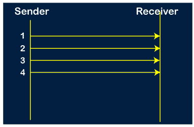

**步骤 2:** 一旦完成窗口大小的传送，发送方就接收到第一帧的确认，即数据包 no1。收到确认后，发送方发送下一个数据包，即 5 号数据包。在这种情况下，窗口滑动具有四个分组，即 2、3、4、5，并且排除了分组 1，因为已经成功接收到分组 1 的确认。

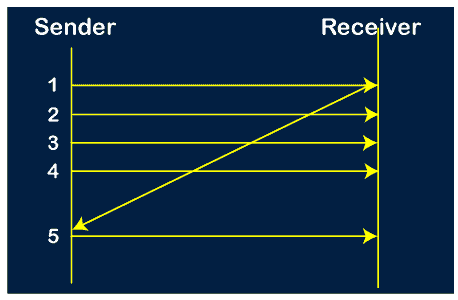

**步骤 3:** 现在，发送方收到数据包 2 的确认。在接收到分组 2 的确认后，发送方发送下一个分组，即分组 6。如问题中所述，每 6 个第丢失一个，所以这个 6 个第数据包丢失，但是发送方不知道第 6 个第数据包已经丢失。

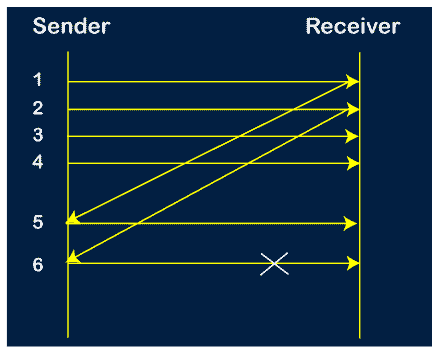

**步骤 4:** 发送方收到 3 号数据包的确认。在收到 3 rd 数据包的确认后，发送方发送下一个数据包，即 7 th 数据包。该窗口将滑动，具有四个分组，即 4、5、6、7。

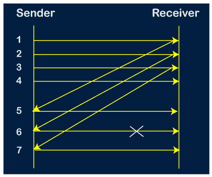

**步骤 5:** 当数据包 7 已发送时，发送方收到对数据包 4 的确认。当发送方收到确认后，发送方发送下一个数据包，即第 8 个数据包。该窗口将滑动，具有四个分组，即 5、6、7、8。

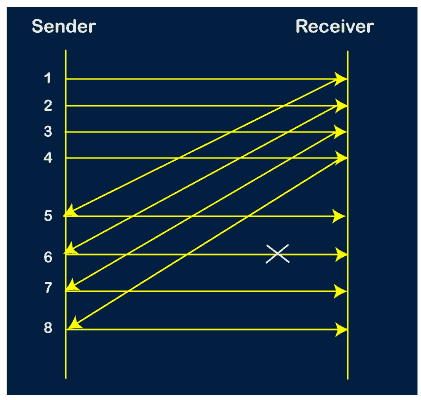

**步骤 6:** 当发送包 8 时，发送方收到包 5 的确认。在接收到分组 5 的确认时，发送方发送下一个分组，即第 9 个分组。该窗口将滑动，具有四个分组，即 6、7、8、9。

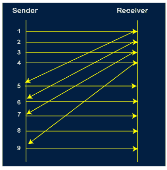

**第 7 步:**当前窗口持有 4 个包，即 6、7、8、9，其中第 6 个包是窗口中的第一个包。我们知道，第 6 个数据包已经丢失，因此发送方收到否定确认 NAK(6)。因为我们知道每 6 个包丢失一次，所以计数器将从 1 重新启动。因此，计数器值 1、2、3 分别被给予第 7包、第 8包、第 9包。

**第 8 步:**由于是 Go-BACK，所以重传当前窗口的所有数据包。它会重新发送 6，7，8，9。6、7、8、9 的计数器值分别是 4、5、6、1。在这种情况下，第 8 个数据包丢失，因为它有 6 个计数器值，因此计数器变量将再次从 1 重新启动。

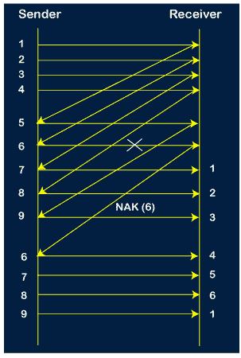

**步骤 9:** 重传后，发送方收到数据包 6 的确认。接收到数据包 6 的确认后，发送方发送第 10 个数据包。现在，当前窗口包含四个数据包，即 7、8、9、10。

**步骤 10:** 发送第 10 个包时，发送方收到包 7 的确认。现在，当前窗口包含三个数据包，即 8、9 和 10。8，9，10 的计数器值是 6，1，2。

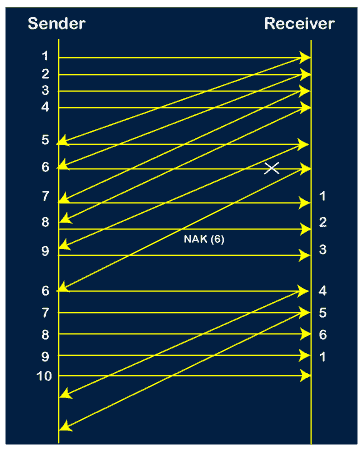

**步骤 11:** 由于第 8 个数据包有 6 个计数器值，这意味着第 8 个数据包丢失，发送方收到 NAK (8)。

**步骤 12:** 由于发送方已经接收到对第 8 个分组的否定确认，它重新发送当前窗口的所有分组，即 8、9、10。

**步骤 13:** 计数器值 8、9、10 分别为 3、4、5，因此它们的确认已被成功接收。

从上图我们得出结论，总共需要 17 次传输。

* * *