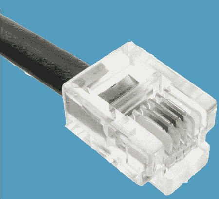
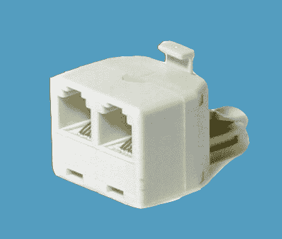
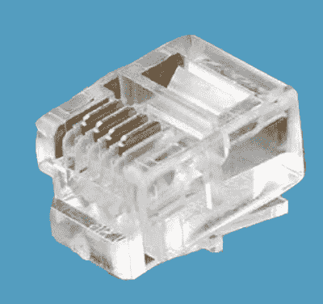
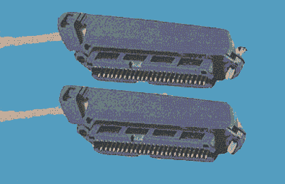
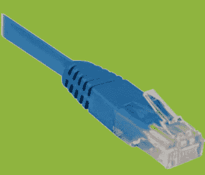
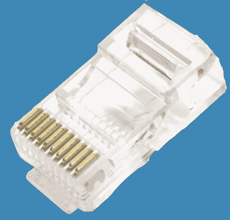

# RJ 电缆公司

> 原文：<https://www.javatpoint.com/rj-cable>

RJ 缩写为**注册杰克**。它用作电信或网络接口的媒介。它使网络设备能够连接语音和数据设备。它主要用于连接不同类型的数据设备和电信媒体，以接受本地服务提供商提供的服务，从而为更远的距离和更短的交换载体交换数据。这些 RJ 电缆根据结构和功能进行分类，如尺寸、个人识别码及其在不同设备上的可靠性。

## RJ 的类型

电话线中使用以下类型的 RJ 电缆，用于在连接的系统之间连接和共享数据。

*   RJ11
*   r11 瓦
*   RJ14
*   rj-21 RJ45 25 接口
*   RJ45
*   RJ48
*   RJ61

### RJ11

它代表注册插孔 11，包含一个四线或六线电话类型的连接器，将电话连接到墙板。但是，它最多支持六线；大多数老式有线电话线使用四线双绞线连接互联网服务提供商。

### r11 瓦

这是 RJ11-W，其中 W 表示壁挂支架。这是 RJ11 的延伸版本。它用于创建到电话线的桥接，具有各种壁挂功能。

### RJ14

它是一个标准的连接器，使用 6P4C，即六个位置，四个触点的模块化连接器。它类似于 RJ11，除了它使用两条电话线，并可用作计算机中的调制解调器连接器。

### RJ21

它是一个配有 50 根导线的注册插孔 21，可以同时处理 25 条电话线。它主要用于广域网，以便在具有多个交换机和设备的组织中运行。

### RJ25

这是一个标准的连接器 RJ25，使用 6P6C，六个位置，六触点模块化连接器。这些模块化插头用于连接三条电话线连接器。

### RJ45

它是以太网电缆或网络设备中广泛使用的一种注册插孔连接器。它类似于电话插孔或连接器，用于通过局域网共享数据。RJ45 电缆或以太网电缆的形状比电话插孔或 RJ11 14、21 和 25 更宽。它用于在以太网的星型拓扑中与屏蔽双绞线(STP)和非屏蔽双绞线(UTP)电缆建立连接。RJ45 连接器通常带有 8P8C，即八个位置、八个触点的模块化连接器，带有独立的双绞线，用于连接计算机和电话线、墙板、接线板和其他网络设备。

### RJ48

这是一种注册插孔连接器，使用双绞线电缆和八针模块化插孔作为数据通信接口。RJ48 使用与我们在 RJ45 连接器中使用的相同类型的插头和插座，但是 RJ48 使用不同类型的引脚输出，其中一对引脚用于传输信号，另一对引脚用于接收信号，另一对引脚用于排出信号，还有一对引脚未使用。RJ48 电缆分为三部分，如 RJ48-C，用于 T1 线路等表面贴装，需要 1、2、4 和 5 个引脚。RJ48-S 使用 56 kbps 的数字线路进行壁挂安装，这些数字线路使用引脚 1、2、7 和 8。RJ48-X 用于需要 1、2、4 和 5 针的复杂故障排除插孔。

### RJ61

它与 RJ11 相同，但它使用 8P8C 连接器，这意味着它有八个位置和八个导体模块，与网络设备中的双绞线电缆连接。

## RJ45 和 RJ11 的区别

| 主要差异 | RJ45 | RJ11 |
| **尺寸** | RJ45 电缆的尺寸更大。 | RJ11 的面积较小。 |
| **连接导线** | 它有八根独立的电线。 | 它有四根相连的电线。 |
| 用法 | 它与以太网电缆和电话线一起使用。 | 它用于电话电缆线路，如单线、双线或三线。 |
| **支持的带宽** | 通过以太网电缆传输数据的速度高达 10 Gbps。 | RJ11 的数据传输速度高达 24 兆位/秒。 |
| **连接器** | 它使用 8P8C 连接器，其中八个位置八个触点是模块化的。 | 它使用 6P4C 连接器，其中六个位置四个触点是模块化的。 |

### RJ 电缆的特点:

1.  它可以配置安装表面来连接语音和数据设备。
2.  它与不同的电话线一起使用，通过注册的插孔连接器共享数据。
3.  有很多院校、大型组织、办事处使用 RJ11、RJ12、RJ25 等。，因为它可以同时连接多条电话线。
4.  它还用于使用以太网电缆连接多台计算机，以通过局域网共享数据。
5.  它可以连接到两个以上系统的交叉连接。

### RJ 电缆的优势:

1.  使用不同的设备很容易安装和配置。
2.  它是一种可靠的电缆，与电信接口的连接速度快。

### RJ 电缆的缺点:

1.  它仅用于与电信设备连接的最短距离。
2.  今天，大多数设备都是无线的，所以注册插孔的使用正在变得过时。
3.  它的电线移动性有限。

* * *